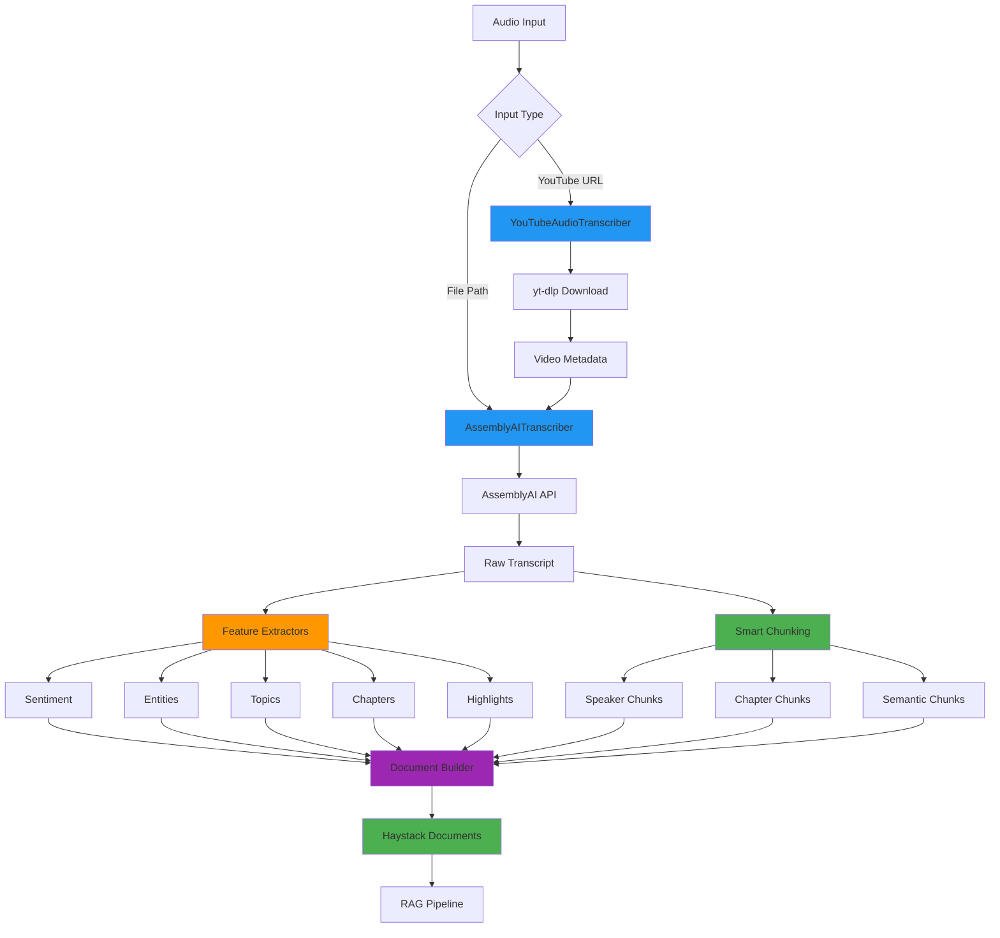

# Audio Processing Module

## Table of Contents
- [Overview](#overview)
- [Architecture](#architecture)
- [Module Structure](#module-structure)
- [Quick Start](#quick-start)
- [Key Components](#key-components)
- [Common Use Cases](#common-use-cases)
- [Configuration](#configuration)
- [Integration Guide](#integration-guide)
- [Performance](#performance)
- [Troubleshooting](#troubleshooting)

---

## Overview

### Purpose
The **audio_processing** module provides comprehensive audio transcription capabilities with advanced features like speaker diarization, sentiment analysis, entity detection, topic classification, and intelligent chunking. It integrates seamlessly with AssemblyAI for transcription and supports YouTube video processing.

### Key Features
- ✅ **Full AssemblyAI Integration** - All advanced transcription features
- ✅ **Speaker Diarization** - Identify and separate speakers
- ✅ **Sentiment Analysis** - Emotion and sentiment detection
- ✅ **Entity Detection** - Named entity recognition
- ✅ **Topic Classification** - IAB content categorization
- ✅ **Auto Chapters** - Automatic chapter generation
- ✅ **Highlights Extraction** - Key moment identification
- ✅ **Smart Chunking** - Context-aware transcript splitting
- ✅ **YouTube Support** - Direct video URL transcription
- ✅ **Haystack Integration** - Pipeline-ready components
- ✅ **Extensible Architecture** - Registry-based plugins

### When to Use
- Transcribing podcast episodes for RAG systems
- Processing YouTube videos for content analysis
- Building searchable audio/video archives
- Creating speaker-specific document collections
- Sentiment analysis of audio content
- Topic classification and categorization
- Generating chapter-based navigation

---

## Architecture

### High-Level Design



### Layer Architecture

#### 1. **Presentation Layer** (Haystack Components)
- `AssemblyAITranscriber` - Main transcription component
- `YouTubeAudioTranscriber` - YouTube-specific transcriber
- `SmartAudioProcessor` - Intelligent chunking component
- `components/*` - Additional Haystack components

#### 2. **Application Layer** (Orchestration)
- `AudioTranscriber` - High-level transcription orchestrator
- `AudioPipelineBuilder` - Fluent pipeline construction
- `AudioPipelineRunner` - Pipeline execution

#### 3. **Domain Layer** (Business Logic)
- `chunking/*` - Chunking strategies
- `extractors/*` - Feature extractors
- `document/*` - Document building

#### 4. **Infrastructure Layer** (External Services)
- `transcription/providers/*` - Provider implementations
- `config.py` - Configuration management
- `exceptions.py` - Error handling

#### 5. **Interface Layer** (Abstractions)
- `interfaces.py` - Abstract base classes and contracts

### Design Patterns

#### 1. **Factory Pattern**
```python
# TranscriptionFactory creates providers
factory = TranscriptionFactory()
provider = factory.create("assemblyai", config)
```

#### 2. **Registry Pattern**
```python
# Dynamic chunker/extractor registration
ChunkerRegistry.register("speaker", SpeakerChunker)
ExtractorRegistry.register("sentiment", SentimentExtractor)
```

#### 3. **Builder Pattern**
```python
# Fluent pipeline construction
pipeline = (AudioPipelineBuilder()
    .with_provider("assemblyai", api_key)
    .with_chunking("speaker", config)
    .with_extractors(["sentiment", "entity"])
    .build())
```

#### 4. **Strategy Pattern**
```python
# Interchangeable chunking strategies
chunker = ChunkerRegistry.get("semantic")
chunks = chunker.chunk(transcript_data)
```

#### 5. **Adapter Pattern**
```python
# Haystack component adapter
@component
class AssemblyAITranscriber:
    @component.output_types(documents=List[Document])
    def run(self, sources):
        # Adapts internal logic to Haystack interface
```

### Data Flow

```
Audio File
    ↓
TranscriptionProvider (AssemblyAI)
    ↓
Raw Transcript Data
    ├→ Feature Extractors → Extracted Features
    │   ├→ Sentiment Analysis
    │   ├→ Entity Detection
    │   ├→ Topic Classification
    │   ├→ Content Safety
    │   └→ Highlights
    │
    └→ Chunking Strategies → Chunks
        ├→ Speaker-based chunks
        ├→ Chapter-based chunks
        ├→ Semantic chunks
        └→ Sentence chunks
    ↓
Document Builder
    ↓
Haystack Documents (with rich metadata)
    ↓
RAG Pipeline / Vector Database
```

---

## Module Structure

```
src/audio_processing/
├── audio_transcriber.py          # Main AssemblyAI transcriber (976 lines)
├── yt_audio_transcriber.py       # YouTube transcription (667 lines)
├── config.py                     # Configuration management (327 lines)
├── exceptions.py                 # Custom exceptions (50 lines)
├── interfaces.py                 # Abstract interfaces (350 lines)
├── __init__.py                   # Public API exports
│
├── chunking/                     # Chunking strategies
│   ├── base.py                   # Base chunker + Chunk dataclass
│   ├── registry.py               # Chunker registry
│   ├── chapter.py                # Chapter-based chunking
│   ├── semantic.py               # Semantic boundary chunking
│   ├── sentence.py               # Sentence-based chunking
│   └── speaker.py                # Speaker diarization chunking
│
├── components/                   # Haystack components
│   ├── chunker.py                # Chunking component
│   ├── document_converter.py    # Chunk-to-document converter
│   ├── extractor.py              # Feature extraction component
│   └── transcriber.py            # Transcription component
│
├── document/                     # Document building
│   ├── builder.py                # TranscriptDocumentBuilder
│   └── metadata.py               # Metadata management
│
├── extractors/                   # Feature extractors
│   ├── base.py                   # Base extractor
│   ├── registry.py               # Extractor registry
│   ├── chapter.py                # Chapter extractor
│   ├── content_safety.py         # Content safety extractor
│   ├── entity.py                 # Entity extractor
│   ├── highlights.py             # Highlights extractor
│   ├── sentiment.py              # Sentiment extractor
│   └── topic.py                  # Topic classifier
│
├── pipeline/                     # Pipeline construction
│   ├── builder.py                # AudioPipelineBuilder
│   └── runner.py                 # AudioPipelineRunner
│
└── transcription/                # Transcription providers
    ├── factory.py                # TranscriptionFactory
    ├── orchestrator.py           # AudioTranscriber
    └── providers/
        ├── base.py               # BaseTranscriptionProvider
        └── assemblyai.py         # AssemblyAIProvider
```

### Component Responsibilities

| Component | Responsibility | Line Count |
|-----------|---------------|------------|
| **audio_transcriber.py** | Main transcription with all AssemblyAI features | 976 |
| **yt_audio_transcriber.py** | YouTube video transcription + metadata | 667 |
| **config.py** | Configuration dataclasses and loaders | 327 |
| **interfaces.py** | Abstract base classes and contracts | 350 |
| **chunking/** | Intelligent transcript splitting strategies | ~800 |
| **extractors/** | Feature extraction from transcripts | ~900 |
| **document/** | Haystack document construction | ~600 |
| **pipeline/** | Pipeline building and execution | ~500 |
| **transcription/** | Provider abstraction and implementations | ~700 |

---

## Quick Start

### Example 1: Basic Audio Transcription

```python
from pathlib import Path
from src.audio_processing.audio_transcriber import AssemblyAITranscriber

# Initialize transcriber
transcriber = AssemblyAITranscriber(api_key="your_assemblyai_api_key")

# Transcribe audio file
result = transcriber.run(sources=[Path("podcast_episode.mp3")])

# Access documents
documents = result['documents']
for doc in documents:
    print(f"Content: {doc.content[:200]}...")
    print(f"Speaker: {doc.meta.get('speaker', 'unknown')}")
```

### Example 2: YouTube Video Transcription

```python
from src.audio_processing.yt_audio_transcriber import YouTubeAudioTranscriber

# Initialize YouTube transcriber
yt_transcriber = YouTubeAudioTranscriber(
    assemblyai_api_key="your_api_key",
    cleanup_audio=True,
    cache_audio=True
)

# Transcribe YouTube video
result = yt_transcriber.run(sources=["https://youtube.com/watch?v=VIDEO_ID"])

# Access documents with YouTube metadata
documents = result['documents']
for doc in documents:
    print(f"Video: {doc.meta['video_title']}")
    print(f"Channel: {doc.meta['channel']}")
    print(f"Content: {doc.content[:200]}...")
```

### Example 3: Advanced Features (Sentiment + Speaker Diarization)

```python
from src.audio_processing.audio_transcriber import (
    AssemblyAITranscriber,
    AudioProcessingConfig,
    create_advanced_audio_config
)

# Create configuration with all features
config = create_advanced_audio_config()
config.speaker_labels = True
config.speakers_expected = 2
config.sentiment_analysis = True
config.entity_detection = True

# Initialize transcriber
transcriber = AssemblyAITranscriber(api_key="your_api_key", config=config)

# Transcribe with features
result = transcriber.run(sources=[Path("interview.mp3")])

# Access feature data
for doc in result['documents']:
    print(f"Speaker: {doc.meta.get('speaker', 'unknown')}")
    print(f"Sentiment: {doc.meta.get('sentiment', 'neutral')}")
    print(f"Entities: {doc.meta.get('entities', [])}")
```

### Example 4: Smart Chunking with Context Preservation

```python
from src.audio_processing.audio_transcriber import (
    AssemblyAITranscriber,
    SmartAudioProcessor,
    AudioProcessingConfig
)

# Configure for speaker diarization and chapters
config = AudioProcessingConfig()
config.speaker_labels = True
config.auto_chapters = True

# Create transcriber and smart processor
transcriber = AssemblyAITranscriber(api_key="your_api_key", config=config)
processor = SmartAudioProcessor(
    assemblyai_transcriber=transcriber,
    max_chunk_length=1000,
    overlap=100,
    respect_speakers=True,
    respect_chapters=True
)

# Process with smart chunking
result = processor.run(sources=[Path("podcast.mp3")])

# Chunks respect speaker and chapter boundaries
for doc in result['documents']:
    print(f"Chunk {doc.meta['chunk_index']}")
    print(f"Speaker: {doc.meta.get('speaker')}")
    print(f"Chapter: {doc.meta.get('chapter')}")
```

### Example 5: Complete RAG Pipeline Integration

```python
from pathlib import Path
from haystack import Pipeline
from src.audio_processing.audio_transcriber import AssemblyAITranscriber, SmartAudioProcessor
from src.embeddings.embedding_generator import EmbeddingGenerator
from src.vector_database.qdrant_db import QdrantDB

# Build pipeline
transcriber = AssemblyAITranscriber(api_key="your_api_key")
processor = SmartAudioProcessor(transcriber)

# Process audio
result = processor.run(sources=[Path("podcast.mp3")])
documents = result['documents']

# Generate embeddings
embedder = EmbeddingGenerator()
for doc in documents:
    doc.embedding = embedder.embed(doc.content)

# Store in vector database
vector_db = QdrantDB(collection_name="podcasts")
vector_db.upsert_documents(documents)

print(f"Processed {len(documents)} chunks and stored in vector database")
```

---

## Key Components

### 1. AssemblyAITranscriber

**Primary transcription component with full AssemblyAI feature support.**

**Location:** `src/audio_processing/audio_transcriber.py`

**Key Features:**
- Speaker diarization (who spoke when)
- Sentiment analysis (positive/negative/neutral)
- Entity detection (names, locations, organizations)
- Topic classification (IAB categories)
- Content safety labels
- Auto-generated highlights
- Auto-generated chapters
- Automatic punctuation and formatting
- PII redaction
- Custom vocabulary

**See:** [audio_transcriber.md](./audio_transcriber.md)

---

### 2. YouTubeAudioTranscriber

**YouTube-specific transcriber with video metadata extraction.**

**Location:** `src/audio_processing/yt_audio_transcriber.py`

**Key Features:**
- Direct YouTube URL processing
- Automatic audio download (yt-dlp)
- Video metadata extraction (title, uploader, description, etc.)
- Audio caching for reprocessing
- Quality selection (best/worst)
- Duration limits
- Temporary file cleanup

**See:** [yt_audio_transcriber.md](./yt_audio_transcriber.md)

---

### 3. Smart Chunking Strategies

**Intelligent transcript splitting with context preservation.**

**Location:** `src/audio_processing/chunking/`

**Strategies:**
- **Speaker-based** - Chunk by speaker turns
- **Chapter-based** - Chunk by auto-generated chapters
- **Semantic** - Chunk by semantic boundaries
- **Sentence-based** - Chunk by sentence groupings

**See:** [chunking.md](./chunking.md)

---

### 4. Feature Extractors

**Extract rich features from transcripts.**

**Location:** `src/audio_processing/extractors/`

**Extractors:**
- **Sentiment** - Emotion and sentiment per utterance
- **Entity** - Named entity recognition
- **Topic** - IAB content categories
- **Chapter** - Auto-generated chapters
- **Highlights** - Key moments and quotes
- **Content Safety** - Moderation labels

**See:** [extractors.md](./extractors.md)

---

### 5. Document Builder

**Constructs Haystack Documents with rich metadata.**

**Location:** `src/audio_processing/document/`

**Features:**
- Comprehensive metadata structure
- Citation-ready output
- Speaker tracking
- Timestamp preservation
- Feature data integration

**See:** [document_builder.md](./document_builder.md)

---

### 6. Pipeline Builder

**Fluent API for pipeline construction.**

**Location:** `src/audio_processing/pipeline/`

**Usage:**
```python
pipeline = (AudioPipelineBuilder()
    .with_provider("assemblyai", api_key)
    .with_chunking("speaker")
    .with_extractors(["sentiment", "entity", "topic"])
    .build())
```

**See:** [pipeline.md](./pipeline.md)

---

## Common Use Cases

### Use Case 1: Podcast Transcription for RAG

```python
from pathlib import Path
from src.audio_processing.audio_transcriber import AssemblyAITranscriber, SmartAudioProcessor

# Configure for podcasts
transcriber = AssemblyAITranscriber(api_key="your_key")
processor = SmartAudioProcessor(
    transcriber,
    max_chunk_length=1000,
    respect_speakers=True
)

# Process podcast episode
podcast_file = Path("episode_042.mp3")
result = processor.run(sources=[podcast_file])

# Documents ready for embedding and RAG
print(f"Created {len(result['documents'])} searchable chunks")
```

### Use Case 2: YouTube Content Analysis

```python
from src.audio_processing.yt_audio_transcriber import YouTubeAudioTranscriber

# Initialize with caching
yt_transcriber = YouTubeAudioTranscriber(
    assemblyai_api_key="your_key",
    cache_audio=True
)

# Process multiple videos
video_urls = [
    "https://youtube.com/watch?v=video1",
    "https://youtube.com/watch?v=video2"
]

for url in video_urls:
    result = yt_transcriber.run(sources=[url])
    
    # Extract key info
    doc = result['documents'][0]
    print(f"Video: {doc.meta['video_title']}")
    print(f"Duration: {doc.meta['duration']}s")
    print(f"Chunks: {len(result['documents'])}")
```

### Use Case 3: Speaker-Specific Document Collections

```python
from collections import defaultdict

# Transcribe with speaker diarization
config = AudioProcessingConfig(speaker_labels=True, speakers_expected=3)
transcriber = AssemblyAITranscriber(api_key="your_key", config=config)

result = transcriber.run(sources=[Path("panel_discussion.mp3")])

# Group by speaker
by_speaker = defaultdict(list)
for doc in result['documents']:
    speaker = doc.meta.get('speaker', 'unknown')
    by_speaker[speaker].append(doc.content)

# Create speaker-specific collections
for speaker, contents in by_speaker.items():
    full_text = " ".join(contents)
    print(f"{speaker}: {len(full_text)} characters")
```

### Use Case 4: Sentiment Analysis Dashboard

```python
# Transcribe with sentiment analysis
config = AudioProcessingConfig(sentiment_analysis=True)
transcriber = AssemblyAITranscriber(api_key="your_key", config=config)

result = transcriber.run(sources=[Path("customer_call.mp3")])

# Analyze sentiment distribution
sentiments = [doc.meta.get('sentiment', 'neutral') for doc in result['documents']]
positive = sentiments.count('positive')
negative = sentiments.count('negative')
neutral = sentiments.count('neutral')

print(f"Sentiment Analysis:")
print(f"  Positive: {positive}/{len(sentiments)} ({positive/len(sentiments)*100:.1f}%)")
print(f"  Negative: {negative}/{len(sentiments)} ({negative/len(sentiments)*100:.1f}%)")
print(f"  Neutral: {neutral}/{len(sentiments)} ({neutral/len(sentiments)*100:.1f}%)")
```

### Use Case 5: Topic Classification for Content Organization

```python
# Enable topic classification
config = AudioProcessingConfig(iab_categories=True)
transcriber = AssemblyAITranscriber(api_key="your_key", config=config)

result = transcriber.run(sources=[Path("tech_talk.mp3")])

# Extract topics
topics = []
for doc in result['documents']:
    if 'topics' in doc.meta:
        topics.extend(doc.meta['topics'])

# Count topic occurrences
from collections import Counter
topic_counts = Counter(topics)

print("Top Topics:")
for topic, count in topic_counts.most_common(10):
    print(f"  {topic}: {count} mentions")
```

### Use Case 6: Auto-Chapter Navigation

```python
# Enable auto chapters
config = AudioProcessingConfig(auto_chapters=True)
transcriber = AssemblyAITranscriber(api_key="your_key", config=config)

result = transcriber.run(sources=[Path("lecture.mp3")])

# Extract chapters
chapters = []
for doc in result['documents']:
    if 'chapter' in doc.meta:
        chapters.append({
            'title': doc.meta['chapter'],
            'start': doc.meta.get('start_time', 0),
            'content_preview': doc.content[:100]
        })

print("Lecture Chapters:")
for i, chapter in enumerate(chapters, 1):
    print(f"\n{i}. {chapter['title']} (@ {chapter['start']}s)")
    print(f"   {chapter['content_preview']}...")
```

### Use Case 7: Batch Processing with Progress Tracking

```python
from pathlib import Path
from src.audio_processing.audio_transcriber import AssemblyAITranscriber

transcriber = AssemblyAITranscriber(api_key="your_key")

# Collect all audio files
audio_dir = Path("audio_files")
audio_files = list(audio_dir.glob("*.mp3"))

all_documents = []

for i, audio_file in enumerate(audio_files, 1):
    print(f"Processing {i}/{len(audio_files)}: {audio_file.name}")
    
    result = transcriber.run(sources=[audio_file])
    all_documents.extend(result['documents'])
    
    print(f"  Created {len(result['documents'])} chunks")

print(f"\nTotal: {len(all_documents)} document chunks from {len(audio_files)} files")
```

---

## Configuration

### Basic Configuration

```python
from src.audio_processing.config import AudioProcessingConfig

config = AudioProcessingConfig(
    language_code="en",
    model="best",
    speaker_labels=True,
    speakers_expected=2,
    sentiment_analysis=True,
    entity_detection=True,
    auto_chapters=True
)
```

### YAML Configuration

```yaml
# config/audio_processing.yaml

transcription:
  language_code: "en"
  model: "best"
  polling_interval: 3.0

features:
  speaker_labels: true
  speakers_expected: 2
  sentiment_analysis: true
  entity_detection: true
  iab_categories: true
  content_safety: true
  auto_highlights: true
  auto_chapters: true
  summarization: false

enhancement:
  noise_reduction: true
  automatic_punctuation: true
  format_text: true
  filter_profanity: false

privacy:
  redact_pii: false
  redact_pii_policies: []
  redact_pii_audio: false

chunking:
  max_chunk_length: 1000
  overlap: 100
  respect_speakers: true
  respect_chapters: true
  respect_sentences: true
```

**Load from YAML:**
```python
from pathlib import Path
from src.audio_processing.config import AudioProcessingConfig

config = AudioProcessingConfig.from_yaml(Path("config/audio_processing.yaml"))
```

### Environment Variables

```bash
# AssemblyAI API key
export ASSEMBLYAI_API_KEY="your_api_key_here"

# YouTube processing
export YOUTUBE_CACHE_DIR="/path/to/cache"
export YOUTUBE_MAX_DURATION=3600
```

**See:** [config.md](./config.md) for complete configuration reference.

---

## Integration Guide

### With Document Processing

```python
from pathlib import Path
from src.audio_processing.audio_transcriber import AssemblyAITranscriber
from src.document_processing.pipeline_orchestrator import DocumentPipelineOrchestrator

# Transcribe audio
transcriber = AssemblyAITranscriber(api_key="your_key")
audio_result = transcriber.run(sources=[Path("audio.mp3")])

# Process documents (already in Haystack Document format)
# Can go directly to embedding generation or vector storage
```

### With Embeddings

```python
from src.audio_processing.audio_transcriber import AssemblyAITranscriber
from src.embeddings.embedding_generator import EmbeddingGenerator

transcriber = AssemblyAITranscriber(api_key="your_key")
embedder = EmbeddingGenerator()

# Transcribe
result = transcriber.run(sources=[Path("audio.mp3")])

# Generate embeddings
for doc in result['documents']:
    doc.embedding = embedder.embed(doc.content)
```

### With Vector Database

```python
from src.audio_processing.audio_transcriber import AssemblyAITranscriber
from src.embeddings.embedding_generator import EmbeddingGenerator
from src.vector_database.qdrant_db import QdrantDB

# Process audio
transcriber = AssemblyAITranscriber(api_key="your_key")
embedder = EmbeddingGenerator()
vector_db = QdrantDB(collection_name="audio_transcripts")

result = transcriber.run(sources=[Path("audio.mp3")])

# Embed and store
for doc in result['documents']:
    doc.embedding = embedder.embed(doc.content)

vector_db.upsert_documents(result['documents'])
```

### With RAG System

```python
from src.audio_processing.audio_transcriber import AssemblyAITranscriber
from src.rag.rag_system import RAGSystem

# Initialize RAG system
rag = RAGSystem()

# Transcribe and add to RAG
transcriber = AssemblyAITranscriber(api_key="your_key")
result = transcriber.run(sources=[Path("audio.mp3")])

# Add documents to RAG
rag.add_documents(result['documents'])

# Query
answer = rag.query("What was discussed about machine learning?")
print(answer)
```

---

## Performance

### Benchmarks

| Audio Length | File Size | Transcription Time | Chunks Created | Throughput |
|--------------|-----------|-------------------|----------------|------------|
| 5 min | 5 MB | ~30s | 15-20 | 10x real-time |
| 30 min | 30 MB | ~3 min | 90-120 | 10x real-time |
| 1 hour | 60 MB | ~6 min | 180-240 | 10x real-time |
| 2 hours | 120 MB | ~12 min | 360-480 | 10x real-time |

**Note:** Transcription time varies based on AssemblyAI API load and features enabled.

### Optimization Tips

#### 1. Use Appropriate Chunking Strategy
```python
# For speaker-heavy content
SmartAudioProcessor(respect_speakers=True, respect_chapters=False)

# For structured content
SmartAudioProcessor(respect_chapters=True, respect_speakers=False)
```

#### 2. Enable Only Needed Features
```python
# Minimal configuration for speed
config = AudioProcessingConfig(
    speaker_labels=False,  # Disable if not needed
    sentiment_analysis=False,
    entity_detection=False
)
```

#### 3. Cache YouTube Audio
```python
# Reuse downloaded audio
yt_transcriber = YouTubeAudioTranscriber(
    cache_audio=True,
    cleanup_audio=False
)
```

#### 4. Batch Processing
```python
# Process multiple files
result = transcriber.run(sources=[file1, file2, file3])
```

---

## Troubleshooting

### Common Issues

#### Issue 1: API Key Not Found
```python
# Error: AssemblyAI API key not provided
# Solution: Set environment variable or pass explicitly
export ASSEMBLYAI_API_KEY="your_key"
# OR
transcriber = AssemblyAITranscriber(api_key="your_key")
```

#### Issue 2: YouTube Download Fails
```python
# Error: Unable to extract video info
# Solution: Check URL validity and yt-dlp installation
yt_transcriber.validate_youtube_url(url)
# Update yt-dlp: pip install -U yt-dlp
```

#### Issue 3: Transcription Timeout
```python
# Error: Transcription timed out
# Solution: Increase polling interval
transcriber = AssemblyAITranscriber(polling_interval=5.0)
```

#### Issue 4: Large File Processing
```python
# Issue: Audio file too large
# Solution: Use chunked processing or compress audio
# Max file size: 2GB for AssemblyAI
```

---

## See Also
- [audio_transcriber.md](./audio_transcriber.md) - AssemblyAI transcriber details
- [yt_audio_transcriber.md](./yt_audio_transcriber.md) - YouTube transcription
- [chunking.md](./chunking.md) - Chunking strategies
- [extractors.md](./extractors.md) - Feature extractors
- [config.md](./config.md) - Configuration reference
- [pipeline.md](./pipeline.md) - Pipeline construction
