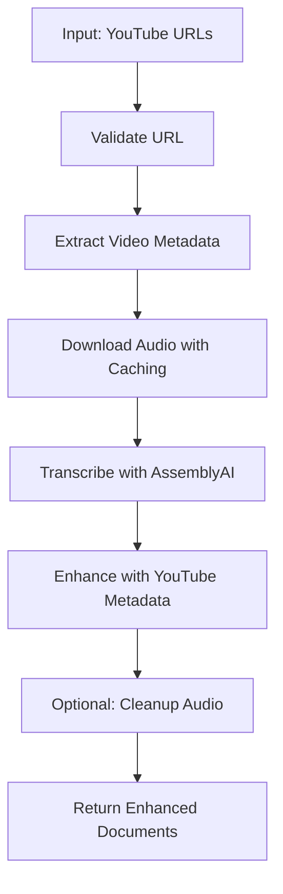

# yt_audio_transcriber.py - YouTube Audio Transcription

## Table of Contents
1. [Overview](#overview)
2. [Core Classes](#core-classes)
3. [YouTubeVideoInfo Dataclass](#youtubevideoin fo-dataclass)
4. [YouTubeAudioTranscriber Component](#youtubeaudiotranscriber-component)
5. [Quick Start Examples](#quick-start-examples)
6. [YouTube-Specific Features](#youtube-specific-features)
7. [Configuration Guide](#configuration-guide)
8. [Integration Patterns](#integration-patterns)
9. [Best Practices](#best-practices)
10. [Troubleshooting](#troubleshooting)

---

## Overview

**Purpose**: Provides comprehensive YouTube-specific audio transcription by combining yt-dlp for video download with AssemblyAI for advanced transcription, automatically enriching results with YouTube metadata.

**File**: `src/audio_processing/yt_audio_transcriber.py` (667 lines)

**Key Features**:
- 🎥 **YouTube URL extraction** with multiple format support
- 📥 **Intelligent audio downloading** with caching
- 🎤 **Full AssemblyAI integration** with all advanced features
- 📊 **Rich metadata extraction** (views, likes, channel info, tags)
- 🔍 **Content categorization** with IAB topics
- 💾 **Smart caching** to avoid re-downloading
- ⏱️ **Duration limits** for resource control
- 🏷️ **Enhanced citation metadata** for proper attribution
- 🧹 **Automatic cleanup** with configurable retention

**Dependencies**:
```python
import yt_dlp                  # YouTube download (install: pip install yt-dlp)
from haystack import component, Document
from .audio_transcriber import AssemblyAITranscriber, AudioProcessingConfig
from src.core.logging import CustomLogger
```

**Integration**: Extends `AssemblyAITranscriber` with YouTube-specific preprocessing and metadata enhancement.

---

## Core Classes

### Class Hierarchy

```
YouTubeVideoInfo (dataclass)
  └─ Comprehensive video metadata container (14 attributes)

YouTubeAudioTranscriber (@component)
  ├─ YouTube URL validation and parsing
  ├─ Audio download with yt-dlp
  ├─ AssemblyAI transcription integration
  └─ Metadata enhancement and citation generation
```

---

## YouTubeVideoInfo Dataclass

**Purpose**: Container for comprehensive YouTube video metadata extracted via yt-dlp.

### Definition

```python
@dataclass
class YouTubeVideoInfo:
    """Contains metadata about a YouTube video."""
    
    # Core identification
    video_id: str
    title: str
    description: str
    
    # Channel information
    uploader: str
    channel: str
    channel_id: str
    
    # Publishing details
    upload_date: str                    # Format: YYYYMMDD
    
    # Video metrics
    duration: Optional[float]           # Seconds
    view_count: Optional[int]
    like_count: Optional[int]
    
    # Content metadata
    tags: List[str]
    categories: List[str]
    thumbnail: Optional[str]            # Thumbnail URL
    webpage_url: str                    # Full YouTube URL
```

**Total Attributes**: 14 comprehensive metadata fields

### Attribute Details

| Attribute | Type | Description | Example |
|-----------|------|-------------|---------|
| `video_id` | `str` | YouTube video ID (11 characters) | `"dQw4w9WgXcQ"` |
| `title` | `str` | Video title | `"AI Tutorial 2024"` |
| `description` | `str` | Full video description | `"Learn about AI in..."` |
| `uploader` | `str` | Channel name (uploader) | `"TechChannel"` |
| `channel` | `str` | Official channel name | `"TechChannel"` |
| `channel_id` | `str` | YouTube channel ID | `"UCxxxxxxxxxxxxxx"` |
| `upload_date` | `str` | Upload date (YYYYMMDD) | `"20240315"` |
| `duration` | `Optional[float]` | Video duration in seconds | `1823.5` |
| `view_count` | `Optional[int]` | Total view count | `1500000` |
| `like_count` | `Optional[int]` | Total like count | `45000` |
| `tags` | `List[str]` | Video tags | `["AI", "tutorial"]` |
| `categories` | `List[str]` | YouTube categories | `["Education"]` |
| `thumbnail` | `Optional[str]` | Thumbnail image URL | `"https://..."` |
| `webpage_url` | `str` | Full YouTube URL | `"https://youtube.com/..."` |

### Methods

#### `to_dict()` - Dictionary Conversion

```python
def to_dict(self) -> Dict[str, Any]:
    """Convert to dictionary for metadata storage."""
    return {
        'video_id': self.video_id,
        'title': self.title,
        'description': self.description,
        'uploader': self.uploader,
        'upload_date': self.upload_date,
        'duration_seconds': self.duration,
        'view_count': self.view_count,
        'like_count': self.like_count,
        'channel': self.channel,
        'channel_id': self.channel_id,
        'tags': self.tags,
        'categories': self.categories,
        'thumbnail': self.thumbnail,
        'webpage_url': self.webpage_url
    }
```

**Returns**: Dictionary with all metadata, suitable for JSON serialization or database storage.

---

## YouTubeAudioTranscriber Component

**Purpose**: Main component for YouTube video transcription with comprehensive metadata enrichment.

### Class Definition

```python
@component
class YouTubeAudioTranscriber:
    """
    Comprehensive YouTube Audio Transcriber that combines YouTube audio extraction
    with advanced AssemblyAI transcription features.
    
    Features:
    - YouTube URL validation and video ID extraction
    - High-quality audio downloading with yt-dlp
    - Full integration with AssemblyAI's advanced features
    - Smart caching to avoid re-downloading
    - Rich metadata extraction from YouTube
    - Comprehensive error handling and logging
    """
```

### Constructor

```python
def __init__(
    self,
    assemblyai_api_key: Optional[str] = None,
    audio_config: Optional[AudioProcessingConfig] = None,
    temp_dir: Optional[str] = None,
    cleanup_audio: bool = True,
    cache_audio: bool = True,
    audio_quality: str = "best",
    max_duration: Optional[int] = None
):
    """
    Initialize the YouTube Audio Transcriber.
    
    :param assemblyai_api_key: AssemblyAI API key
    :param audio_config: Audio processing configuration for transcription
    :param temp_dir: Directory for temporary audio files
    :param cleanup_audio: Whether to delete audio files after transcription
    :param cache_audio: Whether to cache downloaded audio files
    :param audio_quality: Audio quality preference ('best', 'worst', or specific format)
    :param max_duration: Maximum video duration to process (in seconds)
    """
```

**Parameters**:

| Parameter | Type | Default | Description |
|-----------|------|---------|-------------|
| `assemblyai_api_key` | `Optional[str]` | `None` | AssemblyAI API key (uses `ASSEMBLYAI_API_KEY` env if None) |
| `audio_config` | `Optional[AudioProcessingConfig]` | `None` | Transcription config (creates YouTube-optimized if None) |
| `temp_dir` | `Optional[str]` | `None` | Temp directory (uses system temp if None) |
| `cleanup_audio` | `bool` | `True` | Delete audio after transcription |
| `cache_audio` | `bool` | `True` | Cache audio to avoid re-downloading |
| `audio_quality` | `str` | `"best"` | "best", "worst", or specific yt-dlp format |
| `max_duration` | `Optional[int]` | `None` | Max video duration in seconds (None = unlimited) |

**Raises**:
- `ImportError`: If `yt-dlp` not installed
- `ValueError`: If no API key provided

**Default Behavior**:
- Creates YouTube-optimized `AudioProcessingConfig` if none provided
- Uses system temp directory with subdirectory `youtube_audio_transcriber`
- Enables caching by default to save bandwidth
- Cleanup enabled by default (but respects cache setting)

### Core Methods

#### 1. `extract_video_id()` - Video ID Extraction

```python
def extract_video_id(self, url: str) -> Optional[str]:
    """Extract video ID from various YouTube URL formats."""
```

**Supported URL Formats**:
- Standard: `https://www.youtube.com/watch?v=VIDEO_ID`
- Short: `https://youtu.be/VIDEO_ID`
- Embed: `https://www.youtube.com/embed/VIDEO_ID`
- Legacy: `https://www.youtube.com/v/VIDEO_ID`
- With query params: `https://www.youtube.com/watch?v=VIDEO_ID&t=123s`

**Parameters**:
- `url`: YouTube URL in any supported format

**Returns**:
- `str`: 11-character video ID if found
- `None`: If URL format not recognized

**Example**:
```python
transcriber = YouTubeAudioTranscriber()

video_id = transcriber.extract_video_id("https://www.youtube.com/watch?v=dQw4w9WgXcQ")
# Returns: "dQw4w9WgXcQ"

video_id = transcriber.extract_video_id("https://youtu.be/dQw4w9WgXcQ")
# Returns: "dQw4w9WgXcQ"

video_id = transcriber.extract_video_id("invalid_url")
# Returns: None
```

#### 2. `validate_youtube_url()` - URL Validation

```python
def validate_youtube_url(self, url: str) -> bool:
    """Validate if the URL is a valid YouTube URL."""
```

**Checks**:
1. Domain is one of: youtube.com, www.youtube.com, youtu.be, m.youtube.com
2. Valid video ID can be extracted
3. URL structure is parseable

**Parameters**:
- `url`: URL string to validate

**Returns**:
- `True`: URL is valid YouTube URL with extractable video ID
- `False`: Invalid or malformed URL

**Example**:
```python
transcriber = YouTubeAudioTranscriber()

is_valid = transcriber.validate_youtube_url("https://www.youtube.com/watch?v=dQw4w9WgXcQ")
# Returns: True

is_valid = transcriber.validate_youtube_url("https://vimeo.com/12345678")
# Returns: False
```

#### 3. `get_video_info()` - Metadata Extraction

```python
def get_video_info(self, url: str) -> Optional[YouTubeVideoInfo]:
    """Extract comprehensive video metadata using yt-dlp."""
```

**Extracts**:
- All 14 `YouTubeVideoInfo` fields
- Uses yt-dlp's metadata extraction (no download)
- Handles missing/optional fields gracefully

**Parameters**:
- `url`: YouTube video URL

**Returns**:
- `YouTubeVideoInfo`: Populated dataclass with all metadata
- `None`: If extraction fails

**Example**:
```python
transcriber = YouTubeAudioTranscriber()

video_info = transcriber.get_video_info("https://www.youtube.com/watch?v=dQw4w9WgXcQ")

if video_info:
    print(f"Title: {video_info.title}")
    print(f"Channel: {video_info.channel}")
    print(f"Duration: {video_info.duration}s")
    print(f"Views: {video_info.view_count:,}")
    print(f"Tags: {', '.join(video_info.tags)}")
```

#### 4. `download_audio()` - Audio Download

```python
def download_audio(
    self, 
    url: str, 
    video_info: Optional[YouTubeVideoInfo] = None
) -> str:
    """Download audio from YouTube video with caching and quality control."""
```

**Features**:
- Smart caching (checks if audio already downloaded)
- Duration limit enforcement (if `max_duration` set)
- Quality selection via `audio_quality` parameter
- FFmpeg post-processing to M4A format
- Progress logging

**Parameters**:
- `url`: YouTube video URL
- `video_info`: Optional pre-fetched metadata (fetches if None)

**Returns**:
- `str`: Path to downloaded audio file

**Raises**:
- `ValueError`: If duration exceeds `max_duration`
- `FileNotFoundError`: If download succeeds but file not found
- `Exception`: For other download failures

**Caching Logic**:
```python
# Cache filename format: {video_id}_{quality}.m4a
# Example: dQw4w9WgXcQ_best.m4a

if cache_audio and cached_file_exists:
    return cached_file_path  # Skip download
else:
    download_with_ytdlp()    # Download new
```

**Example**:
```python
transcriber = YouTubeAudioTranscriber(
    cache_audio=True,
    audio_quality="best",
    max_duration=3600  # 1 hour max
)

# First call: Downloads audio
audio_path = transcriber.download_audio("https://www.youtube.com/watch?v=VIDEO_ID")
print(audio_path)  # /tmp/youtube_audio_transcriber/VIDEO_ID_best.m4a

# Second call: Uses cached audio (fast)
audio_path = transcriber.download_audio("https://www.youtube.com/watch?v=VIDEO_ID")
print(audio_path)  # Same path, no download
```

#### 5. `run()` - Main Transcription Method

```python
@component.output_types(documents=List[Document])
def run(self, sources: List[str]) -> Dict[str, List[Document]]:
    """
    Transcribe YouTube videos with comprehensive analysis.
    
    :param sources: List of YouTube URLs
    :return: Dictionary with 'documents' key containing transcribed documents
    """
```

**Workflow**:


**Parameters**:
- `sources`: List of YouTube URLs (strings)

**Returns**: Dictionary with structure:
```python
{
    "documents": [
        Document(
            content="# Transcription: Video Title\n## Full Transcript\n...",
            meta={
                # Original AssemblyAI metadata
                "transcript_id": "abc123...",
                "audio_duration_seconds": 1823.5,
                "confidence": 0.95,
                "sentiment_analysis": [...],
                "entities": [...],
                
                # YouTube-specific metadata
                "source_type": "youtube_video",
                "youtube_url": "https://...",
                "video_info": {
                    "video_id": "dQw4w9WgXcQ",
                    "title": "Video Title",
                    "channel": "Channel Name",
                    "view_count": 1500000,
                    "upload_date": "20240315",
                    # ... all YouTubeVideoInfo fields
                },
                
                # Citation metadata
                "citation": {
                    "title": "Video Title",
                    "channel": "Channel Name",
                    "url": "https://...",
                    "video_id": "dQw4w9WgXcQ",
                    "upload_date": "20240315",
                    "access_date": "2024-03-20T10:30:00",
                    "duration": 1823.5
                },
                
                # Processing metadata
                "processed_timestamp": "2024-03-20T10:30:00",
                "transcriber_version": "2.0",
                "processing_method": "youtube_audio_transcription"
            }
        ),
        # ... more documents for chapters, utterances, etc.
    ]
}
```

**Error Handling**: Continues processing remaining videos if one fails, logs errors.

#### 6. `_enhance_documents_with_youtube_metadata()` - Metadata Enhancement

```python
def _enhance_documents_with_youtube_metadata(
    self,
    documents: List[Document],
    video_info: YouTubeVideoInfo,
    original_url: str
) -> List[Document]:
    """Enhance transcription documents with YouTube-specific metadata."""
```

**Purpose**: Enriches AssemblyAI documents with comprehensive YouTube metadata for:
- Proper source attribution
- Citation generation
- Content organization
- Search/retrieval optimization

**Added Metadata Fields**:
- `source_type`: `"youtube_video"`
- `youtube_url`: Original URL
- `video_info`: Full `YouTubeVideoInfo` dictionary
- `video_id`, `video_title`, `channel_name`, etc.: Extracted fields for easy access
- `citation`: Structured citation object
- `processed_timestamp`: ISO 8601 timestamp
- `content_type`: Document classification (main_transcript, sentence, paragraph, etc.)

#### 7. `cleanup_temp_files()` - Cleanup Management

```python
def cleanup_temp_files(self, keep_cache: bool = True) -> None:
    """Clean up temporary files."""
```

**Parameters**:
- `keep_cache`: If True, preserves cached audio files

**Behavior**:
- Deletes all `.m4a` files in temp directory
- Respects `cache_audio` setting if `keep_cache=True`
- Removes empty temp directory
- Logs cleanup actions

#### 8. `_create_youtube_optimized_config()` - Default Config

```python
def _create_youtube_optimized_config(self) -> AudioProcessingConfig:
    """Create an optimized configuration for YouTube audio transcription."""
```

**YouTube-Optimized Settings**:
```python
AudioProcessingConfig(
    # Best quality model
    model="best",
    
    # Speaker analysis (podcasts, interviews)
    speaker_labels=True,
    speakers_expected=None,  # Auto-detect
    
    # Content analysis
    sentiment_analysis=True,
    entity_detection=True,
    iab_categories=True,       # Topic classification
    content_safety=True,
    auto_highlights=True,
    
    # Audio enhancement (YouTube audio varies in quality)
    noise_reduction=True,
    automatic_punctuation=True,
    format_text=True,
    
    # Structure extraction
    include_utterances=True,
    include_sentences=True,
    include_paragraphs=True,
    auto_chapters=False,  # Disabled to allow summarization
    summarization=True,    # Note: Can't have both chapters and summarization
    
    # Custom vocabulary (common YouTube terms)
    custom_vocabulary=[
        "YouTube", "subscribe", "notification", "like", "comment",
        "channel", "playlist", "timestamp", "description", "pinned",
        "livestream", "premiere", "tutorial", "vlog", "podcast"
    ],
    boost_param="high"
)
```

---

## Quick Start Examples

### Example 1: Basic YouTube Transcription

```python
from src.audio_processing.yt_audio_transcriber import YouTubeAudioTranscriber

# Initialize with minimal configuration
transcriber = YouTubeAudioTranscriber(
    assemblyai_api_key="your_api_key",  # Or set ASSEMBLYAI_API_KEY env var
    cache_audio=True,
    audio_quality="best"
)

# Transcribe a single YouTube video
youtube_url = "https://www.youtube.com/watch?v=dQw4w9WgXcQ"
result = transcriber.run(sources=[youtube_url])

# Access results
documents = result["documents"]
main_doc = documents[0]

print(f"Video: {main_doc.meta['video_title']}")
print(f"Channel: {main_doc.meta['channel_name']}")
print(f"Transcript:\n{main_doc.content}")
```

### Example 2: Batch YouTube Transcription

```python
from src.audio_processing.yt_audio_transcriber import YouTubeAudioTranscriber

transcriber = YouTubeAudioTranscriber()

# Multiple YouTube URLs
youtube_urls = [
    "https://www.youtube.com/watch?v=VIDEO_ID_1",
    "https://www.youtube.com/watch?v=VIDEO_ID_2",
    "https://www.youtube.com/watch?v=VIDEO_ID_3",
]

# Transcribe all videos
result = transcriber.run(sources=youtube_urls)

# Process results
for doc in result["documents"]:
    if doc.meta.get("content_type") == "main_transcript":
        title = doc.meta["video_title"]
        views = doc.meta["video_info"]["view_count"]
        duration = doc.meta["video_info"]["duration_seconds"]
        
        print(f"✅ {title}")
        print(f"   Views: {views:,}, Duration: {duration}s")
```

### Example 3: YouTube Metadata Analysis

```python
from src.audio_processing.yt_audio_transcriber import YouTubeAudioTranscriber

transcriber = YouTubeAudioTranscriber()

# Get metadata without transcription (fast)
video_info = transcriber.get_video_info("https://www.youtube.com/watch?v=VIDEO_ID")

if video_info:
    print(f"📺 Video Analysis")
    print(f"Title: {video_info.title}")
    print(f"Channel: {video_info.channel} ({video_info.channel_id})")
    print(f"Uploaded: {video_info.upload_date}")
    print(f"Duration: {video_info.duration}s ({video_info.duration/60:.1f} min)")
    print(f"Views: {video_info.view_count:,}")
    print(f"Likes: {video_info.like_count:,}")
    print(f"Tags: {', '.join(video_info.tags)}")
    print(f"Categories: {', '.join(video_info.categories)}")
    print(f"Thumbnail: {video_info.thumbnail}")
```

### Example 4: Duration-Limited Transcription

```python
from src.audio_processing.yt_audio_transcriber import YouTubeAudioTranscriber

# Limit to 30-minute videos
transcriber = YouTubeAudioTranscriber(
    max_duration=1800,  # 30 minutes = 1800 seconds
    cache_audio=True
)

# Try to transcribe (will reject if > 30 minutes)
try:
    result = transcriber.run(sources=["https://www.youtube.com/watch?v=LONG_VIDEO"])
    print("✅ Video transcribed successfully")
except ValueError as e:
    print(f"❌ Video too long: {e}")
```

### Example 5: Custom Configuration for Technical Content

```python
from src.audio_processing.yt_audio_transcriber import (
    YouTubeAudioTranscriber,
    AudioProcessingConfig
)

# Technical content configuration
tech_config = AudioProcessingConfig(
    model="best",
    speaker_labels=True,
    entity_detection=True,
    iab_categories=True,
    auto_chapters=True,
    format_text=True,
    
    # Technical vocabulary
    custom_vocabulary=[
        "Kubernetes", "Docker", "PostgreSQL", "Python",
        "FastAPI", "AssemblyAI", "TypeScript", "React",
        "microservices", "API", "database", "cloud"
    ],
    boost_param="high"
)

transcriber = YouTubeAudioTranscriber(
    audio_config=tech_config,
    cache_audio=True
)

# Transcribe technical YouTube content
result = transcriber.run(sources=["https://www.youtube.com/watch?v=TECH_TUTORIAL"])

# Technical terms will be recognized correctly
doc = result["documents"][0]
print(doc.content)  # Will have accurate technical terminology
```

### Example 6: Citation Generation

```python
from src.audio_processing.yt_audio_transcriber import YouTubeAudioTranscriber
from datetime import datetime

transcriber = YouTubeAudioTranscriber()

result = transcriber.run(sources=["https://www.youtube.com/watch?v=VIDEO_ID"])
doc = result["documents"][0]

# Extract citation information
citation = doc.meta["citation"]

# Format as APA-style citation
apa_citation = (
    f"{citation['channel']}. ({citation['upload_date'][:4]}). "
    f"{citation['title']} [Video]. YouTube. {citation['url']}. "
    f"Accessed {datetime.fromisoformat(citation['access_date']).strftime('%B %d, %Y')}."
)

print(apa_citation)
# Output: TechChannel. (2024). AI Tutorial [Video]. YouTube. https://... Accessed March 20, 2024.
```

### Example 7: Podcast RAG Pipeline

```python
from haystack import Pipeline
from haystack.components.embedders import SentenceTransformersDocumentEmbedder
from src.audio_processing.yt_audio_transcriber import YouTubeAudioTranscriber
from src.audio_processing.audio_transcriber import SmartAudioProcessor
from src.vector_database.qdrant_db import QdrantDocumentWriter

# Build complete podcast RAG pipeline
pipeline = Pipeline()

# 1. YouTube transcription
transcriber = YouTubeAudioTranscriber(
    cache_audio=True,
    max_duration=7200  # 2 hours
)
pipeline.add_component("transcriber", transcriber)

# 2. Smart chunking by speakers
chunker = SmartAudioProcessor(
    chunk_strategy="speaker",
    max_chunk_length=800,
    preserve_context=True
)
pipeline.add_component("chunker", chunker)

# 3. Generate embeddings
embedder = SentenceTransformersDocumentEmbedder(
    model="sentence-transformers/all-MiniLM-L6-v2"
)
pipeline.add_component("embedder", embedder)

# 4. Store in vector database
writer = QdrantDocumentWriter(collection_name="podcast_episodes")
pipeline.add_component("writer", writer)

# Connect components
pipeline.connect("transcriber.documents", "chunker.documents")
pipeline.connect("chunker.documents", "embedder.documents")
pipeline.connect("embedder.documents", "writer.documents")

# Process podcast episode
podcast_url = "https://www.youtube.com/watch?v=PODCAST_EPISODE"
result = pipeline.run({
    "transcriber": {"sources": [podcast_url]}
})

print(f"✅ Stored {len(result['writer']['documents_written'])} chunks")
```

---

## YouTube-Specific Features

### 1. URL Format Support

**Supported Formats**:
```python
# Standard watch URL
"https://www.youtube.com/watch?v=VIDEO_ID"
"https://www.youtube.com/watch?v=VIDEO_ID&t=123s"
"https://www.youtube.com/watch?v=VIDEO_ID&list=PLAYLIST"

# Short URL
"https://youtu.be/VIDEO_ID"
"https://youtu.be/VIDEO_ID?t=123"

# Embed URL
"https://www.youtube.com/embed/VIDEO_ID"

# Legacy URL
"https://www.youtube.com/v/VIDEO_ID"

# Mobile URL
"https://m.youtube.com/watch?v=VIDEO_ID"
```

### 2. Comprehensive Metadata Extraction

**Automatically Extracted**:
- **Video Details**: Title, description, duration
- **Channel Info**: Name, ID, uploader
- **Engagement Metrics**: Views, likes (if available)
- **Content Organization**: Tags, categories
- **Media Assets**: Thumbnail URLs
- **Timestamps**: Upload date in YYYYMMDD format

**Use Cases**:
- Content categorization
- Channel analytics
- Trend analysis
- Engagement correlation with content

### 3. Smart Caching System

**How It Works**:
```python
# Cache filename: {video_id}_{quality}.m4a
# Location: temp_dir/youtube_audio_transcriber/

# First request
audio_path = transcriber.download_audio(url)  # Downloads audio
# → /tmp/youtube_audio_transcriber/dQw4w9WgXcQ_best.m4a

# Second request (same video)
audio_path = transcriber.download_audio(url)  # Uses cache (instant)
# → Same path, no download

# Different quality = different cache
transcriber.audio_quality = "worst"
audio_path = transcriber.download_audio(url)  # Downloads again
# → /tmp/youtube_audio_transcriber/dQw4w9WgXcQ_worst.m4a
```

**Benefits**:
- Saves bandwidth
- Faster processing
- Handles repeated requests efficiently
- Enables re-transcription with different configs

**Management**:
```python
# Enable caching (default)
transcriber = YouTubeAudioTranscriber(cache_audio=True)

# Disable caching (always download fresh)
transcriber = YouTubeAudioTranscriber(cache_audio=False)

# Cleanup while preserving cache
transcriber.cleanup_temp_files(keep_cache=True)

# Full cleanup (delete everything)
transcriber.cleanup_temp_files(keep_cache=False)
```

### 4. Duration Limits

**Purpose**: Resource control and cost management.

**Configuration**:
```python
# Unlimited duration (default)
transcriber = YouTubeAudioTranscriber(max_duration=None)

# 10-minute limit
transcriber = YouTubeAudioTranscriber(max_duration=600)

# 1-hour limit
transcriber = YouTubeAudioTranscriber(max_duration=3600)

# 2-hour limit
transcriber = YouTubeAudioTranscriber(max_duration=7200)
```

**Behavior**:
```python
# Video under limit: Processes normally
result = transcriber.run(sources=["https://youtube.com/watch?v=SHORT_VIDEO"])

# Video over limit: Raises ValueError
try:
    result = transcriber.run(sources=["https://youtube.com/watch?v=LONG_VIDEO"])
except ValueError as e:
    print(f"Video too long: {e}")
    # Video duration (7500s) exceeds maximum allowed (3600s)
```

**Use Cases**:
- Free tier API limits
- Budget control
- Processing time management
- Content filtering

### 5. Audio Quality Selection

**Options**:
```python
# Best available quality (default)
transcriber = YouTubeAudioTranscriber(audio_quality="best")

# Lowest quality (faster, smaller files)
transcriber = YouTubeAudioTranscriber(audio_quality="worst")

# Specific yt-dlp format code
transcriber = YouTubeAudioTranscriber(audio_quality="140")  # M4A 128k
```

**Quality vs Performance**:
| Quality | File Size | Download Time | Transcription Accuracy |
|---------|-----------|---------------|------------------------|
| `best` | Largest | Slowest | Highest |
| `worst` | Smallest | Fastest | Good (usually sufficient) |
| `140` | ~1MB/min | Medium | High |

**Recommendation**: Use `"best"` for production, `"worst"` for testing/development.

### 6. Citation Metadata

**Purpose**: Proper academic/professional attribution of YouTube sources.

**Structure**:
```python
citation = {
    "title": "Video Title",
    "channel": "Channel Name",
    "url": "https://www.youtube.com/watch?v=VIDEO_ID",
    "video_id": "VIDEO_ID",
    "upload_date": "20240315",  # YYYYMMDD
    "access_date": "2024-03-20T10:30:00",  # ISO 8601
    "duration": 1823.5  # seconds
}
```

**Citation Formats**:

**APA Style**:
```python
citation = doc.meta["citation"]
apa = (
    f"{citation['channel']}. ({citation['upload_date'][:4]}). "
    f"{citation['title']} [Video]. YouTube. {citation['url']}"
)
# Channel Name. (2024). Video Title [Video]. YouTube. https://...
```

**MLA Style**:
```python
citation = doc.meta["citation"]
mla = (
    f"\"{citation['title']}.\" YouTube, uploaded by {citation['channel']}, "
    f"{citation['upload_date'][:4]}, {citation['url']}"
)
# "Video Title." YouTube, uploaded by Channel Name, 2024, https://...
```

**Chicago Style**:
```python
citation = doc.meta["citation"]
chicago = (
    f"{citation['channel']}. \"{citation['title']}.\" YouTube video, "
    f"{citation['upload_date'][:4]}. {citation['url']}"
)
# Channel Name. "Video Title." YouTube video, 2024. https://...
```

---

## Configuration Guide

### Helper Function: `create_youtube_transcription_pipeline()`

**Purpose**: Quick setup with sensible defaults.

```python
def create_youtube_transcription_pipeline(
    assemblyai_api_key: Optional[str] = None,
    enable_advanced_features: bool = True,
    max_video_duration: Optional[int] = 3600
) -> YouTubeAudioTranscriber:
    """
    Create a pre-configured YouTube transcription pipeline.
    
    :param assemblyai_api_key: AssemblyAI API key
    :param enable_advanced_features: Whether to enable all advanced features
    :param max_video_duration: Maximum video duration in seconds
    :return: Configured YouTubeAudioTranscriber
    """
```

**Usage**:
```python
from src.audio_processing.yt_audio_transcriber import (
    create_youtube_transcription_pipeline
)

# Full-featured pipeline
transcriber = create_youtube_transcription_pipeline(
    enable_advanced_features=True,
    max_video_duration=3600
)

# Basic pipeline (faster, cheaper)
transcriber = create_youtube_transcription_pipeline(
    enable_advanced_features=False,
    max_video_duration=1800
)
```

### Presets for Common Use Cases

#### Preset 1: Quick Draft Transcription

```python
from src.audio_processing.yt_audio_transcriber import (
    YouTubeAudioTranscriber,
    AudioProcessingConfig
)

draft_config = AudioProcessingConfig(
    model="nano",  # Fast model
    speaker_labels=False,
    sentiment_analysis=False,
    entity_detection=False,
    iab_categories=False,
    auto_highlights=False,
    summarization=False
)

transcriber = YouTubeAudioTranscriber(
    audio_config=draft_config,
    cache_audio=True,
    audio_quality="worst"  # Fast download
)
```

**Use when**: Quick preview, development, testing.

#### Preset 2: Podcast Production

```python
podcast_config = AudioProcessingConfig(
    model="best",
    speaker_labels=True,
    sentiment_analysis=True,
    entity_detection=True,
    iab_categories=True,
    auto_highlights=True,
    auto_chapters=True,
    summarization=False,  # Can't have both chapters and summary
    custom_vocabulary=[
        "podcast", "episode", "subscribe", "Patreon"
    ]
)

transcriber = YouTubeAudioTranscriber(
    audio_config=podcast_config,
    cache_audio=True,
    audio_quality="best",
    max_duration=7200  # 2 hours
)
```

**Use when**: Professional podcast transcription, show notes generation.

#### Preset 3: Educational Content

```python
education_config = AudioProcessingConfig(
    model="best",
    speaker_labels=True,
    entity_detection=True,
    iab_categories=True,
    auto_chapters=True,
    summarization=False,
    format_text=True,
    custom_vocabulary=[
        "tutorial", "lesson", "example", "practice"
    ]
)

transcriber = YouTubeAudioTranscriber(
    audio_config=education_config,
    max_duration=3600
)
```

**Use when**: Course videos, tutorials, lectures.

#### Preset 4: Content Moderation

```python
moderation_config = AudioProcessingConfig(
    model="best",
    content_safety=True,
    content_safety_confidence=70,
    sentiment_analysis=True,
    filter_profanity=True,
    entity_detection=True
)

transcriber = YouTubeAudioTranscriber(
    audio_config=moderation_config
)
```

**Use when**: User-generated content review, compliance checking.

### Environment Variables

```bash
# Required
export ASSEMBLYAI_API_KEY="your_api_key"

# Optional
export YOUTUBE_CACHE_DIR="/path/to/cache"
export YOUTUBE_MAX_DURATION="3600"
export YOUTUBE_AUDIO_QUALITY="best"
```

Load from environment:
```python
import os
from src.audio_processing.yt_audio_transcriber import YouTubeAudioTranscriber

transcriber = YouTubeAudioTranscriber(
    assemblyai_api_key=os.getenv("ASSEMBLYAI_API_KEY"),
    temp_dir=os.getenv("YOUTUBE_CACHE_DIR"),
    max_duration=int(os.getenv("YOUTUBE_MAX_DURATION", "3600")),
    audio_quality=os.getenv("YOUTUBE_AUDIO_QUALITY", "best")
)
```

---

## Integration Patterns

### Pattern 1: Channel Archive Transcription

```python
from src.audio_processing.yt_audio_transcriber import YouTubeAudioTranscriber
import yt_dlp

def get_channel_videos(channel_url: str, max_videos: int = 50) -> List[str]:
    """Get recent videos from a YouTube channel."""
    ydl_opts = {
        'quiet': True,
        'extract_flat': True,
        'playlistend': max_videos
    }
    
    with yt_dlp.YoutubeDL(ydl_opts) as ydl:
        playlist_info = ydl.extract_info(channel_url, download=False)
        video_urls = [
            f"https://www.youtube.com/watch?v={entry['id']}"
            for entry in playlist_info['entries']
            if entry
        ]
    
    return video_urls

# Get all videos from channel
channel_url = "https://www.youtube.com/@ChannelName/videos"
video_urls = get_channel_videos(channel_url, max_videos=100)

# Transcribe all videos
transcriber = YouTubeAudioTranscriber(cache_audio=True)

for i, url in enumerate(video_urls, 1):
    print(f"Processing video {i}/{len(video_urls)}")
    result = transcriber.run(sources=[url])
    
    # Save transcript
    doc = result["documents"][0]
    filename = f"transcripts/{doc.meta['video_id']}.txt"
    with open(filename, 'w', encoding='utf-8') as f:
        f.write(doc.content)
```

### Pattern 2: Playlist RAG Ingestion

```python
from haystack import Pipeline
from src.audio_processing.yt_audio_transcriber import YouTubeAudioTranscriber
from src.vector_database.qdrant_db import QdrantDocumentWriter
import yt_dlp

def get_playlist_videos(playlist_url: str) -> List[str]:
    """Extract all video URLs from a YouTube playlist."""
    ydl_opts = {
        'quiet': True,
        'extract_flat': True
    }
    
    with yt_dlp.YoutubeDL(ydl_opts) as ydl:
        playlist_info = ydl.extract_info(playlist_url, download=False)
        return [
            f"https://www.youtube.com/watch?v={entry['id']}"
            for entry in playlist_info['entries']
            if entry
        ]

# Get playlist videos
playlist_url = "https://www.youtube.com/playlist?list=PLAYLIST_ID"
video_urls = get_playlist_videos(playlist_url)

# Process playlist
transcriber = YouTubeAudioTranscriber(
    cache_audio=True,
    max_duration=3600
)

result = transcriber.run(sources=video_urls)

# Store in vector database
writer = QdrantDocumentWriter(collection_name="youtube_playlist")
writer.run(documents=result["documents"])
```

### Pattern 3: Real-Time YouTube Monitoring

```python
import time
import feedparser
from src.audio_processing.yt_audio_transcriber import YouTubeAudioTranscriber

def get_latest_uploads(channel_id: str) -> List[str]:
    """Get latest uploads from YouTube RSS feed."""
    rss_url = f"https://www.youtube.com/feeds/videos.xml?channel_id={channel_id}"
    feed = feedparser.parse(rss_url)
    
    return [
        entry.link for entry in feed.entries
    ]

# Monitor channel for new uploads
channel_id = "UC_CHANNEL_ID"
transcriber = YouTubeAudioTranscriber(cache_audio=True)
processed_videos = set()

while True:
    latest_videos = get_latest_uploads(channel_id)
    new_videos = [v for v in latest_videos if v not in processed_videos]
    
    if new_videos:
        print(f"Found {len(new_videos)} new videos")
        result = transcriber.run(sources=new_videos)
        
        # Process new transcripts
        for doc in result["documents"]:
            if doc.meta.get("content_type") == "main_transcript":
                print(f"✅ Transcribed: {doc.meta['video_title']}")
                processed_videos.add(doc.meta['youtube_url'])
    
    time.sleep(300)  # Check every 5 minutes
```

---

## Best Practices

### 1. Cache Management

**✅ Do**:
- Enable caching for repeated processing
- Use persistent cache directory for long-running applications
- Implement cache size limits

```python
import shutil
from pathlib import Path

def manage_cache_size(cache_dir: Path, max_size_gb: float = 10.0):
    """Keep cache under size limit."""
    total_size = sum(f.stat().st_size for f in cache_dir.glob("*.m4a"))
    total_gb = total_size / (1024**3)
    
    if total_gb > max_size_gb:
        # Delete oldest files
        files = sorted(cache_dir.glob("*.m4a"), key=lambda f: f.stat().st_mtime)
        for f in files:
            f.unlink()
            total_size -= f.stat().st_size
            if total_size / (1024**3) < max_size_gb:
                break
```

**❌ Don't**:
- Disable caching without reason (wastes bandwidth)
- Forget to clean up cache in short-lived scripts
- Store cache in system temp (may be cleared)

### 2. Error Handling

**✅ Do**:
- Handle individual video failures gracefully
- Log errors with context
- Implement retry logic for transient failures

```python
import time
from src.audio_processing.yt_audio_transcriber import YouTubeAudioTranscriber

def transcribe_with_retry(
    transcriber: YouTubeAudioTranscriber,
    url: str,
    max_retries: int = 3
) -> Optional[Dict]:
    """Transcribe with automatic retry on failure."""
    for attempt in range(max_retries):
        try:
            result = transcriber.run(sources=[url])
            return result
        except Exception as e:
            print(f"Attempt {attempt+1} failed: {e}")
            if attempt < max_retries - 1:
                time.sleep(5 * (attempt + 1))  # Exponential backoff
    return None
```

**❌ Don't**:
- Let single video failure stop entire batch
- Silently swallow errors
- Retry indefinitely

### 3. Duration Limits

**✅ Do**:
- Set appropriate limits based on use case
- Check duration before downloading (use `get_video_info()`)
- Communicate limits to users

```python
transcriber = YouTubeAudioTranscriber(max_duration=1800)

# Pre-check duration
video_info = transcriber.get_video_info(url)
if video_info and video_info.duration:
    if video_info.duration > 1800:
        print(f"Skipping long video: {video_info.title} ({video_info.duration}s)")
    else:
        result = transcriber.run(sources=[url])
```

**❌ Don't**:
- Process unlimited duration in production
- Ignore duration limits (causes unexpected costs)
- Set limits too low (frustrates users)

### 4. Metadata Usage

**✅ Do**:
- Store full video metadata for analytics
- Use tags/categories for content organization
- Generate proper citations

**❌ Don't**:
- Discard metadata after transcription
- Ignore copyright information
- Forget to attribute sources

### 5. Batch Processing

**✅ Do**:
- Process videos in manageable batches
- Implement progress tracking
- Save intermediate results

```python
def batch_transcribe(
    urls: List[str],
    batch_size: int = 10,
    checkpoint_file: str = "progress.json"
):
    """Process URLs in batches with checkpoints."""
    transcriber = YouTubeAudioTranscriber(cache_audio=True)
    
    # Load checkpoint
    completed = set()
    if Path(checkpoint_file).exists():
        with open(checkpoint_file) as f:
            completed = set(json.load(f))
    
    # Process in batches
    for i in range(0, len(urls), batch_size):
        batch = [u for u in urls[i:i+batch_size] if u not in completed]
        
        if batch:
            result = transcriber.run(sources=batch)
            
            # Save results
            for doc in result["documents"]:
                url = doc.meta["youtube_url"]
                completed.add(url)
            
            # Save checkpoint
            with open(checkpoint_file, 'w') as f:
                json.dump(list(completed), f)
```

**❌ Don't**:
- Process hundreds of videos without checkpoints
- Block on single slow video
- Accumulate all results in memory

---

## Troubleshooting

### Issue 1: yt-dlp Not Found

**Symptom**:
```python
ImportError: yt-dlp is required for YouTube audio transcription
```

**Solution**:
```bash
pip install yt-dlp
```

### Issue 2: FFmpeg Not Available

**Symptom**: Audio extraction fails with FFmpeg error.

**Solution**:
```bash
# Ubuntu/Debian
sudo apt-get install ffmpeg

# macOS
brew install ffmpeg

# Windows
# Download from https://ffmpeg.org/download.html
```

### Issue 3: Video Download Fails

**Symptoms**: Download fails with various errors.

**Possible Causes & Solutions**:

1. **Age-restricted video**:
```python
# Some age-restricted videos require authentication
# yt-dlp limitation - may not work for all videos
```

2. **Private/deleted video**:
```python
# Check if video exists and is public
video_info = transcriber.get_video_info(url)
if not video_info:
    print("Video not available")
```

3. **Network issues**:
```python
# Implement retry logic
import time

def download_with_retry(transcriber, url, retries=3):
    for i in range(retries):
        try:
            return transcriber.download_audio(url)
        except Exception as e:
            if i < retries - 1:
                time.sleep(5)
            else:
                raise
```

### Issue 4: Cached Audio Not Updating

**Symptom**: Old audio used even after video re-upload.

**Solution**:
```python
# Clear cache for specific video
import os
from pathlib import Path

video_id = "VIDEO_ID"
cache_dir = Path(transcriber.temp_dir)
for cached_file in cache_dir.glob(f"{video_id}_*.m4a"):
    cached_file.unlink()

# Or disable caching
transcriber = YouTubeAudioTranscriber(cache_audio=False)
```

### Issue 5: High Memory Usage

**Symptoms**: Memory issues with large batches.

**Solutions**:

1. **Process smaller batches**:
```python
# Instead of
result = transcriber.run(sources=all_100_urls)

# Do
for i in range(0, len(all_100_urls), 10):
    batch = all_100_urls[i:i+10]
    result = transcriber.run(sources=batch)
    # Process immediately, don't accumulate
```

2. **Enable cleanup**:
```python
transcriber = YouTubeAudioTranscriber(
    cleanup_audio=True,
    cache_audio=False  # Don't keep audio files
)
```

### Issue 6: API Rate Limits

**Symptoms**: AssemblyAI API errors after many requests.

**Solutions**:

1. **Add delays**:
```python
import time

for url in urls:
    result = transcriber.run(sources=[url])
    time.sleep(2)  # Rate limit protection
```

2. **Use queuing**:
```python
from queue import Queue
import threading

def worker(queue, transcriber):
    while True:
        url = queue.get()
        if url is None:
            break
        result = transcriber.run(sources=[url])
        # Process result
        queue.task_done()
        time.sleep(1)  # Rate limit

# Process with rate limiting
queue = Queue()
thread = threading.Thread(target=worker, args=(queue, transcriber))
thread.start()

for url in urls:
    queue.put(url)

queue.join()
queue.put(None)  # Stop signal
thread.join()
```

### Issue 7: Inaccurate Metadata

**Symptoms**: Missing or incorrect metadata fields.

**Cause**: Some metadata optional or restricted by uploader.

**Solution**:
```python
# Always check if metadata exists
video_info = transcriber.get_video_info(url)

views = video_info.view_count if video_info.view_count else "N/A"
likes = video_info.like_count if video_info.like_count else "N/A"
duration = video_info.duration if video_info.duration else "Unknown"
```

---

## Performance Considerations

### YouTube Download Speed

| Quality | File Size (per minute) | Download Time (10 Mbps) |
|---------|------------------------|-------------------------|
| `best` | ~2-3 MB | ~2-3 seconds |
| `worst` | ~0.5-1 MB | ~0.5-1 seconds |
| `140` | ~1 MB | ~1 second |

### Processing Time Estimates

**5-minute YouTube video**:
- Download: 5-10 seconds (best quality)
- Transcription: 20-40 seconds
- **Total**: ~30-50 seconds

**30-minute YouTube video**:
- Download: 30-60 seconds
- Transcription: 2-4 minutes
- **Total**: ~3-5 minutes

**1-hour YouTube video**:
- Download: 1-2 minutes
- Transcription: 4-8 minutes
- **Total**: ~5-10 minutes

### Cost Optimization

1. **Use caching aggressively**
2. **Set appropriate duration limits**
3. **Use `"worst"` quality for testing**
4. **Disable unnecessary features** for draft transcripts
5. **Batch process during off-peak hours**

---

## See Also

- [overview.md](overview.md) - Audio processing module overview
- [audio_transcriber.md](audio_transcriber.md) - Core AssemblyAI transcription
- [config.md](config.md) - Configuration management
- [chunking.md](chunking.md) - Smart chunking strategies
- [yt-dlp Documentation](https://github.com/yt-dlp/yt-dlp) - YouTube download tool
- [AssemblyAI API](https://www.assemblyai.com/docs) - Transcription API
