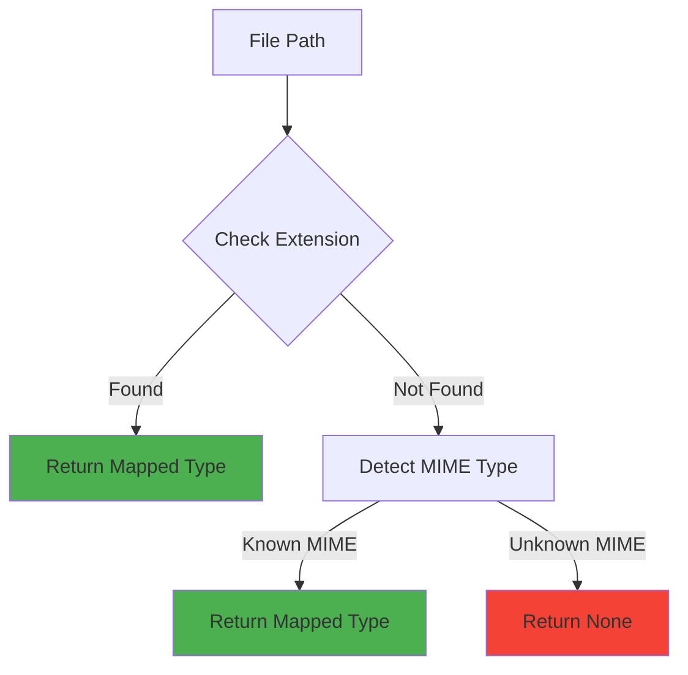

# File Analyzer

## Table of Contents
- [Overview](#overview)
- [Class: FileAnalyzer](#class-fileanalyzer)
- [Methods](#methods)
- [File Type Detection](#file-type-detection)
- [Validation Rules](#validation-rules)
- [Usage Examples](#usage-examples)
- [Error Handling](#error-handling)
- [Integration Guide](#integration-guide)

---

## Overview

### Purpose
`file_analyzer.py` provides **comprehensive file validation and analysis** before processing. The `FileAnalyzer` class performs file existence checks, type detection, size analysis, and security validations to ensure only valid, supported files enter the processing pipeline.

### Key Features
- ✅ **File validation** - Existence, readability, type checks
- ✅ **Type detection** - Extension and MIME type-based classification
- ✅ **Security checks** - File permissions and access validation
- ✅ **Size analysis** - Human-readable size formatting
- ✅ **Batch validation** - Efficient validation of multiple files
- ✅ **Detailed reporting** - Comprehensive file information and error messages

### Design Principles
Follows **AGENTS.md**:
- **Single Responsibility** - Only handles file analysis and validation
- **Defensibility** - Validates all inputs, fails fast with clear errors
- **Portability** - Uses `pathlib.Path` for cross-platform compatibility

### When to Use
- Before processing files in the pipeline
- Validating user-uploaded files
- Checking file compatibility with processing capabilities
- Generating file inventory reports

---

## Class: FileAnalyzer

### Location
```python
from src.document_processing.file_analyzer import FileAnalyzer
```

### Initialization

```python
def __init__(self, config: PipelineConfig)
```

**Parameters:**
- `config` (PipelineConfig): Pipeline configuration containing validation rules and supported file types

**Example:**
```python
from src.document_processing.file_analyzer import FileAnalyzer
from src.document_processing.pipeline_config import get_pipeline_config

config = get_pipeline_config()
analyzer = FileAnalyzer(config)
```

---

## Methods

### `analyze_files()`

**Analyze multiple files for validity and processing requirements.**

```python
def analyze_files(self, file_paths: List[Path]) -> Dict[str, Any]
```

**Parameters:**
- `file_paths` (List[Path]): List of file paths to analyze

**Returns:**
```python
{
    "valid_files": List[Path],        # Files that passed validation
    "errors": List[str],               # Error messages for invalid files
    "file_types": Dict[str, int],      # Count of each file type
    "total_size": int                  # Total size in bytes
}
```

**Validation Steps:**
1. Check file existence
2. Verify it's a file (not directory)
3. Check file size (non-zero)
4. Detect file type
5. Verify type is enabled in configuration
6. Check read permissions

**Example:**
```python
from pathlib import Path

analyzer = FileAnalyzer(config)

files = [
    Path("data/paper1.pdf"),
    Path("data/notes.md"),
    Path("data/summary.txt")
]

result = analyzer.analyze_files(files)

print(f"Valid files: {len(result['valid_files'])}")
print(f"Errors: {len(result['errors'])}")
print(f"File types: {result['file_types']}")  # e.g., {"PDF": 1, "Markdown": 1, "Text": 1}
print(f"Total size: {result['total_size']} bytes")
```

---

### `detect_file_type()`

**Detect file type based on extension and MIME type.**

```python
def detect_file_type(self, file_path: Path) -> str | None
```

**Parameters:**
- `file_path` (Path): Path to the file

**Returns:**
- `str`: File type ("PDF", "Text", "Markdown")
- `None`: If file type is unsupported

**Detection Strategy:**
1. **Primary:** Check file extension against mapping
2. **Fallback:** Use MIME type detection via `mimetypes` module

**Example:**
```python
from pathlib import Path

analyzer = FileAnalyzer(config)

# Detect by extension
file_type = analyzer.detect_file_type(Path("document.pdf"))
print(file_type)  # "PDF"

file_type = analyzer.detect_file_type(Path("notes.md"))
print(file_type)  # "Markdown"

# Unknown extension - uses MIME type
file_type = analyzer.detect_file_type(Path("file.unknown"))
print(file_type)  # None
```

---

### `get_file_info()`

**Get detailed information about a single file.**

```python
def get_file_info(self, file_path: Path) -> Dict[str, Any]
```

**Parameters:**
- `file_path` (Path): Path to the file

**Returns:**
```python
{
    "exists": bool,
    "path": str,
    "name": str,
    "size": int,                    # Size in bytes
    "size_human": str,              # Human-readable size (e.g., "1.5 MB")
    "file_type": str | None,        # Detected type
    "extension": str,
    "is_supported": bool,
    "processing_enabled": bool,
    "modified_time": float,         # Unix timestamp
    "is_readable": bool,
    # OR if error:
    "error": str
}
```

**Example:**
```python
from pathlib import Path

analyzer = FileAnalyzer(config)

info = analyzer.get_file_info(Path("data/document.pdf"))

print(f"File: {info['name']}")
print(f"Size: {info['size_human']}")
print(f"Type: {info['file_type']}")
print(f"Supported: {info['is_supported']}")
print(f"Processing enabled: {info['processing_enabled']}")
print(f"Readable: {info['is_readable']}")
```

---

### `validate_file_batch()`

**Validate a batch of files with comprehensive statistics.**

```python
def validate_file_batch(self, file_paths: List[Union[str, Path]]) -> Dict[str, Any]
```

**Parameters:**
- `file_paths` (List[Union[str, Path]]): List of file paths (strings or Path objects)

**Returns:**
```python
{
    "valid": bool,                          # True if all files valid
    "stats": {
        "total_files": int,
        "valid_files": int,
        "invalid_files": int,
        "total_size": int,
        "total_size_human": str,
        "file_type_distribution": Dict[str, int],
        "validation_passed": bool
    },
    "valid_files": List[Path],
    "errors": List[str]
}
```

**Example:**
```python
analyzer = FileAnalyzer(config)

files = ["data/doc1.pdf", "data/doc2.txt", "data/nonexistent.pdf"]

validation = analyzer.validate_file_batch(files)

if validation['valid']:
    print("✅ All files valid!")
else:
    print(f"❌ Validation failed: {len(validation['errors'])} errors")

# Access statistics
stats = validation['stats']
print(f"""
Batch Statistics:
  Total Files: {stats['total_files']}
  Valid Files: {stats['valid_files']}
  Invalid Files: {stats['invalid_files']}
  Total Size: {stats['total_size_human']}
  File Types: {stats['file_type_distribution']}
""")
```

---

### Private Methods

#### `_analyze_single_file()`
```python
def _analyze_single_file(self, file_path: Path) -> Dict[str, Any]
```
**Purpose:** Analyze a single file  
**Returns:** Analysis result with `valid`, `errors`, `file_type`, `size`

#### `_is_file_type_enabled()`
```python
def _is_file_type_enabled(self, file_type: str) -> bool
```
**Purpose:** Check if processing is enabled for file type  
**Returns:** `True` if enabled, `False` otherwise

#### `_format_file_size()`
```python
def _format_file_size(self, size_bytes: int) -> str
```
**Purpose:** Format file size in human-readable format  
**Returns:** Formatted string (e.g., "1.5 MB", "256 KB", "512 bytes")

---

## File Type Detection

### Supported File Types

| File Type | Extensions | MIME Type | Configuration Key |
|-----------|------------|-----------|-------------------|
| **PDF** | `.pdf` | `application/pdf` | `enable_pdf_processing` |
| **Text** | `.txt`, `.text` | `text/plain` | `enable_text_processing` |
| **Markdown** | `.md`, `.markdown` | `text/markdown` | `enable_markdown_processing` |

### Extension Mapping

Configured in `pipeline_config.yaml`:

```yaml
extension_to_type_mapping:
  .pdf: "PDF"
  .txt: "Text"
  .text: "Text"
  .md: "Markdown"
  .markdown: "Markdown"
```

### MIME Type Mapping

Used as fallback when extension is unknown:

```python
mime_to_type = {
    "application/pdf": "PDF",
    "text/plain": "Text",
    "text/markdown": "Markdown"
}
```

### Detection Algorithm



---

## Validation Rules

### File Existence
```python
if not file_path.exists():
    errors.append(f"File does not exist: {file_path}")
```

### File Type Check
```python
if not file_path.is_file():
    errors.append(f"Path is not a file: {file_path}")
```

### Size Validation
```python
if file_size == 0:
    errors.append(f"File is empty: {file_path}")
```

### Type Support
```python
if file_type and not self._is_file_type_enabled(file_type):
    errors.append(f"File type {file_type} processing is disabled: {file_path}")
```

### Permission Check
```python
if not os.access(file_path, os.R_OK):
    errors.append(f"File is not readable: {file_path}")
```

---

## Usage Examples

### Example 1: Basic File Analysis

```python
from pathlib import Path
from src.document_processing.file_analyzer import FileAnalyzer
from src.document_processing.pipeline_config import get_pipeline_config

config = get_pipeline_config()
analyzer = FileAnalyzer(config)

# Analyze single file
info = analyzer.get_file_info(Path("data/document.pdf"))

if info['exists']:
    print(f"✅ {info['name']}")
    print(f"   Type: {info['file_type']}")
    print(f"   Size: {info['size_human']}")
    print(f"   Supported: {info['is_supported']}")
else:
    print(f"❌ {info['error']}")
```

### Example 2: Batch Validation

```python
from pathlib import Path

analyzer = FileAnalyzer(config)

# Collect all files from directory
files = list(Path("data").glob("*.*"))

# Analyze batch
result = analyzer.analyze_files(files)

# Report results
print(f"Analyzed {len(files)} files:")
print(f"  Valid: {len(result['valid_files'])}")
print(f"  Invalid: {len(result['errors'])}")
print(f"  Total size: {result['total_size'] / (1024**2):.2f} MB")

# Show file type distribution
for file_type, count in result['file_types'].items():
    print(f"  {file_type}: {count} files")
```

### Example 3: Pre-Processing Validation

```python
from pathlib import Path

def validate_before_processing(files: List[Path]) -> bool:
    """Validate files before starting expensive processing."""
    analyzer = FileAnalyzer(config)
    
    validation = analyzer.validate_file_batch(files)
    
    if not validation['valid']:
        print("❌ Validation failed:")
        for error in validation['errors']:
            print(f"  - {error}")
        return False
    
    stats = validation['stats']
    print(f"✅ Validation passed")
    print(f"   Files: {stats['valid_files']}")
    print(f"   Size: {stats['total_size_human']}")
    print(f"   Types: {stats['file_type_distribution']}")
    
    return True

# Use validation
files = [Path("data/doc1.pdf"), Path("data/doc2.txt")]
if validate_before_processing(files):
    # Proceed with processing
    orchestrator.process_documents(files)
```

### Example 4: Type-Specific File Collection

```python
from pathlib import Path

def collect_files_by_type(directory: Path) -> Dict[str, List[Path]]:
    """Collect and organize files by detected type."""
    analyzer = FileAnalyzer(config)
    
    all_files = list(directory.glob("*.*"))
    files_by_type = {}
    
    for file_path in all_files:
        file_type = analyzer.detect_file_type(file_path)
        
        if file_type:
            if file_type not in files_by_type:
                files_by_type[file_type] = []
            files_by_type[file_type].append(file_path)
    
    return files_by_type

# Use collection
files = collect_files_by_type(Path("data"))
for file_type, paths in files.items():
    print(f"{file_type}: {len(paths)} files")
```

### Example 5: Detailed File Inspection

```python
from pathlib import Path
from datetime import datetime

def inspect_file(file_path: Path):
    """Print detailed file inspection report."""
    analyzer = FileAnalyzer(config)
    info = analyzer.get_file_info(file_path)
    
    if not info['exists']:
        print(f"❌ File not found: {file_path}")
        return
    
    print(f"""
File Inspection Report
======================
Name: {info['name']}
Path: {info['path']}
Size: {info['size_human']} ({info['size']:,} bytes)
Type: {info['file_type'] or 'Unknown'}
Extension: {info['extension']}
Supported: {'✅ Yes' if info['is_supported'] else '❌ No'}
Processing Enabled: {'✅ Yes' if info['processing_enabled'] else '❌ No'}
Readable: {'✅ Yes' if info['is_readable'] else '❌ No'}
Last Modified: {datetime.fromtimestamp(info['modified_time']).strftime('%Y-%m-%d %H:%M:%S')}
""")

# Use inspection
inspect_file(Path("data/document.pdf"))
```

### Example 6: Custom Validation Logic

```python
from pathlib import Path

def validate_with_size_limits(files: List[Path], max_size_mb: float = 10.0) -> Dict[str, Any]:
    """Validate files with custom size limits."""
    analyzer = FileAnalyzer(config)
    
    # Get basic validation
    validation = analyzer.validate_file_batch(files)
    
    # Add custom size validation
    max_size_bytes = max_size_mb * 1024 * 1024
    oversized_files = []
    
    for file_path in validation['valid_files']:
        info = analyzer.get_file_info(file_path)
        if info['size'] > max_size_bytes:
            oversized_files.append(f"{file_path}: {info['size_human']} exceeds {max_size_mb} MB limit")
    
    if oversized_files:
        validation['valid'] = False
        validation['errors'].extend(oversized_files)
    
    return validation

# Use custom validation
files = [Path("data/large_file.pdf")]
validation = validate_with_size_limits(files, max_size_mb=5.0)

if not validation['valid']:
    print("Validation failed:")
    for error in validation['errors']:
        print(f"  - {error}")
```

---

## Error Handling

### Error Types

1. **File Not Found**
   ```python
   "File does not exist: /path/to/file.pdf"
   ```

2. **Not a File**
   ```python
   "Path is not a file: /path/to/directory"
   ```

3. **Empty File**
   ```python
   "File is empty: /path/to/file.txt"
   ```

4. **Unsupported Type**
   ```python
   "Unsupported file type: /path/to/file.xyz"
   ```

5. **Type Disabled**
   ```python
   "File type PDF processing is disabled: /path/to/file.pdf"
   ```

6. **Permission Denied**
   ```python
   "File is not readable: /path/to/file.pdf"
   ```

7. **Access Error**
   ```python
   "Cannot access file /path/to/file.pdf: Permission denied"
   ```

### Error Recovery Pattern

```python
from pathlib import Path

def safe_file_analysis(files: List[Path]) -> Dict[str, Any]:
    """Analyze files with error recovery."""
    analyzer = FileAnalyzer(config)
    
    try:
        result = analyzer.analyze_files(files)
        
        if result['errors']:
            # Log errors but continue
            logger.warning(f"Analysis found {len(result['errors'])} errors")
            for error in result['errors']:
                logger.debug(f"  {error}")
        
        return result
    
    except Exception as e:
        # Catastrophic failure - return empty result
        logger.error(f"File analysis crashed: {e}")
        return {
            "valid_files": [],
            "errors": [f"Analysis failed: {str(e)}"],
            "file_types": {},
            "total_size": 0
        }
```

---

## Integration Guide

### With Pipeline Orchestrator

The orchestrator uses `FileAnalyzer` as the first step:

```python
class DocumentPipelineOrchestrator:
    def process_documents(self, file_paths: List[Path]) -> Dict[str, Any]:
        # Step 1: Analyze files
        analysis_result = self.file_analyzer.analyze_files(file_paths)
        valid_files = analysis_result["valid_files"]
        
        if not valid_files:
            return {
                "documents": [],
                "errors": analysis_result["errors"],
                "stats": {...}
            }
        
        # Continue with valid files...
```

### Standalone Usage

Use independently for file validation:

```python
from src.document_processing.file_analyzer import FileAnalyzer
from src.document_processing.pipeline_config import get_pipeline_config

# Initialize
config = get_pipeline_config()
analyzer = FileAnalyzer(config)

# Validate files before any processing
files = [Path("data/file1.pdf"), Path("data/file2.txt")]
validation = analyzer.validate_file_batch(files)

if validation['valid']:
    # Safe to proceed
    pass
else:
    # Handle errors
    for error in validation['errors']:
        print(error)
```

### With Custom Configuration

```python
from src.document_processing.pipeline_config import PipelineConfig, ProcessingConfig

# Create custom config
config = PipelineConfig()
config.processing = ProcessingConfig(
    enable_pdf_processing=True,
    enable_text_processing=False,  # Disable text files
    enable_markdown_processing=True
)

analyzer = FileAnalyzer(config)

# Only PDF and Markdown files will be valid
result = analyzer.analyze_files(files)
```

---

## Configuration Reference

### File Types Configuration

```yaml
supported_mime_types:
  - "application/pdf"
  - "text/plain"
  - "text/markdown"

supported_extensions:
  - ".pdf"
  - ".txt"
  - ".text"
  - ".md"
  - ".markdown"

extension_to_type_mapping:
  .pdf: "PDF"
  .txt: "Text"
  .text: "Text"
  .md: "Markdown"
  .markdown: "Markdown"
```

### Processing Options

```yaml
processing_options:
  enable_pdf_processing: true
  enable_text_processing: true
  enable_markdown_processing: true
```

### Validation Options

```yaml
validation:
  validate_inputs: true
  check_file_existence: true
```

### File Size Thresholds

```yaml
file_size_thresholds:
  kb: 1024
  mb: 1048576
```

---

## Dependencies

### Internal Dependencies
- `src.document_processing.pipeline_config.PipelineConfig`
- `src.core.logging.get_logger`

### External Dependencies
- `pathlib.Path` - Cross-platform path handling
- `mimetypes` - MIME type detection
- `os` - File permissions and access checks
- `typing` - Type hints

---

## See Also
- [Overview](./overview.md) - Module architecture
- [Pipeline Orchestrator](./pipeline_orchestrator.md) - Main coordinator
- [Document Converter](./document_converter.md) - File conversion
- [Pipeline Config](./pipeline_config.md) - Configuration management
