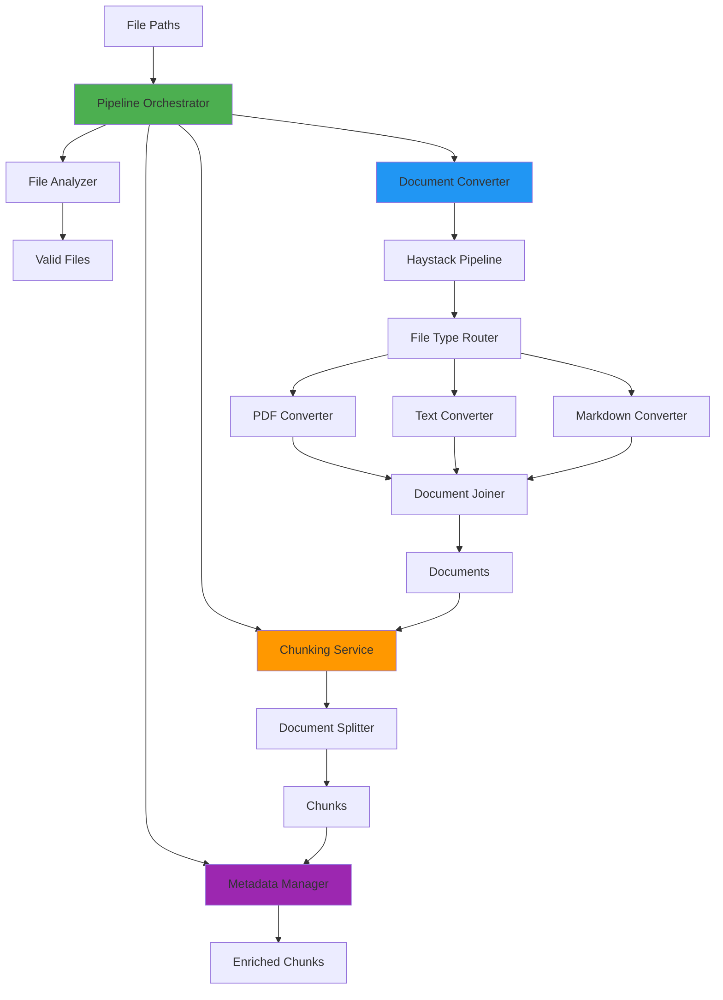

# Document Processing Module

## 📋 Table of Contents
- [Overview](#overview)
- [Architecture](#architecture)
- [Module Structure](#module-structure)
- [Quick Start](#quick-start)
- [Key Concepts](#key-concepts)
- [Configuration](#configuration)
- [Common Use Cases](#common-use-cases)
- [Integration Guide](#integration-guide)
- [Performance Considerations](#performance-considerations)

## Overview

The **Document Processing Module** is a comprehensive system for converting, chunking, and enriching documents from multiple file formats (PDF, Text, Markdown) into structured Haystack `Document` objects ready for downstream processing like embedding generation and vector storage.

### Purpose
- **File Analysis**: Validate files, detect types, check permissions
- **Document Conversion**: Convert PDF/Text/Markdown files to Haystack Documents
- **Intelligent Chunking**: Split documents into semantic chunks with configurable overlap
- **Metadata Management**: Enrich chunks with standard, processing, and citation metadata
- **Pipeline Orchestration**: Coordinate the entire processing workflow

### Key Features
✅ Support for multiple file formats (PDF, TXT, MD)  
✅ Intelligent chunking with boundary detection  
✅ Lazy-loaded service architecture  
✅ Comprehensive metadata enrichment  
✅ YAML-based configuration with environment overrides  
✅ Robust error handling and statistics tracking  
✅ Haystack integration for ML pipeline compatibility  

## Architecture

### Design Patterns



### Component Responsibilities

| Component | Responsibility | Pattern |
|-----------|---------------|---------|
| **PipelineOrchestrator** | Coordinate entire workflow | Facade |
| **FileAnalyzer** | Validate and analyze files | Validator |
| **DocumentConverter** | Convert files to Documents | Strategy |
| **ChunkingService** | Split documents into chunks | Strategy |
| **MetadataManager** | Enrich with metadata | Decorator |
| **PipelineConfig** | Configuration management | Singleton |

### Data Flow

```
1. Input: List[Union[str, Path]]
   ↓
2. FileAnalyzer: Validate existence, type, permissions
   ↓
3. Group by type: {PDF: [...], Text: [...], Markdown: [...]}
   ↓
4. DocumentConverter: Build Haystack Pipeline → Convert files
   ↓
5. ChunkingService: Split using DocumentSplitter → Create chunks
   ↓
6. MetadataManager: Add standard/processing/citation metadata
   ↓
7. Output: {documents: List[Document], errors: List[str], stats: Dict}
```

## Module Structure

```
src/document_processing/
├── __init__.py                    # Package initializer (empty)
├── doc_processor.py               # Legacy monolithic processor (660 lines)
├── pipeline_orchestrator.py      # High-level workflow coordinator (294 lines)
├── file_analyzer.py              # File validation & type detection (279 lines)
├── document_converter.py         # Haystack-based file conversion (288 lines)
├── chunking_service.py           # Intelligent document chunking (266 lines)
├── metadata_manager.py           # Centralized metadata management (318 lines)
└── pipeline_config.py            # Configuration with YAML support (332 lines)
```

### File Responsibilities

| File | Lines | Purpose | Entry Point |
|------|-------|---------|-------------|
| `pipeline_orchestrator.py` | 294 | Main workflow coordinator | `DocumentPipelineOrchestrator.process_documents()` |
| `file_analyzer.py` | 279 | File validation & type detection | `FileAnalyzer.analyze_files()` |
| `document_converter.py` | 288 | File → Document conversion | `DocumentConverter.convert_files()` |
| `chunking_service.py` | 266 | Document → Chunks splitting | `ChunkingService.chunk_documents()` |
| `metadata_manager.py` | 318 | Metadata enrichment | `MetadataManager.enhance_metadata()` |
| `pipeline_config.py` | 332 | Configuration management | `get_pipeline_config()` |
| `doc_processor.py` | 660 | Legacy all-in-one processor | `DocumentProcessor.run()` |

## Quick Start

### Basic Usage (Recommended)

```python
from src.document_processing.pipeline_orchestrator import DocumentPipelineOrchestrator

# Initialize orchestrator (uses default config)
orchestrator = DocumentPipelineOrchestrator()

# Process multiple files
result = orchestrator.process_documents([
    "research_paper.pdf",
    "notes.txt",
    "readme.md"
])

# Access results
print(f"✅ Processed: {result['stats']['files_processed']} files")
print(f"📄 Created: {result['stats']['documents_created']} chunks")
print(f"⏱️  Time: {result['stats']['processing_time']:.2f}s")
print(f"❌ Errors: {len(result['errors'])}")

# Iterate through chunks
for doc in result["documents"]:
    print(f"Chunk {doc.meta['chunk_index']}: {doc.meta['source_file']}")
    print(f"  Content: {doc.content[:100]}...")
    print(f"  Size: {doc.meta['chunk_size']} chars")
```

### Custom Configuration

```python
from src.document_processing.pipeline_config import PipelineConfig, ChunkingConfig
from src.document_processing.pipeline_orchestrator import DocumentPipelineOrchestrator

# Create custom configuration
custom_config = PipelineConfig(
    chunking=ChunkingConfig(
        chunk_size=2000,           # Larger chunks
        chunk_overlap=400,         # More overlap
        min_chunk_size_ratio=0.6   # Stricter minimum
    )
)

# Use custom config
orchestrator = DocumentPipelineOrchestrator(config=custom_config)
result = orchestrator.process_documents(["large_document.pdf"])
```

### Environment Variable Configuration

```bash
# Set environment variables
export PIPELINE_CHUNK_SIZE=1500
export PIPELINE_CHUNK_OVERLAP=300
export PIPELINE_FAIL_FAST=false

# Python will automatically pick up env vars
python process_docs.py
```

## Key Concepts

### 1. Documents vs Chunks

**Document**: A Haystack `Document` object representing a complete file or a chunk of content.

```python
from haystack.dataclasses import Document

doc = Document(
    content="Your text content here...",
    meta={
        "source_file": "document.pdf",
        "source_type": "PDF",
        "page_number": 1
    }
)
```

**Chunk**: A smaller piece of a document, created by the chunking service.

```python
# After chunking, each chunk is also a Document with enhanced metadata
chunk = Document(
    content="Chunk content...",
    meta={
        "chunk_id": "abc123",
        "chunk_index": 0,
        "source_file": "document.pdf",
        "chunk_size": 1000,
        "parent_content_hash": "xyz789"
    }
)
```

### 2. Chunking Strategy

The module uses **word-based splitting** with configurable parameters:

- **chunk_size**: Target number of characters per chunk (default: 1000)
- **chunk_overlap**: Characters to overlap between consecutive chunks (default: 200)
- **boundary_preferences**: Preferred split points (paragraph > sentence > line)

**Why Overlap?**
Overlap ensures context continuity. When searching or embedding, boundary content isn't lost.

```
Chunk 1: [----------------|overlap]
Chunk 2:          [overlap|----------------|overlap]
Chunk 3:                   [overlap|----------------]
```

### 3. Metadata Structure

Each processed chunk contains rich metadata:

```python
{
    # Standard metadata
    "chunk_id": "md5_hash_of_content",
    "chunk_index": 0,
    "source_file": "document.pdf",
    "source_type": "PDF",
    "page_number": 1,
    
    # Processing metadata
    "content_hash": "abc123",
    "chunk_size": 1000,
    "word_count": 150,
    "line_count": 10,
    "processing_date": "2025-12-07T10:30:00",
    "pipeline_version": "1.0.0",
    
    # Citation metadata
    "citation": {
        "source": "document.pdf",
        "type": "PDF",
        "page": 1,
        "chunk": 0
    },
    
    # Chunking metadata
    "start_char": 0,
    "end_char": 1000,
    "boundary_found": True,
    "boundary_type": "paragraph"
}
```

### 4. File Type Routing

The system uses Haystack's `FileTypeRouter` to intelligently route files:

```python
# Router detects MIME type and routes to appropriate converter
Router → PDF → PyPDFToDocument
Router → Text → TextFileToDocument  
Router → Markdown → MarkdownToDocument (with fallback to Text)
```

### 5. Error Handling Modes

**Fail Fast** (default: `true`):
```python
# Stops processing on first error
config.error_handling.fail_fast = True
```

**Continue on Error**:
```python
# Processes all files, collects errors
config.error_handling.fail_fast = False
config.error_handling.continue_on_individual_file_error = True
```

## Configuration

### Configuration File Structure

Location: `src/config/document_processing.yaml`

```yaml
# Chunking configuration
chunking:
  chunk_size: 1000                    # Target characters per chunk
  chunk_overlap: 200                  # Overlap between chunks
  min_chunk_size_ratio: 0.5          # Min chunk size as ratio of target
  boundary_preferences:               # Boundary detection order
    - paragraph
    - sentence
    - line
  enable_statistics: true             # Track chunking stats
  enable_preview: true                # Include content preview
  preview_length: 200                 # Preview character length

# Supported file types
supported_mime_types:
  - application/pdf
  - text/plain
  - text/markdown

supported_extensions:
  - .pdf
  - .txt
  - .text
  - .md
  - .markdown

# Extension to type mapping
extension_to_type_mapping:
  .pdf: PDF
  .txt: Text
  .text: Text
  .md: Markdown
  .markdown: Markdown

# Metadata field names
metadata_fields:
  chunk_id: chunk_id
  chunk_index: chunk_index
  source_file: source_file
  source_type: source_type
  page_number: page_number
  content_hash: content_hash
  start_char: start_char
  end_char: end_char

# Processing options
processing_options:
  enable_pdf_processing: true
  enable_text_processing: true
  enable_markdown_processing: true
  enable_markdown_fallback: true       # Fallback to text if MD fails

# Performance settings
performance:
  enable_timing: true                  # Track processing time
  enable_statistics: true              # Collect detailed stats
  enable_progress_tracking: true       # Log progress updates

# Validation settings
validation:
  validate_inputs: true                # Validate before processing
  validate_outputs: true               # Validate after processing
  check_file_existence: true           # Check files exist
  validate_metadata: true              # Validate metadata structure

# Error handling
error_handling:
  fail_fast: true                      # Stop on first error
  continue_on_individual_file_error: true  # Continue if single file fails
```

### Environment Variable Overrides

All configuration can be overridden via environment variables:

```bash
# Chunking
export PIPELINE_CHUNK_SIZE=2000
export PIPELINE_CHUNK_OVERLAP=400
export PIPELINE_MIN_CHUNK_SIZE_RATIO=0.6

# Processing
export PIPELINE_ENABLE_PDF_PROCESSING=true
export PIPELINE_ENABLE_MARKDOWN_FALLBACK=true

# Performance
export PIPELINE_ENABLE_TIMING=true
export PIPELINE_ENABLE_STATISTICS=true

# Error handling
export PIPELINE_FAIL_FAST=false
export PIPELINE_CONTINUE_ON_INDIVIDUAL_FILE_ERROR=true
```

### Loading Configuration

```python
# Load default configuration
from src.document_processing.pipeline_config import get_pipeline_config

config = get_pipeline_config()
print(f"Chunk size: {config.chunking.chunk_size}")

# Reload configuration (force reload from disk)
from src.document_processing.pipeline_config import reload_pipeline_config

config = reload_pipeline_config()

# Create custom configuration in code
from src.document_processing.pipeline_config import PipelineConfig, ChunkingConfig

config = PipelineConfig(
    chunking=ChunkingConfig(chunk_size=1500, chunk_overlap=300)
)
```

## Common Use Cases

### Use Case 1: Process Research Papers

```python
from src.document_processing.pipeline_orchestrator import DocumentPipelineOrchestrator

orchestrator = DocumentPipelineOrchestrator()

# Process multiple PDFs
papers = [
    "papers/machine_learning.pdf",
    "papers/deep_learning.pdf",
    "papers/nlp_survey.pdf"
]

result = orchestrator.process_documents(papers)

# Filter chunks by page number
page_1_chunks = [
    doc for doc in result["documents"] 
    if doc.meta.get("page_number") == 1
]

print(f"Found {len(page_1_chunks)} chunks from page 1")
```

### Use Case 2: Large Document with Custom Chunking

```python
from src.document_processing.pipeline_config import PipelineConfig, ChunkingConfig
from src.document_processing.pipeline_orchestrator import DocumentPipelineOrchestrator

# Large chunks for better context
config = PipelineConfig(
    chunking=ChunkingConfig(
        chunk_size=3000,
        chunk_overlap=600,
        min_chunk_size_ratio=0.7
    )
)

orchestrator = DocumentPipelineOrchestrator(config=config)
result = orchestrator.process_documents(["thesis.pdf"])

# Verify chunk sizes
for doc in result["documents"]:
    size = doc.meta["chunk_size"]
    if size < 2100:  # 0.7 * 3000
        print(f"Warning: Small chunk detected ({size} chars)")
```

### Use Case 3: Batch Processing with Error Handling

```python
from pathlib import Path
from src.document_processing.pipeline_config import (
    PipelineConfig, ErrorHandlingConfig
)
from src.document_processing.pipeline_orchestrator import DocumentPipelineOrchestrator

# Configure to continue on errors
config = PipelineConfig(
    error_handling=ErrorHandlingConfig(
        fail_fast=False,
        continue_on_individual_file_error=True
    )
)

orchestrator = DocumentPipelineOrchestrator(config=config)

# Process entire directory
doc_dir = Path("documents/")
files = list(doc_dir.glob("**/*"))

result = orchestrator.process_documents(files)

# Report results
print(f"✅ Successfully processed: {result['stats']['files_processed']}")
print(f"❌ Failed: {len(result['errors'])}")

for error in result["errors"]:
    print(f"  Error: {error}")
```

### Use Case 4: Extract Specific Pages

```python
orchestrator = DocumentPipelineOrchestrator()
result = orchestrator.process_documents(["document.pdf"])

# Extract only introduction (pages 1-3)
intro_chunks = [
    doc for doc in result["documents"]
    if 1 <= doc.meta.get("page_number", 0) <= 3
]

# Concatenate intro content
intro_text = "\n\n".join(doc.content for doc in intro_chunks)
print(f"Introduction:\n{intro_text}")
```

### Use Case 5: Validate Before Processing

```python
from pathlib import Path
from src.document_processing.file_analyzer import FileAnalyzer
from src.document_processing.pipeline_config import get_pipeline_config
from src.document_processing.pipeline_orchestrator import DocumentPipelineOrchestrator

# First, analyze files
analyzer = FileAnalyzer(get_pipeline_config())
files = [Path("doc1.pdf"), Path("doc2.txt"), Path("missing.pdf")]

analysis = analyzer.analyze_files(files)

print(f"Valid files: {len(analysis['valid_files'])}")
print(f"Errors: {len(analysis['errors'])}")

# Process only valid files
if analysis["valid_files"]:
    orchestrator = DocumentPipelineOrchestrator()
    result = orchestrator.process_documents(analysis["valid_files"])
```

## Integration Guide

### Integration with Embeddings Module

```python
from src.document_processing.pipeline_orchestrator import DocumentPipelineOrchestrator
from src.embeddings.embedding_generator import EmbeddingGenerator

# Step 1: Process documents
orchestrator = DocumentPipelineOrchestrator()
result = orchestrator.process_documents(["document.pdf"])

chunks = result["documents"]

# Step 2: Generate embeddings
embedding_gen = EmbeddingGenerator()
embedded_docs = embedding_gen.embed_documents(chunks)

print(f"Generated embeddings for {len(embedded_docs)} chunks")
```

### Integration with Vector Database

```python
from src.document_processing.pipeline_orchestrator import DocumentPipelineOrchestrator
from src.vector_database.qdrant_db import QdrantVectorDB

# Step 1: Process documents
orchestrator = DocumentPipelineOrchestrator()
result = orchestrator.process_documents(["knowledge_base.pdf"])

# Step 2: Store in vector database
vector_db = QdrantVectorDB()
vector_db.add_documents(result["documents"])

print(f"Stored {len(result['documents'])} chunks in vector database")
```

### Integration with RAG System

```python
from src.document_processing.pipeline_orchestrator import DocumentPipelineOrchestrator
from src.rag.factories.rag_factory import RAGFactory
from src.rag.config.rag_config import RAGConfig

# Step 1: Process documents
orchestrator = DocumentPipelineOrchestrator()
result = orchestrator.process_documents(["data.pdf"])

# Step 2: Create RAG system
config = RAGConfig.from_yaml("config/rag.yml")
rag_system = RAGFactory.create_from_config(config)

# Step 3: Add documents to RAG
rag_system.add_documents(result["documents"])

# Step 4: Query
response = rag_system.generate_response("What is the main topic?")
print(response.answer)
```

## Performance Considerations

### Chunk Size Trade-offs

| Chunk Size | Pros | Cons | Best For |
|------------|------|------|----------|
| Small (500-1000) | Precise search, faster embedding | Loss of context | FAQs, short answers |
| Medium (1000-2000) | Balanced | Default | General use |
| Large (2000-4000) | More context | Slower, less precise | Long-form content |

### Processing Time Benchmarks

Approximate processing times (Intel Core i7, 16GB RAM):

| File Type | Size | Documents | Chunks | Time |
|-----------|------|-----------|--------|------|
| PDF | 1 MB | 1 | ~50 | 2-3s |
| PDF | 10 MB | 1 | ~500 | 15-20s |
| Text | 1 MB | 1 | ~50 | 0.5-1s |
| Markdown | 1 MB | 1 | ~50 | 0.5-1s |

### Memory Usage

- **PDF Processing**: ~10-20 MB per file
- **Chunking**: ~1-2 MB per 100 chunks
- **Peak Memory**: ~50-100 MB for typical workload

### Optimization Tips

1. **Batch Processing**: Process multiple files together
2. **Lazy Loading**: Use orchestrator's lazy-loaded services
3. **Chunk Size**: Larger chunks = fewer chunks = faster processing
4. **Disable Features**: Turn off stats/timing in production
5. **Error Handling**: Use `continue_on_error` for robustness

```python
# Optimized configuration for production
config = PipelineConfig(
    chunking=ChunkingConfig(
        chunk_size=2000,  # Larger chunks
        enable_statistics=False,  # Disable stats
        enable_preview=False  # Disable preview
    ),
    performance=PerformanceConfig(
        enable_timing=False,  # Disable timing
        enable_progress_tracking=False  # Disable progress logs
    )
)
```

---

## Next Steps

- Read individual file documentation for detailed API reference
- See [pipeline_orchestrator.md](./pipeline_orchestrator.md) for workflow details
- See [chunking_service.md](./chunking_service.md) for chunking strategies
- Check [examples/](../examples/document_processing/) for more code samples

## Related Modules

- **[Embeddings](../embeddings/overview.md)**: Generate vector embeddings from chunks
- **[Vector Database](../vector_database/overview.md)**: Store and search chunks
- **[RAG](../rag/overview.md)**: Build RAG systems with processed documents
