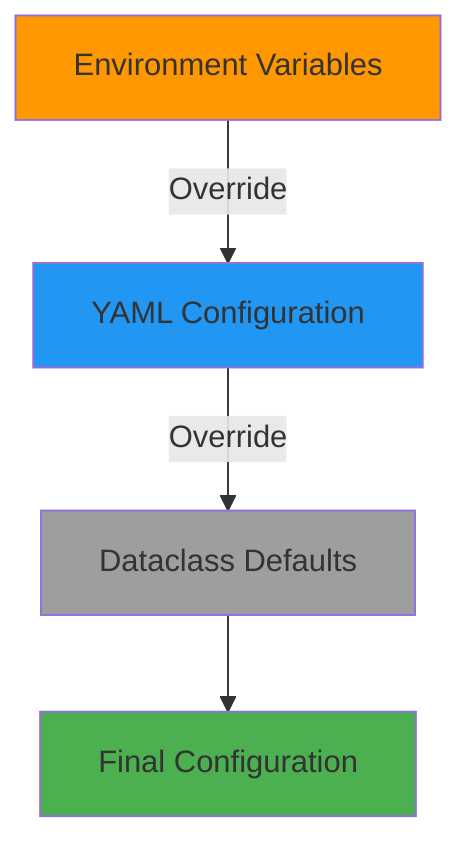

# Pipeline Configuration

## Table of Contents
- [Overview](#overview)
- [Configuration Classes](#configuration-classes)
- [Configuration Loader](#configuration-loader)
- [YAML Structure](#yaml-structure)
- [Environment Variables](#environment-variables)
- [Usage Examples](#usage-examples)
- [Validation](#validation)
- [Best Practices](#best-practices)

---

## Overview

### Purpose
`pipeline_config.py` provides **centralized configuration management** for the document processing pipeline. It loads settings from YAML files with environment variable overrides, validates configuration values, and provides type-safe access via dataclasses.

### Key Features
- ✅ **YAML-based configuration** - Human-readable, version-controllable
- ✅ **Environment variable overrides** - Flexible runtime configuration
- ✅ **Type-safe dataclasses** - Auto-completion and type checking
- ✅ **Validation** - Automatic validation of configuration values
- ✅ **Singleton pattern** - Global configuration instance
- ✅ **Deep merging** - Hierarchical configuration composition

### Design Principles
- **Portability** - No hardcoded values
- **Defensibility** - Validates all configuration values
- **Extensibility** - Easy to add new configuration sections

### When to Use
- Initializing pipeline components
- Customizing processing behavior
- Runtime configuration overrides
- Testing with different configurations

---

## Configuration Classes

### PipelineConfig (Main Container)

**The top-level configuration container.**

```python
@dataclass
class PipelineConfig:
    chunking: ChunkingConfig
    file_types: FileTypeConfig
    metadata: MetadataConfig
    performance: PerformanceConfig
    processing: ProcessingConfig
    validation: ValidationConfig
    error_handling: ErrorHandlingConfig
    file_size_thresholds: Dict[str, int]
```

**Example:**
```python
from src.document_processing.pipeline_config import get_pipeline_config

config = get_pipeline_config()

print(f"Chunk size: {config.chunking.chunk_size}")
print(f"PDF enabled: {config.processing.enable_pdf_processing}")
print(f"Fail fast: {config.error_handling.fail_fast}")
```

---

### ChunkingConfig

**Configuration for document chunking.**

```python
@dataclass
class ChunkingConfig:
    chunk_size: int = 1000                        # Target chunk size (words)
    chunk_overlap: int = 200                      # Overlap between chunks (words)
    min_chunk_size_ratio: float = 0.5             # Minimum chunk size ratio
    boundary_preferences: List[str] = [...]       # Preferred split boundaries
    enable_statistics: bool = True
    enable_preview: bool = True
    preview_length: int = 200
```

**Validation:**
- `chunk_size` must be positive
- `chunk_overlap` must be non-negative and less than `chunk_size`
- `min_chunk_size_ratio` must be between 0 and 1

**Example:**
```python
config = get_pipeline_config()

# Access chunking configuration
print(f"Chunk size: {config.chunking.chunk_size} words")
print(f"Overlap: {config.chunking.chunk_overlap} words")
print(f"Boundaries: {config.chunking.boundary_preferences}")
```

---

### FileTypeConfig

**Configuration for supported file types and routing.**

```python
@dataclass
class FileTypeConfig:
    supported_mime_types: List[str] = [...]
    supported_extensions: List[str] = [...]
    extension_to_type_mapping: Dict[str, str] = {...}
```

**Default Values:**
```python
supported_mime_types = [
    "application/pdf",
    "text/plain",
    "text/markdown"
]

supported_extensions = [
    ".pdf", ".txt", ".text", ".md", ".markdown"
]

extension_to_type_mapping = {
    ".pdf": "PDF",
    ".txt": "Text",
    ".text": "Text",
    ".md": "Markdown",
    ".markdown": "Markdown"
}
```

**Example:**
```python
config = get_pipeline_config()

print(f"Supported types: {config.file_types.supported_extensions}")
print(f"PDF extension maps to: {config.file_types.extension_to_type_mapping['.pdf']}")
```

---

### MetadataConfig

**Configuration for metadata field names.**

```python
@dataclass
class MetadataConfig:
    chunk_id: str = "chunk_id"
    chunk_index: str = "chunk_index"
    source_file: str = "source_file"
    source_type: str = "source_type"
    page_number: str = "page_number"
    content_hash: str = "content_hash"
    start_char: str = "start_char"
    end_char: str = "end_char"
    word_count: str = "word_count"
    line_count: str = "line_count"
    boundary_found: str = "boundary_found"
    boundary_type: str = "boundary_type"
    processing_date: str = "processing_date"
```

**Purpose:** Allows customization of metadata field names for compatibility with different systems.

**Example:**
```python
config = get_pipeline_config()

# Use configured field names
chunk_id_field = config.metadata.chunk_id
source_field = config.metadata.source_file

# Access document metadata
print(f"Chunk ID: {document.meta[chunk_id_field]}")
print(f"Source: {document.meta[source_field]}")
```

---

### PerformanceConfig

**Configuration for performance monitoring and optimization.**

```python
@dataclass
class PerformanceConfig:
    enable_timing: bool = True
    enable_statistics: bool = True
    enable_progress_tracking: bool = True
```

**Example:**
```python
config = get_pipeline_config()

if config.performance.enable_timing:
    start_time = time.time()
    # ... processing ...
    elapsed = time.time() - start_time
```

---

### ProcessingConfig

**Configuration for document processing options.**

```python
@dataclass
class ProcessingConfig:
    enable_pdf_processing: bool = True
    enable_text_processing: bool = True
    enable_markdown_processing: bool = True
    enable_markdown_fallback: bool = True
```

**Example:**
```python
config = get_pipeline_config()

# Check if PDF processing is enabled
if config.processing.enable_pdf_processing:
    # Process PDFs
    pass
```

---

### ValidationConfig

**Configuration for input/output validation.**

```python
@dataclass
class ValidationConfig:
    validate_inputs: bool = True
    validate_outputs: bool = True
    check_file_existence: bool = True
    validate_metadata: bool = True
```

**Example:**
```python
config = get_pipeline_config()

if config.validation.validate_inputs:
    # Perform input validation
    pass
```

---

### ErrorHandlingConfig

**Configuration for error handling behavior.**

```python
@dataclass
class ErrorHandlingConfig:
    fail_fast: bool = True
    continue_on_individual_file_error: bool = True
```

**Behavior:**
- `fail_fast=True`: Stop processing on first error
- `fail_fast=False`: Collect errors and continue
- `continue_on_individual_file_error=True`: Skip failed files, continue with others

**Example:**
```python
config = get_pipeline_config()

if config.error_handling.fail_fast:
    # Raise exception on error
    raise Exception("Processing failed")
else:
    # Log error and continue
    logger.error("Error occurred, continuing...")
```

---

## Configuration Loader

### PipelineConfigLoader

**Loads configuration from YAML with environment overrides.**

```python
class PipelineConfigLoader:
    def __init__(self, config_path: Optional[Path] = None)
    def load_config(self) -> PipelineConfig
```

**Default Config Path:** `src/config/document_processing.yaml`

**Features:**
- Loads YAML configuration
- Applies environment variable overrides
- Validates configuration values
- Caches loaded configuration (singleton)
- Falls back to defaults if file missing

---

### Global Functions

#### `get_pipeline_config()`

**Get the global pipeline configuration instance.**

```python
def get_pipeline_config() -> PipelineConfig
```

**Returns:** Loaded and validated PipelineConfig (singleton)

**Example:**
```python
from src.document_processing.pipeline_config import get_pipeline_config

config = get_pipeline_config()
# Use config...
```

#### `reload_pipeline_config()`

**Reload configuration from disk.**

```python
def reload_pipeline_config() -> PipelineConfig
```

**Returns:** Freshly loaded PipelineConfig

**Use Case:** Testing or dynamic configuration updates

**Example:**
```python
from src.document_processing.pipeline_config import reload_pipeline_config

# Modify config file on disk
# ...

# Reload configuration
config = reload_pipeline_config()
```

---

## YAML Structure

### Complete YAML Example

```yaml
# src/config/document_processing.yaml

# Chunking configuration
chunking:
  chunk_size: 1000
  chunk_overlap: 200
  content_analysis:
    min_chunk_size_ratio: 0.5
    boundary_preferences:
      - paragraph
      - sentence
      - line
    enable_statistics: true
    enable_preview: true
    preview_length: 200

# File type support
supported_mime_types:
  - "application/pdf"
  - "text/plain"
  - "text/markdown"

supported_extensions:
  - ".pdf"
  - ".txt"
  - ".text"
  - ".md"
  - ".markdown"

extension_to_type_mapping:
  .pdf: "PDF"
  .txt: "Text"
  .text: "Text"
  .md: "Markdown"
  .markdown: "Markdown"

# Metadata field names
metadata_fields:
  chunk_id: "chunk_id"
  chunk_index: "chunk_index"
  source_file: "source_file"
  source_type: "source_type"
  page_number: "page_number"
  content_hash: "content_hash"
  start_char: "start_char"
  end_char: "end_char"
  word_count: "word_count"
  line_count: "line_count"
  boundary_found: "boundary_found"
  boundary_type: "boundary_type"
  processing_date: "processing_date"

# Performance options
performance:
  enable_timing: true
  enable_statistics: true
  enable_progress_tracking: true

# Processing options
processing_options:
  enable_pdf_processing: true
  enable_text_processing: true
  enable_markdown_processing: true
  enable_markdown_fallback: true

# Validation options
validation:
  validate_inputs: true
  validate_outputs: true
  check_file_existence: true
  validate_metadata: true

# Error handling
error_handling:
  fail_fast: true
  continue_on_individual_file_error: true

# File size thresholds
file_size_thresholds:
  kb: 1024
  mb: 1048576
```

---

## Environment Variables

### Supported Variables

| Environment Variable | Configuration Path | Type | Description |
|---------------------|-------------------|------|-------------|
| `PIPELINE_CHUNK_SIZE` | `chunking.chunk_size` | int | Target chunk size (words) |
| `PIPELINE_CHUNK_OVERLAP` | `chunking.chunk_overlap` | int | Chunk overlap (words) |
| `PIPELINE_ENABLE_TIMING` | `performance.enable_timing` | bool | Enable timing |
| `PIPELINE_FAIL_FAST` | `error_handling.fail_fast` | bool | Fail fast mode |

### Environment Variable Parsing

**Automatic type conversion:**
- `"true"` / `"false"` → `bool`
- `"123"` → `int`
- `"123.45"` → `float`
- Other → `str`

**Example:**
```bash
# Set environment variables
export PIPELINE_CHUNK_SIZE=1500
export PIPELINE_CHUNK_OVERLAP=300
export PIPELINE_FAIL_FAST=false
```

```python
# Load configuration (environment overrides applied)
config = get_pipeline_config()

print(f"Chunk size: {config.chunking.chunk_size}")  # 1500
print(f"Overlap: {config.chunking.chunk_overlap}")  # 300
print(f"Fail fast: {config.error_handling.fail_fast}")  # False
```

---

## Usage Examples

### Example 1: Basic Configuration Loading

```python
from src.document_processing.pipeline_config import get_pipeline_config

# Load configuration
config = get_pipeline_config()

# Access configuration values
print(f"Chunk size: {config.chunking.chunk_size}")
print(f"Chunk overlap: {config.chunking.chunk_overlap}")
print(f"PDF processing: {config.processing.enable_pdf_processing}")
```

### Example 2: Custom Configuration Object

```python
from src.document_processing.pipeline_config import (
    PipelineConfig,
    ChunkingConfig,
    ProcessingConfig
)

# Create custom configuration
config = PipelineConfig(
    chunking=ChunkingConfig(
        chunk_size=500,
        chunk_overlap=100
    ),
    processing=ProcessingConfig(
        enable_pdf_processing=True,
        enable_text_processing=False,
        enable_markdown_processing=True
    )
)

# Use custom config
from src.document_processing.chunking_service import ChunkingService

chunker = ChunkingService(config)
```

### Example 3: Environment Variable Overrides

```bash
# Shell
export PIPELINE_CHUNK_SIZE=2000
export PIPELINE_CHUNK_OVERLAP=400
```

```python
# Python
import os
from src.document_processing.pipeline_config import get_pipeline_config

# Verify environment variables
print(f"PIPELINE_CHUNK_SIZE: {os.getenv('PIPELINE_CHUNK_SIZE')}")

# Load configuration (with overrides)
config = get_pipeline_config()

# Environment overrides applied
print(f"Chunk size: {config.chunking.chunk_size}")  # 2000
print(f"Overlap: {config.chunking.chunk_overlap}")  # 400
```

### Example 4: Configuration Reload for Testing

```python
from src.document_processing.pipeline_config import get_pipeline_config, reload_pipeline_config
import os

# Load default configuration
config = get_pipeline_config()
print(f"Original chunk size: {config.chunking.chunk_size}")

# Change environment variable
os.environ['PIPELINE_CHUNK_SIZE'] = '1500'

# Reload configuration
config = reload_pipeline_config()
print(f"New chunk size: {config.chunking.chunk_size}")  # 1500
```

### Example 5: Custom Config File Path

```python
from pathlib import Path
from src.document_processing.pipeline_config import PipelineConfigLoader

# Load from custom location
config_path = Path("custom/config/pipeline.yaml")
loader = PipelineConfigLoader(config_path)
config = loader.load_config()

# Use custom configuration
print(f"Chunk size: {config.chunking.chunk_size}")
```

### Example 6: Configuration Inspection

```python
from src.document_processing.pipeline_config import get_pipeline_config

config = get_pipeline_config()

# Inspect chunking configuration
print("Chunking Configuration:")
print(f"  Size: {config.chunking.chunk_size} words")
print(f"  Overlap: {config.chunking.chunk_overlap} words")
print(f"  Min ratio: {config.chunking.min_chunk_size_ratio}")
print(f"  Boundaries: {', '.join(config.chunking.boundary_preferences)}")

# Inspect file types
print("\nSupported File Types:")
for ext, type_name in config.file_types.extension_to_type_mapping.items():
    print(f"  {ext} → {type_name}")

# Inspect processing options
print("\nProcessing Options:")
print(f"  PDF: {'✅ Enabled' if config.processing.enable_pdf_processing else '❌ Disabled'}")
print(f"  Text: {'✅ Enabled' if config.processing.enable_text_processing else '❌ Disabled'}")
print(f"  Markdown: {'✅ Enabled' if config.processing.enable_markdown_processing else '❌ Disabled'}")
```

### Example 7: Validation Configuration

```python
config = get_pipeline_config()

# Check validation settings
if config.validation.validate_inputs:
    print("✅ Input validation enabled")
    
    if config.validation.check_file_existence:
        print("  - File existence checks enabled")
    
    if config.validation.validate_metadata:
        print("  - Metadata validation enabled")
```

### Example 8: Error Handling Configuration

```python
config = get_pipeline_config()

def process_with_config_error_handling(files):
    """Process files using configured error handling."""
    try:
        result = process_documents(files)
        return result
    except Exception as e:
        if config.error_handling.fail_fast:
            # Re-raise exception
            raise
        else:
            # Log and continue
            logger.error(f"Processing failed: {e}")
            return {"documents": [], "errors": [str(e)]}
```

---

## Validation

### Validation Rules

#### ChunkingConfig Validation

```python
def __post_init__(self):
    if self.chunk_size <= 0:
        raise ValueError(f"chunk_size must be positive, got {self.chunk_size}")
    
    if self.chunk_overlap < 0:
        raise ValueError(f"chunk_overlap must be non-negative, got {self.chunk_overlap}")
    
    if self.chunk_overlap >= self.chunk_size:
        raise ValueError(
            f"chunk_overlap ({self.chunk_overlap}) must be less than "
            f"chunk_size ({self.chunk_size})"
        )
    
    if not 0 < self.min_chunk_size_ratio <= 1:
        raise ValueError(
            f"min_chunk_size_ratio must be between 0 and 1, "
            f"got {self.min_chunk_size_ratio}"
        )
```

**Valid Examples:**
```python
# ✅ Valid
ChunkingConfig(chunk_size=1000, chunk_overlap=200)
ChunkingConfig(chunk_size=500, chunk_overlap=100)

# ❌ Invalid
ChunkingConfig(chunk_size=0, chunk_overlap=200)  # ValueError: chunk_size must be positive
ChunkingConfig(chunk_size=1000, chunk_overlap=1000)  # ValueError: overlap >= chunk_size
ChunkingConfig(chunk_size=1000, chunk_overlap=-100)  # ValueError: overlap must be non-negative
```

### Error Messages

```python
# Invalid chunk size
ValueError: chunk_size must be positive, got 0

# Invalid overlap
ValueError: chunk_overlap must be non-negative, got -100

# Overlap too large
ValueError: chunk_overlap (500) must be less than chunk_size (500)

# Invalid ratio
ValueError: min_chunk_size_ratio must be between 0 and 1, got 1.5
```

---

## Best Practices

### 1. Use Default Configuration First

```python
# ✅ GOOD - Start with defaults
config = get_pipeline_config()

# ❌ BAD - Don't create custom configs without reason
config = PipelineConfig(...)
```

### 2. Use Environment Variables for Runtime Changes

```python
# ✅ GOOD - Environment variables for deployment
export PIPELINE_CHUNK_SIZE=1500

# ❌ BAD - Hardcoding values
config.chunking.chunk_size = 1500
```

### 3. Validate Custom Configurations

```python
# ✅ GOOD - Let dataclass validate
try:
    config = ChunkingConfig(chunk_size=500, chunk_overlap=600)
except ValueError as e:
    print(f"Invalid configuration: {e}")

# ❌ BAD - Skipping validation
config = ChunkingConfig.__new__(ChunkingConfig)
config.chunk_size = 500
config.chunk_overlap = 600  # Invalid!
```

### 4. Document Custom Configurations

```python
# ✅ GOOD - Document why you're changing defaults
# Smaller chunks for precise retrieval in medical domain
config = get_pipeline_config()
config.chunking.chunk_size = 500
config.chunking.chunk_overlap = 100

# ❌ BAD - No documentation
config = get_pipeline_config()
config.chunking.chunk_size = 500
```

### 5. Use Reload for Testing

```python
# ✅ GOOD - Reload for test isolation
def test_with_custom_config():
    os.environ['PIPELINE_CHUNK_SIZE'] = '500'
    config = reload_pipeline_config()
    # Test with config...

# ❌ BAD - Modifying global config
def test_with_custom_config():
    config = get_pipeline_config()
    config.chunking.chunk_size = 500  # Affects other tests!
```

### 6. Check Configuration in Logs

```python
# ✅ GOOD - Log configuration at startup
config = get_pipeline_config()
logger.info(f"Pipeline configuration loaded: chunk_size={config.chunking.chunk_size}")

# ❌ BAD - Silent configuration
config = get_pipeline_config()
# No visibility into what settings are being used
```

---

## Configuration Hierarchy

### Priority Order (Highest to Lowest)

1. **Environment Variables** - Runtime overrides
2. **YAML File** - Project-specific configuration
3. **Dataclass Defaults** - Code-defined defaults



**Example:**
```python
# Dataclass default
ChunkingConfig(chunk_size=1000)  # Default

# YAML file
chunking:
  chunk_size: 1200  # Overrides default

# Environment variable
PIPELINE_CHUNK_SIZE=1500  # Overrides YAML

# Result: chunk_size = 1500
```

---

## Dependencies

### Internal Dependencies
- `src.core.logging.get_logger` - Logging
- `src.utils.config_loader.load_config` - YAML loading utility

### Standard Library
- `dataclasses` - Configuration classes
- `pathlib.Path` - File path handling
- `typing` - Type hints
- `os` - Environment variables

---

## See Also
- [Overview](./overview.md) - Module architecture
- [Pipeline Orchestrator](./pipeline_orchestrator.md) - Uses configuration
- [File Analyzer](./file_analyzer.md) - Uses file type configuration
- [Chunking Service](./chunking_service.md) - Uses chunking configuration
- [Metadata Manager](./metadata_manager.md) - Uses metadata configuration
