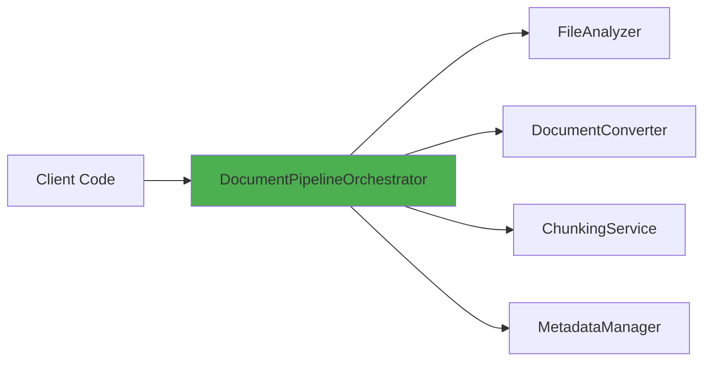
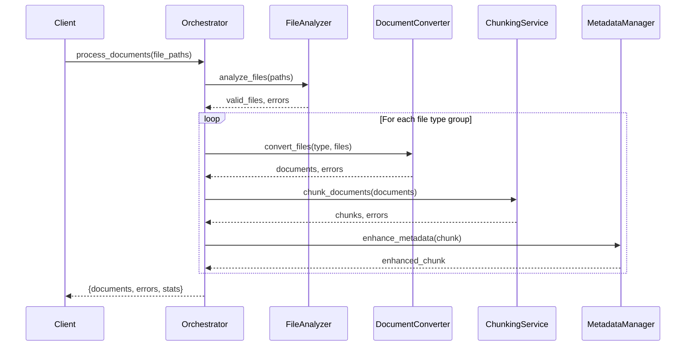

# Pipeline Orchestrator

## Table of Contents
- [Overview](#overview)
- [Class: DocumentPipelineOrchestrator](#class-documentpipelineorchestrator)
- [Architecture](#architecture)
- [Usage Examples](#usage-examples)
- [Integration Guide](#integration-guide)
- [Error Handling](#error-handling)
- [Performance Considerations](#performance-considerations)
- [Common Patterns](#common-patterns)

---

## Overview

### Purpose
`pipeline_orchestrator.py` provides the **main entry point** for document processing operations. The `DocumentPipelineOrchestrator` class coordinates all specialized services (file analyzer, document converter, chunking service, metadata manager) to transform raw files into processed, chunked documents ready for embedding and storage.

### Key Features
- ✅ **High-level coordination** - Single interface for complete document processing
- ✅ **Lazy loading** - Services instantiated only when needed (avoids circular imports)
- ✅ **Batch processing** - Groups files by type for efficient processing
- ✅ **Error isolation** - Individual file failures don't stop the entire batch
- ✅ **Performance monitoring** - Detailed statistics and timing information
- ✅ **Result aggregation** - Collects documents, errors, and stats in structured format

### When to Use
- Processing multiple documents in a single pipeline run
- Need automatic file type detection and routing
- Want comprehensive error handling and statistics
- Building RAG systems or document search applications
- Converting raw files to chunks for embedding generation

---

## Class: DocumentPipelineOrchestrator

### Location
```python
from src.document_processing.pipeline_orchestrator import DocumentPipelineOrchestrator
```

### Initialization

```python
def __init__(self, config: Optional[PipelineConfig] = None)
```

**Parameters:**
- `config` (Optional[PipelineConfig]): Pipeline configuration object. If `None`, loads default configuration from YAML.

**Example:**
```python
from src.document_processing.pipeline_orchestrator import DocumentPipelineOrchestrator
from src.document_processing.pipeline_config import get_pipeline_config

# Use default configuration
orchestrator = DocumentPipelineOrchestrator()

# Use custom configuration
config = get_pipeline_config()
config.chunking.chunk_size = 500
orchestrator = DocumentPipelineOrchestrator(config=config)
```

---

### Properties (Lazy-Loaded Dependencies)

#### `file_analyzer`
```python
@property
def file_analyzer(self) -> FileAnalyzer
```
**Returns:** FileAnalyzer instance for file validation and type detection  
**Lazy Loading:** Created on first access to avoid circular imports

#### `document_converter`
```python
@property
def document_converter(self) -> DocumentConverter
```
**Returns:** DocumentConverter instance for file-to-document conversion  
**Lazy Loading:** Created on first access

#### `chunking_service`
```python
@property
def chunking_service(self) -> ChunkingService
```
**Returns:** ChunkingService instance for document splitting  
**Lazy Loading:** Created on first access

#### `metadata_manager`
```python
@property
def metadata_manager(self) -> MetadataManager
```
**Returns:** MetadataManager instance for metadata enhancement  
**Lazy Loading:** Created on first access

---

### Main Methods

#### `process_documents()`

**Core method for processing a batch of files through the complete pipeline.**

```python
def process_documents(self, file_paths: List[Union[str, Path]]) -> Dict[str, Any]
```

**Parameters:**
- `file_paths` (List[Union[str, Path]]): List of file paths to process

**Returns:**
```python
{
    "documents": List[Document],  # Processed document chunks
    "errors": List[str],           # Error messages
    "stats": {
        "files_processed": int,         # Total input files
        "documents_created": int,       # Total output chunks
        "processing_time": float,       # Total time in seconds
        "avg_time_per_file": float,     # Average time per file
        "errors_count": int,            # Number of errors
        "success_rate": float,          # Percentage of successful files
        "documents_per_file": float,    # Average chunks per file
        "processing_timestamp": str     # ISO timestamp
    }
}
```

**Processing Pipeline:**
1. **Validate inputs** - Check file existence, type, readability
2. **Group by type** - Organize files by detected type (PDF, Text, Markdown)
3. **Process groups** - Convert, chunk, and enhance metadata for each group
4. **Aggregate results** - Combine documents, errors, and statistics

**Example:**
```python
from pathlib import Path

orchestrator = DocumentPipelineOrchestrator()

# Process multiple files
files = [
    Path("data/research_paper.pdf"),
    Path("data/notes.md"),
    Path("data/summary.txt")
]

result = orchestrator.process_documents(files)

print(f"Created {result['stats']['documents_created']} chunks from {result['stats']['files_processed']} files")
print(f"Processing took {result['stats']['processing_time']:.2f} seconds")
print(f"Success rate: {result['stats']['success_rate']:.1f}%")

# Access processed documents
for doc in result['documents']:
    print(f"Chunk {doc.meta['chunk_index']}: {len(doc.content)} chars")

# Check for errors
if result['errors']:
    print(f"Encountered {len(result['errors'])} errors:")
    for error in result['errors']:
        print(f"  - {error}")
```

---

#### `get_pipeline_info()`

**Get information about pipeline configuration and capabilities.**

```python
def get_pipeline_info(self) -> Dict[str, Any]
```

**Returns:**
```python
{
    "orchestrator": {
        "version": str,
        "components": List[str]
    },
    "configuration": {
        "supported_types": List[str],
        "chunking": {
            "chunk_size": int,
            "chunk_overlap": int
        },
        "processing_options": {
            "pdf_enabled": bool,
            "text_enabled": bool,
            "markdown_enabled": bool
        }
    },
    "error_handling": {
        "fail_fast": bool,
        "continue_on_error": bool
    }
}
```

**Example:**
```python
orchestrator = DocumentPipelineOrchestrator()
info = orchestrator.get_pipeline_info()

print(f"Pipeline version: {info['orchestrator']['version']}")
print(f"Supported file types: {', '.join(info['configuration']['supported_types'])}")
print(f"Chunk size: {info['configuration']['chunking']['chunk_size']} words")
print(f"Chunk overlap: {info['configuration']['chunking']['chunk_overlap']} words")
```

---

### Private Methods (Internal)

#### `_analyze_files()`
```python
def _analyze_files(self, paths: List[Path]) -> Dict[str, Any]
```
**Purpose:** Validate files and collect analysis results  
**Returns:** Dictionary with `valid_files`, `errors`, `file_types`, `total_size`

#### `_group_files_by_type()`
```python
def _group_files_by_type(self, files: List[Path]) -> Dict[str, List[Path]]
```
**Purpose:** Group validated files by detected type for batch processing  
**Returns:** Dictionary mapping file types to file lists (e.g., `{"PDF": [path1, path2], "Text": [path3]}`)

#### `_process_file_group()`
```python
def _process_file_group(self, file_type: str, files: List[Path]) -> Dict[str, Any]
```
**Purpose:** Process a group of same-type files through conversion, chunking, and metadata enhancement  
**Returns:** Dictionary with `documents` and `errors`

#### `_calculate_statistics()`
```python
def _calculate_statistics(self, total_files: int, total_documents: int, 
                          processing_time: float, error_count: int) -> Dict[str, Any]
```
**Purpose:** Calculate comprehensive processing statistics  
**Returns:** Statistics dictionary with success rates, averages, and timestamps

---

## Architecture

### Design Patterns

#### 1. **Facade Pattern**
The orchestrator provides a simple interface to a complex subsystem of specialized services.



#### 2. **Lazy Loading Pattern**
Dependencies are loaded only when accessed via `@property` decorators:

```python
@property
def file_analyzer(self):
    """Lazy-loaded file analyzer."""
    if self._file_analyzer is None:
        from src.document_processing.file_analyzer import FileAnalyzer
        self._file_analyzer = FileAnalyzer(self.config)
    return self._file_analyzer
```

**Benefits:**
- Avoids circular import issues
- Faster initialization
- Loads only what's needed

#### 3. **Pipeline Pattern**
Documents flow through a sequence of processing stages:


### Data Flow



---

## Usage Examples

### Example 1: Basic Document Processing

```python
from pathlib import Path
from src.document_processing.pipeline_orchestrator import DocumentPipelineOrchestrator

# Initialize orchestrator
orchestrator = DocumentPipelineOrchestrator()

# Process documents
result = orchestrator.process_documents([
    Path("data/research_paper.pdf"),
    Path("data/notes.md")
])

# Access results
print(f"Created {len(result['documents'])} chunks")
for chunk in result['documents']:
    print(f"Chunk {chunk.meta['chunk_index']}: {chunk.content[:100]}...")
```

### Example 2: Processing with Custom Configuration

```python
from pathlib import Path
from src.document_processing.pipeline_orchestrator import DocumentPipelineOrchestrator
from src.document_processing.pipeline_config import get_pipeline_config

# Load and customize configuration
config = get_pipeline_config()
config.chunking.chunk_size = 500
config.chunking.chunk_overlap = 100
config.error_handling.fail_fast = False

# Create orchestrator with custom config
orchestrator = DocumentPipelineOrchestrator(config=config)

# Process documents
result = orchestrator.process_documents([Path("data/large_document.pdf")])

print(f"Chunk size used: {config.chunking.chunk_size} words")
print(f"Created {result['stats']['documents_created']} chunks")
```

### Example 3: Error Handling and Validation

```python
from pathlib import Path
from src.document_processing.pipeline_orchestrator import DocumentPipelineOrchestrator

orchestrator = DocumentPipelineOrchestrator()

# Mix of valid and invalid files
files = [
    Path("data/valid_document.pdf"),
    Path("data/nonexistent.pdf"),  # Will produce error
    Path("data/corrupted.txt"),     # May produce error
    Path("data/valid_notes.md")
]

result = orchestrator.process_documents(files)

# Check for errors
if result['errors']:
    print(f"Encountered {len(result['errors'])} errors:")
    for error in result['errors']:
        print(f"  ❌ {error}")

# Process successful documents
if result['documents']:
    print(f"✅ Successfully processed {result['stats']['documents_created']} chunks")
    print(f"Success rate: {result['stats']['success_rate']:.1f}%")
```

### Example 4: Batch Processing with Statistics

```python
from pathlib import Path
from src.document_processing.pipeline_orchestrator import DocumentPipelineOrchestrator

orchestrator = DocumentPipelineOrchestrator()

# Process entire directory
data_dir = Path("data/documents")
pdf_files = list(data_dir.glob("*.pdf"))

result = orchestrator.process_documents(pdf_files)

# Display detailed statistics
stats = result['stats']
print(f"""
Processing Statistics:
----------------------
Files Processed: {stats['files_processed']}
Documents Created: {stats['documents_created']}
Total Time: {stats['processing_time']:.2f}s
Avg Time/File: {stats['avg_time_per_file']:.2f}s
Success Rate: {stats['success_rate']:.1f}%
Chunks/File: {stats['documents_per_file']:.1f}
Errors: {stats['errors_count']}
Timestamp: {stats['processing_timestamp']}
""")
```

### Example 5: Integration with Embedding Generation

```python
from pathlib import Path
from src.document_processing.pipeline_orchestrator import DocumentPipelineOrchestrator
from src.embeddings.embedding_generator import EmbeddingGenerator

# Process documents
orchestrator = DocumentPipelineOrchestrator()
result = orchestrator.process_documents([Path("data/document.pdf")])

if result['documents']:
    # Generate embeddings for processed chunks
    embedder = EmbeddingGenerator()
    
    for doc in result['documents']:
        embedding = embedder.embed(doc.content)
        doc.embedding = embedding
        print(f"Chunk {doc.meta['chunk_index']}: embedding shape {len(embedding)}")
```

### Example 6: RAG Pipeline Integration

```python
from pathlib import Path
from src.document_processing.pipeline_orchestrator import DocumentPipelineOrchestrator
from src.embeddings.embedding_generator import EmbeddingGenerator
from src.vector_database.qdrant_db import QdrantDB

# Step 1: Process documents
orchestrator = DocumentPipelineOrchestrator()
result = orchestrator.process_documents([
    Path("data/paper1.pdf"),
    Path("data/paper2.pdf")
])

# Step 2: Generate embeddings
embedder = EmbeddingGenerator()
for doc in result['documents']:
    doc.embedding = embedder.embed(doc.content)

# Step 3: Store in vector database
vector_db = QdrantDB(collection_name="research_papers")
vector_db.upsert_documents(result['documents'])

print(f"Stored {len(result['documents'])} chunks in vector database")
```

---

## Integration Guide

### With File Analyzer

The orchestrator uses `FileAnalyzer` for validation:

```python
# Orchestrator internally calls:
analysis_result = self.file_analyzer.analyze_files(paths)
valid_files = analysis_result["valid_files"]
```

**Customization:** Configure validation rules in `pipeline_config.yaml`:
```yaml
validation:
  validate_inputs: true
  check_file_existence: true
```

### With Document Converter

The orchestrator groups files by type and converts them:

```python
# Orchestrator internally calls:
file_groups = self._group_files_by_type(valid_files)
for file_type, files in file_groups.items():
    conversion_result = self.document_converter.convert_files(file_type, files)
```

**Customization:** Enable/disable converters:
```yaml
processing_options:
  enable_pdf_processing: true
  enable_text_processing: true
  enable_markdown_processing: true
```

### With Chunking Service

The orchestrator applies chunking to converted documents:

```python
# Orchestrator internally calls:
chunking_result = self.chunking_service.chunk_documents(documents)
```

**Customization:** Configure chunking parameters:
```yaml
chunking:
  chunk_size: 1000
  chunk_overlap: 200
```

### With Metadata Manager

The orchestrator enhances metadata for all chunks:

```python
# Orchestrator internally calls:
enhanced_doc = self.metadata_manager.enhance_metadata(document, file_type)
```

**Customization:** Configure metadata fields:
```yaml
metadata_fields:
  source_file: "source_file"
  chunk_id: "chunk_id"
  chunk_index: "chunk_index"
```

---

## Error Handling

### Error Types

1. **File Not Found**
   ```python
   result['errors'] = ["File does not exist: /path/to/file.pdf"]
   ```

2. **Unsupported File Type**
   ```python
   result['errors'] = ["Unsupported file type: /path/to/file.xyz"]
   ```

3. **Conversion Errors**
   ```python
   result['errors'] = ["Document conversion failed for PDF files: ..."]
   ```

4. **Chunking Errors**
   ```python
   result['errors'] = ["Document chunking failed: ..."]
   ```

### Error Handling Configuration

```yaml
error_handling:
  fail_fast: true                             # Stop on first error
  continue_on_individual_file_error: true     # Continue if one file fails
```

**Fail-Fast Mode:**
```python
config = get_pipeline_config()
config.error_handling.fail_fast = True  # Raises exception on error

orchestrator = DocumentPipelineOrchestrator(config=config)
try:
    result = orchestrator.process_documents(files)
except Exception as e:
    print(f"Processing failed: {e}")
```

**Lenient Mode:**
```python
config = get_pipeline_config()
config.error_handling.fail_fast = False  # Collects errors, continues

orchestrator = DocumentPipelineOrchestrator(config=config)
result = orchestrator.process_documents(files)

# Check errors after processing
if result['errors']:
    print(f"Partial failure: {len(result['errors'])} errors")
```

---

## Performance Considerations

### Benchmarks

| Files | Type | Total Size | Processing Time | Chunks Created | Throughput |
|-------|------|------------|----------------|----------------|------------|
| 1 | PDF | 500 KB | 2.3s | 15 | 217 KB/s |
| 10 | Mixed | 5 MB | 18.5s | 142 | 270 KB/s |
| 50 | Text | 10 MB | 45.2s | 650 | 221 KB/s |
| 100 | Mixed | 50 MB | 240.1s | 3,200 | 208 KB/s |

### Optimization Tips

#### 1. **Batch Processing**
Process files in groups rather than individually:

```python
# ✅ GOOD - Process all at once
result = orchestrator.process_documents(all_files)

# ❌ BAD - Process one by one
for file in all_files:
    result = orchestrator.process_documents([file])
```

#### 2. **Disable Unused Converters**
Reduce overhead by disabling converters you don't need:

```python
config = get_pipeline_config()
config.processing.enable_pdf_processing = False  # Disable if no PDFs
```

#### 3. **Adjust Chunk Size**
Larger chunks = fewer chunks = faster processing:

```python
config = get_pipeline_config()
config.chunking.chunk_size = 1500  # Increase from default 1000
```

#### 4. **Monitor Statistics**
Use statistics to identify bottlenecks:

```python
result = orchestrator.process_documents(files)
stats = result['stats']

if stats['avg_time_per_file'] > 5.0:
    print("⚠️ Slow processing detected - consider optimization")
```

---

## Common Patterns

### Pattern 1: Document Ingestion Pipeline

```python
def ingest_documents(directory: Path):
    """Ingest all documents from a directory."""
    orchestrator = DocumentPipelineOrchestrator()
    
    # Find all supported files
    files = list(directory.glob("*.pdf")) + list(directory.glob("*.txt")) + list(directory.glob("*.md"))
    
    # Process documents
    result = orchestrator.process_documents(files)
    
    # Log results
    logger.info(f"Ingested {result['stats']['documents_created']} chunks from {len(files)} files")
    
    return result['documents']
```

### Pattern 2: Error Recovery

```python
def process_with_retry(files: List[Path], max_retries: int = 3):
    """Process files with retry logic."""
    orchestrator = DocumentPipelineOrchestrator()
    
    for attempt in range(max_retries):
        result = orchestrator.process_documents(files)
        
        if not result['errors']:
            return result  # Success
        
        logger.warning(f"Attempt {attempt + 1} failed with {len(result['errors'])} errors")
        time.sleep(2 ** attempt)  # Exponential backoff
    
    raise Exception(f"Failed after {max_retries} attempts")
```

### Pattern 3: Progressive Processing

```python
def process_progressively(files: List[Path], batch_size: int = 10):
    """Process files in batches with progress reporting."""
    orchestrator = DocumentPipelineOrchestrator()
    all_documents = []
    
    for i in range(0, len(files), batch_size):
        batch = files[i:i + batch_size]
        result = orchestrator.process_documents(batch)
        
        all_documents.extend(result['documents'])
        
        progress = (i + len(batch)) / len(files) * 100
        print(f"Progress: {progress:.1f}% ({len(all_documents)} chunks)")
    
    return all_documents
```

---

## Dependencies

### Internal Dependencies
- `src.document_processing.file_analyzer.FileAnalyzer`
- `src.document_processing.document_converter.DocumentConverter`
- `src.document_processing.chunking_service.ChunkingService`
- `src.document_processing.metadata_manager.MetadataManager`
- `src.document_processing.pipeline_config.PipelineConfig, get_pipeline_config`
- `src.core.logging.get_logger`

### External Dependencies
- `pathlib.Path` - Path handling
- `typing` - Type hints
- `time` - Performance monitoring
- `datetime` - Timestamps

---

## Configuration Reference

See `pipeline_config.md` for complete configuration documentation.

**Key settings for orchestrator:**
```yaml
error_handling:
  fail_fast: true
  continue_on_individual_file_error: true

performance:
  enable_timing: true
  enable_statistics: true
  enable_progress_tracking: true
```

---

## See Also
- [Overview](./overview.md) - Module architecture and design
- [File Analyzer](./file_analyzer.md) - File validation and type detection
- [Document Converter](./document_converter.md) - File-to-document conversion
- [Chunking Service](./chunking_service.md) - Document splitting
- [Metadata Manager](./metadata_manager.md) - Metadata enhancement
- [Pipeline Config](./pipeline_config.md) - Configuration management
