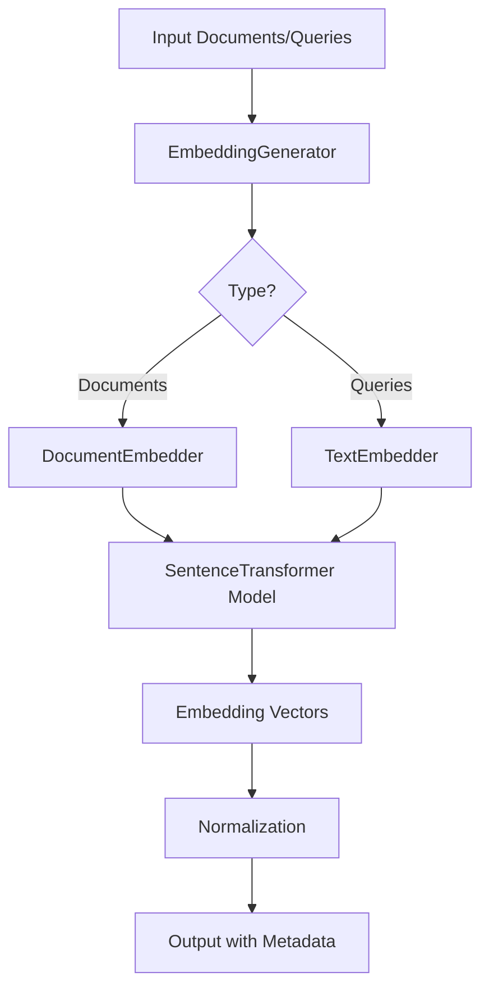

# Embeddings Module - Overview

## Table of Contents
1. [Overview](#overview)
2. [Architecture](#architecture)
3. [Core Components](#core-components)
4. [Quick Start](#quick-start)
5. [Providers](#providers)
6. [Services](#services)
7. [Configuration](#configuration)
8. [Integration Examples](#integration-examples)
9. [Performance](#performance)
10. [Troubleshooting](#troubleshooting)

---

## Overview

**Purpose**: Provides comprehensive embedding generation capabilities using state-of-the-art transformer models through Haystack integration.

**Key Features**:
- 🎯 **Multiple Model Support**: Sentence Transformers, OpenAI, HuggingFace
- 📊 **Batch Processing**: Efficient processing of large document sets
- 🔄 **Document & Query Embeddings**: Separate optimized paths
- 📝 **Metadata Embedding**: Include metadata fields in embeddings
- ⚡ **GPU Acceleration**: CUDA support for faster processing
- 🎛️ **Normalization**: L2 normalization for cosine similarity
- 🏭 **Factory Pattern**: Easy provider switching
- 📦 **Haystack Integration**: Native pipeline components

**Module Structure**:
```
embeddings/
├── embedding_generator.py       # Main embedding interface (462 lines)
├── config/
│   └── embedding_config.py      # Configuration management
├── providers/
│   ├── base.py                  # Abstract base provider
│   └── haystack_provider.py     # Haystack implementation
├── services/
│   ├── document_embedder.py     # Document embedding service
│   ├── query_embedder.py        # Query embedding service
│   └── batch_processor.py       # Batch processing utilities
├── factories/
│   └── embedding_factory.py     # Provider factory
├── models/
│   └── embedding_models.py      # Model definitions
└── utils/
    └── embedding_utils.py       # Utility functions
```

---

## Architecture

### High-Level Design



### Component Layers

1. **Interface Layer**: `EmbeddingGenerator` - Main user-facing API
2. **Service Layer**: Document/Query embedders with specialized logic
3. **Provider Layer**: Abstract providers for different backends
4. **Model Layer**: Actual transformer models (Sentence Transformers, OpenAI, etc.)
5. **Utility Layer**: Batch processing, normalization, validation

### Design Patterns

- **Factory Pattern**: `EmbeddingFactory` for provider creation
- **Strategy Pattern**: Interchangeable embedding providers
- **Singleton Pattern**: Shared model instances
- **Builder Pattern**: Configuration building
- **Adapter Pattern**: Haystack component wrapping

---

## Core Components

### 1. EmbeddingGenerator

**File**: `embedding_generator.py` (462 lines)

**Purpose**: Main interface for generating embeddings from documents and queries.

```python
from src.embeddings.embedding_generator import EmbeddingGenerator

# Initialize
generator = EmbeddingGenerator(
    model_name="BAAI/bge-small-en-v1.5",
    device="cuda",  # or "cpu"
    normalize_embeddings=True,
    batch_size=32,
    meta_fields_to_embed=["title", "tags"]
)

# Embed documents
from haystack import Document

docs = [
    Document(content="AI is transforming technology", meta={"title": "AI Trends"}),
    Document(content="Machine learning powers AI", meta={"title": "ML Basics"})
]

embedded_docs = generator.embed_documents(docs)

# Embed query
query_embedding = generator.embed_query("What is artificial intelligence?")
```

**Constructor Parameters**:

| Parameter | Type | Default | Description |
|-----------|------|---------|-------------|
| `model_name` | `str` | `"BAAI/bge-small-en-v1.5"` | HuggingFace model identifier |
| `device` | `Optional[str]` | `None` | Device: "cpu", "cuda", "cuda:0", etc. |
| `normalize_embeddings` | `bool` | `True` | L2 normalize vectors |
| `batch_size` | `int` | `32` | Batch size for processing |
| `prefix` | `Optional[str]` | `None` | Text prefix (model-specific) |
| `meta_fields_to_embed` | `Optional[List[str]]` | `None` | Metadata fields to embed |

**Key Methods**:

```python
# Embed multiple documents
embedded_docs = generator.embed_documents(
    documents: List[Document]
) -> List[EmbeddedDocument]

# Embed single query
query_vector = generator.embed_query(
    query: str
) -> np.ndarray

# Get embedding dimension
dim = generator.get_embedding_dimension() -> int

# Batch process large datasets
for batch in generator.embed_documents_batched(
    documents=all_docs,
    batch_size=100
):
    # Process batch
    store_embeddings(batch)
```

### 2. EmbeddedDocument

**Dataclass**: Container for document with embedding vector.

```python
from src.embeddings.embedding_generator import EmbeddedDocument

@dataclass
class EmbeddedDocument:
    """Document with its embedding vector and metadata."""
    document: Document
    embedding: np.ndarray
    embedding_model: str
    embedding_dimension: int
    
    def to_dict(self) -> Dict[str, Any]:
        """Convert to dictionary for storage/serialization."""
        return {
            'content': self.document.content,
            'meta': self.document.meta,
            'embedding': self.embedding.tolist(),
            'embedding_model': self.embedding_model,
            'embedding_dimension': self.embedding_dimension
        }
```

**Usage**:
```python
embedded_doc = embedded_docs[0]
print(f"Content: {embedded_doc.document.content}")
print(f"Embedding shape: {embedded_doc.embedding.shape}")
print(f"Model: {embedded_doc.embedding_model}")
print(f"Dimension: {embedded_doc.embedding_dimension}")

# Serialize for storage
doc_dict = embedded_doc.to_dict()
```

---

## Quick Start

### Example 1: Basic Document Embedding

```python
from haystack import Document
from src.embeddings.embedding_generator import EmbeddingGenerator

# Initialize generator
generator = EmbeddingGenerator(
    model_name="sentence-transformers/all-MiniLM-L6-v2",
    normalize_embeddings=True
)

# Create documents
documents = [
    Document(content="Python is a programming language"),
    Document(content="JavaScript is used for web development"),
    Document(content="Machine learning uses Python extensively")
]

# Generate embeddings
embedded_docs = generator.embed_documents(documents)

# Access embeddings
for doc in embedded_docs:
    print(f"Text: {doc.document.content}")
    print(f"Embedding: {doc.embedding[:5]}...")  # First 5 dims
    print(f"Shape: {doc.embedding.shape}")
    print()
```

### Example 2: Query Embedding for Retrieval

```python
from src.embeddings.embedding_generator import EmbeddingGenerator
import numpy as np

generator = EmbeddingGenerator()

# Embed documents
docs = [
    Document(content="How to train neural networks"),
    Document(content="Introduction to deep learning"),
    Document(content="Natural language processing basics")
]
embedded_docs = generator.embed_documents(docs)

# Embed query
query = "neural network training"
query_embedding = generator.embed_query(query)

# Calculate similarities (cosine similarity with normalized vectors)
similarities = []
for doc in embedded_docs:
    similarity = np.dot(query_embedding, doc.embedding)
    similarities.append((doc.document.content, similarity))

# Sort by similarity
similarities.sort(key=lambda x: x[1], reverse=True)

print("Search Results:")
for content, score in similarities:
    print(f"Score: {score:.4f} - {content}")
```

### Example 3: Metadata Embedding

```python
from src.embeddings.embedding_generator import EmbeddingGenerator
from haystack import Document

# Initialize with metadata fields
generator = EmbeddingGenerator(
    model_name="BAAI/bge-small-en-v1.5",
    meta_fields_to_embed=["title", "category", "tags"]
)

# Documents with rich metadata
documents = [
    Document(
        content="Quantum computing is revolutionary",
        meta={
            "title": "Quantum Computing Breakthrough",
            "category": "Technology",
            "tags": ["quantum", "computing", "science"]
        }
    ),
    Document(
        content="AI transforms industries",
        meta={
            "title": "AI in Business",
            "category": "Technology",
            "tags": ["ai", "business", "innovation"]
        }
    )
]

# Embed with metadata
embedded_docs = generator.embed_documents(documents)

# Metadata is included in embedding calculation
# This improves retrieval accuracy when metadata is relevant
```

### Example 4: GPU-Accelerated Batch Processing

```python
from src.embeddings.embedding_generator import EmbeddingGenerator
from haystack import Document
from pathlib import Path

# Initialize with GPU
generator = EmbeddingGenerator(
    model_name="BAAI/bge-base-en-v1.5",  # Larger model
    device="cuda",
    batch_size=64,  # Larger batches on GPU
    normalize_embeddings=True
)

# Load large document set
documents = []
for file_path in Path("documents/").glob("*.txt"):
    content = file_path.read_text()
    documents.append(Document(content=content, meta={"source": str(file_path)}))

print(f"Processing {len(documents)} documents...")

# Process in batches
all_embedded = []
for batch_embedded in generator.embed_documents_batched(documents, batch_size=100):
    all_embedded.extend(batch_embedded)
    print(f"Processed {len(all_embedded)}/{len(documents)}")

print(f"✅ All {len(all_embedded)} documents embedded")
```

### Example 5: Model Comparison

```python
from src.embeddings.embedding_generator import EmbeddingGenerator
from haystack import Document
import time

models = [
    "sentence-transformers/all-MiniLM-L6-v2",  # Small, fast
    "BAAI/bge-small-en-v1.5",                   # Balanced
    "BAAI/bge-base-en-v1.5",                    # Large, accurate
]

test_doc = Document(content="Machine learning is transforming AI")

print("Model Performance Comparison:\n")
for model_name in models:
    generator = EmbeddingGenerator(model_name=model_name)
    
    # Warm up
    generator.embed_documents([test_doc])
    
    # Benchmark
    start = time.time()
    for _ in range(100):
        generator.embed_documents([test_doc])
    elapsed = time.time() - start
    
    dim = generator.get_embedding_dimension()
    print(f"{model_name}:")
    print(f"  Dimension: {dim}")
    print(f"  Speed: {elapsed/100*1000:.2f}ms per document")
    print()
```

---

## Providers

### Provider Architecture

```python
# Abstract base provider
class BaseEmbeddingProvider(ABC):
    @abstractmethod
    def embed_documents(self, documents: List[Document]) -> List[np.ndarray]:
        pass
    
    @abstractmethod
    def embed_query(self, query: str) -> np.ndarray:
        pass
```

### Available Providers

#### 1. Haystack Provider (Default)

**File**: `providers/haystack_provider.py`

**Features**:
- Sentence Transformers integration
- Native Haystack components
- GPU support
- Batch processing
- Metadata embedding

```python
from src.embeddings.providers.haystack_provider import HaystackEmbeddingProvider

provider = HaystackEmbeddingProvider(
    model_name="sentence-transformers/all-MiniLM-L6-v2",
    device="cuda"
)

embeddings = provider.embed_documents(documents)
```

**Supported Models**:
- All Sentence Transformers models from HuggingFace
- Custom fine-tuned models
- Multilingual models

### Provider Selection

```python
from src.embeddings.factories.embedding_factory import EmbeddingFactory

# Get provider by name
provider = EmbeddingFactory.create_provider(
    provider_type="haystack",
    model_name="BAAI/bge-small-en-v1.5"
)

# Use provider
embedded = provider.embed_documents(documents)
```

---

## Services

### 1. Document Embedder Service

**File**: `services/document_embedder.py`

**Purpose**: Specialized service for embedding documents with advanced features.

```python
from src.embeddings.services.document_embedder import DocumentEmbedderService

service = DocumentEmbedderService(
    model_name="BAAI/bge-small-en-v1.5",
    batch_size=32,
    cache_embeddings=True  # Cache for repeated documents
)

# Embed with caching
embedded_docs = service.embed_documents(documents)

# Re-embedding cached documents is instant
embedded_again = service.embed_documents(documents)  # Uses cache
```

### 2. Query Embedder Service

**File**: `services/query_embedder.py`

**Purpose**: Optimized query embedding with query-specific preprocessing.

```python
from src.embeddings.services.query_embedder import QueryEmbedderService

service = QueryEmbedderService(
    model_name="BAAI/bge-small-en-v1.5",
    add_query_prefix=True  # Model-specific prefix
)

# Embed queries
query_embedding = service.embed_query("What is machine learning?")

# Batch query embedding
queries = [
    "How does AI work?",
    "What is deep learning?",
    "Explain neural networks"
]
query_embeddings = service.embed_queries(queries)
```

### 3. Batch Processor

**File**: `services/batch_processor.py`

**Purpose**: Utilities for efficient batch processing of large document sets.

```python
from src.embeddings.services.batch_processor import BatchProcessor

processor = BatchProcessor(
    generator=generator,
    batch_size=100,
    show_progress=True
)

# Process large dataset
all_embedded = processor.process_documents(
    documents=large_document_list,
    save_checkpoints=True,
    checkpoint_path="embeddings_checkpoint.pkl"
)

# Resume from checkpoint if interrupted
all_embedded = processor.resume_from_checkpoint("embeddings_checkpoint.pkl")
```

---

## Configuration

### Configuration File Structure

**File**: `config/embedding_config.py`

```python
from dataclasses import dataclass
from typing import Optional, List

@dataclass
class EmbeddingConfig:
    """Embedding generation configuration."""
    
    # Model settings
    model_name: str = "BAAI/bge-small-en-v1.5"
    device: Optional[str] = None
    
    # Processing settings
    batch_size: int = 32
    normalize_embeddings: bool = True
    
    # Advanced settings
    prefix: Optional[str] = None
    meta_fields_to_embed: List[str] = None
    cache_embeddings: bool = False
    
    # Performance settings
    use_gpu: bool = True
    max_seq_length: int = 512
```

### YAML Configuration

```yaml
# config/embeddings.yaml
model:
  name: "BAAI/bge-small-en-v1.5"
  device: "cuda"
  
processing:
  batch_size: 64
  normalize_embeddings: true
  max_seq_length: 512
  
metadata:
  fields_to_embed:
    - title
    - category
    - tags
  
performance:
  use_gpu: true
  cache_embeddings: true
```

Load from YAML:
```python
from src.embeddings.config.embedding_config import EmbeddingConfig
from pathlib import Path
import yaml

with open("config/embeddings.yaml") as f:
    config_dict = yaml.safe_load(f)

config = EmbeddingConfig(**config_dict)
generator = EmbeddingGenerator(**config.__dict__)
```

### Environment Variables

```bash
# Model settings
export EMBEDDING_MODEL="BAAI/bge-small-en-v1.5"
export EMBEDDING_DEVICE="cuda"

# Processing settings
export EMBEDDING_BATCH_SIZE="64"
export EMBEDDING_NORMALIZE="true"

# Cache settings
export EMBEDDING_CACHE_DIR="./cache/embeddings"
```

---

## Integration Examples

### Example 1: RAG Pipeline Integration

```python
from haystack import Pipeline
from haystack.components.embedders import SentenceTransformersDocumentEmbedder
from src.document_processing.pipeline_orchestrator import DocumentProcessingPipeline
from src.embeddings.embedding_generator import EmbeddingGenerator
from src.vector_database.qdrant_db import QdrantVectorDB

# Build complete RAG ingestion pipeline
pipeline = Pipeline()

# 1. Document processing
doc_processor = DocumentProcessingPipeline()
processed_docs = doc_processor.process_documents(["document.pdf"])

# 2. Embedding
generator = EmbeddingGenerator(model_name="BAAI/bge-small-en-v1.5")
embedded_docs = generator.embed_documents(processed_docs)

# 3. Storage
vector_db = QdrantVectorDB(collection_name="documents")
vector_db.upsert_documents([doc.document for doc in embedded_docs])

print(f"✅ Stored {len(embedded_docs)} embedded documents")
```

### Example 2: Semantic Search

```python
from src.embeddings.embedding_generator import EmbeddingGenerator
from src.vector_database.qdrant_db import QdrantVectorDB
import numpy as np

# Initialize
generator = EmbeddingGenerator()
vector_db = QdrantVectorDB()

# Embed query
query = "What is machine learning?"
query_embedding = generator.embed_query(query)

# Search
results = vector_db.search(
    query_embedding=query_embedding,
    top_k=5,
    score_threshold=0.7
)

print("Search Results:")
for result in results:
    print(f"Score: {result.score:.4f}")
    print(f"Content: {result.content[:200]}...")
    print()
```

### Example 3: Document Similarity Matrix

```python
from src.embeddings.embedding_generator import EmbeddingGenerator
from haystack import Document
import numpy as np

generator = EmbeddingGenerator()

documents = [
    Document(content="Python programming language"),
    Document(content="JavaScript for web development"),
    Document(content="Python for data science"),
    Document(content="Java programming basics"),
]

# Embed all documents
embedded_docs = generator.embed_documents(documents)

# Create similarity matrix
n = len(embedded_docs)
similarity_matrix = np.zeros((n, n))

for i in range(n):
    for j in range(n):
        # Cosine similarity (vectors already normalized)
        similarity_matrix[i][j] = np.dot(
            embedded_docs[i].embedding,
            embedded_docs[j].embedding
        )

print("Document Similarity Matrix:")
print(similarity_matrix)

# Find most similar pairs
for i in range(n):
    for j in range(i+1, n):
        if similarity_matrix[i][j] > 0.5:
            print(f"Similar: Doc {i} <-> Doc {j} (score: {similarity_matrix[i][j]:.4f})")
```

### Example 4: Multi-Language Embedding

```python
from src.embeddings.embedding_generator import EmbeddingGenerator
from haystack import Document

# Use multilingual model
generator = EmbeddingGenerator(
    model_name="sentence-transformers/paraphrase-multilingual-MiniLM-L12-v2"
)

# Documents in different languages
documents = [
    Document(content="Machine learning is transforming AI", meta={"lang": "en"}),
    Document(content="El aprendizaje automático está transformando la IA", meta={"lang": "es"}),
    Document(content="L'apprentissage automatique transforme l'IA", meta={"lang": "fr"}),
    Document(content="机器学习正在改变人工智能", meta={"lang": "zh"})
]

# Embed all languages
embedded_docs = generator.embed_documents(documents)

# Embeddings are in same vector space
# Can search across languages
query = "artificial intelligence"
query_embedding = generator.embed_query(query)

for doc in embedded_docs:
    similarity = np.dot(query_embedding, doc.embedding)
    print(f"[{doc.document.meta['lang']}] Similarity: {similarity:.4f}")
```

---

## Performance

### Model Comparison

| Model | Dimension | Speed (docs/sec) | Accuracy | Memory | Use Case |
|-------|-----------|------------------|----------|--------|----------|
| `all-MiniLM-L6-v2` | 384 | 500+ | Good | 80MB | Fast retrieval, large scale |
| `bge-small-en-v1.5` | 384 | 400+ | Better | 134MB | Balanced performance |
| `bge-base-en-v1.5` | 768 | 200+ | Best | 420MB | High accuracy needs |
| `bge-large-en-v1.5` | 1024 | 100+ | Excellent | 1.3GB | Research, critical apps |

### GPU vs CPU Performance

**Test**: Embedding 1,000 documents

| Device | Model | Time | Speed |
|--------|-------|------|-------|
| CPU | all-MiniLM-L6-v2 | 12.5s | 80 docs/sec |
| GPU (RTX 3090) | all-MiniLM-L6-v2 | 1.8s | 555 docs/sec |
| CPU | bge-base-en-v1.5 | 45.2s | 22 docs/sec |
| GPU (RTX 3090) | bge-base-en-v1.5 | 4.5s | 222 docs/sec |

**GPU Speedup**: 6-8x faster

### Optimization Tips

1. **Use GPU when available**:
```python
generator = EmbeddingGenerator(device="cuda")
```

2. **Increase batch size on GPU**:
```python
generator = EmbeddingGenerator(batch_size=64)  # vs 32 on CPU
```

3. **Choose appropriate model**:
- Development: `all-MiniLM-L6-v2`
- Production: `bge-small-en-v1.5`
- Critical: `bge-base-en-v1.5`

4. **Enable caching for repeated documents**:
```python
service = DocumentEmbedderService(cache_embeddings=True)
```

5. **Batch process large datasets**:
```python
for batch in generator.embed_documents_batched(docs, batch_size=100):
    process_batch(batch)
```

---

## Troubleshooting

### Issue 1: Out of Memory (GPU)

**Symptom**: CUDA out of memory error

**Solutions**:
```python
# 1. Reduce batch size
generator = EmbeddingGenerator(batch_size=16)  # Instead of 32

# 2. Use smaller model
generator = EmbeddingGenerator(model_name="all-MiniLM-L6-v2")

# 3. Use CPU
generator = EmbeddingGenerator(device="cpu")
```

### Issue 2: Slow Embedding Speed

**Symptom**: Processing takes too long

**Solutions**:
```python
# 1. Enable GPU
generator = EmbeddingGenerator(device="cuda")

# 2. Use faster model
generator = EmbeddingGenerator(model_name="all-MiniLM-L6-v2")

# 3. Increase batch size
generator = EmbeddingGenerator(batch_size=64)

# 4. Use batch processing
for batch in generator.embed_documents_batched(docs, batch_size=100):
    process(batch)
```

### Issue 3: Model Download Fails

**Symptom**: Cannot download model from HuggingFace

**Solutions**:
```bash
# 1. Set HuggingFace cache directory
export HF_HOME="/path/to/cache"

# 2. Download model manually
python -c "from sentence_transformers import SentenceTransformer; SentenceTransformer('BAAI/bge-small-en-v1.5')"

# 3. Use offline mode (after download)
export TRANSFORMERS_OFFLINE=1
```

### Issue 4: Dimension Mismatch

**Symptom**: Vector dimension doesn't match database

**Solutions**:
```python
# Check embedding dimension
dim = generator.get_embedding_dimension()
print(f"Embedding dimension: {dim}")

# Ensure vector DB matches
vector_db = QdrantVectorDB(embedding_dim=dim)
```

### Issue 5: Poor Retrieval Quality

**Symptom**: Search results not relevant

**Solutions**:
```python
# 1. Use better model
generator = EmbeddingGenerator(model_name="BAAI/bge-base-en-v1.5")

# 2. Enable metadata embedding
generator = EmbeddingGenerator(
    meta_fields_to_embed=["title", "category"]
)

# 3. Normalize embeddings
generator = EmbeddingGenerator(normalize_embeddings=True)

# 4. Check model-specific prefix
generator = EmbeddingGenerator(
    model_name="BAAI/bge-small-en-v1.5",
    prefix="Represent this sentence for searching relevant passages: "
)
```

---

## See Also

- [../vector_database/overview.md](../vector_database/overview.md) - Vector storage integration
- [../document_processing/overview.md](../document_processing/overview.md) - Document preprocessing
- [../rag/overview.md](../rag/overview.md) - RAG system integration
- [Sentence Transformers](https://www.sbert.net/) - Model documentation
- [HuggingFace Models](https://huggingface.co/models) - Available models
