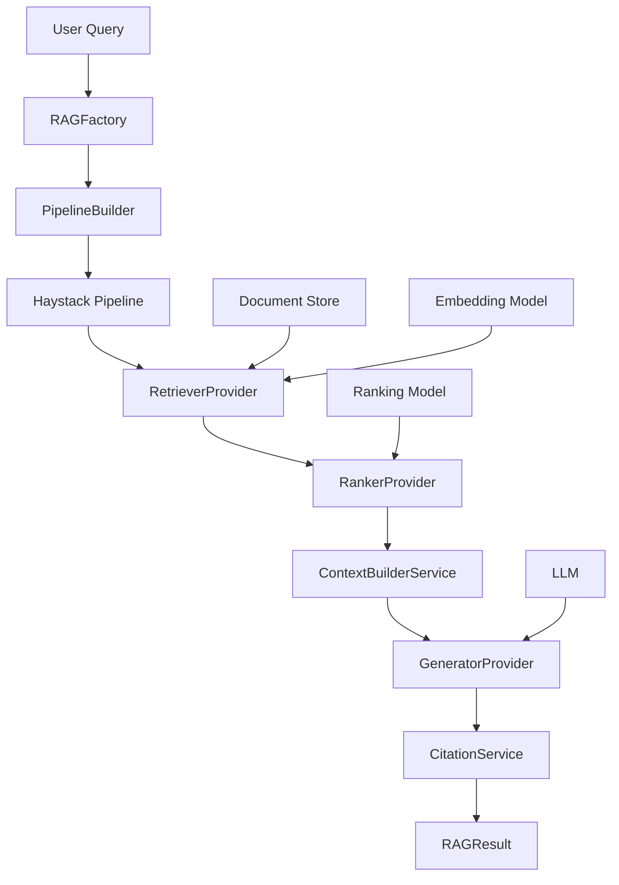

# RAG (Retrieval-Augmented Generation) Module - Overview

## Table of Contents
1. [Overview](#overview)
2. [Architecture](#architecture)
3. [Core Components](#core-components)
4. [Quick Start](#quick-start)
5. [RAG Factory](#rag-factory)
6. [Providers](#providers)
7. [Services](#services)
8. [Pipeline Building](#pipeline-building)
9. [Configuration](#configuration)
10. [Troubleshooting](#troubleshooting)

---

## Overview

**Purpose**: Provides a complete Retrieval-Augmented Generation (RAG) system with configurable retrieval, ranking, and generation components integrated with the full Cerebrus AI ecosystem.

**Key Features**:
- 🔍 **Multi-Provider Retrieval**: InMemory BM25, Elasticsearch, VectorDB
- 🎯 **Advanced Ranking**: FastEmbed, Cohere, SentenceTransformers
- 🤖 **LLM Integration**: Gemini, OpenAI, Anthropic
- 🏭 **Factory Pattern**: Dependency injection for all components
- ⚙️ **YAML Configuration**: Type-safe Pydantic models
- 📊 **Citation Tracking**: Comprehensive source attribution
- 🔄 **Pipeline Orchestration**: Haystack-based pipelines
- 📈 **Performance Metrics**: Detailed result tracking
- ✅ **278 Tests**: Comprehensive test coverage (Batch 1-2 complete)

**Module Structure**:
```
rag/
├── config/
│   ├── rag_config.py          # Pydantic configuration models
│   └── __init__.py
├── factories/
│   ├── rag_factory.py         # Dependency injection factory
│   └── __init__.py
├── models/
│   ├── rag_result.py          # RAGResult dataclass
│   ├── search_result.py       # SearchResult dataclass
│   └── __init__.py
├── pipeline/
│   ├── pipeline_builder.py    # Haystack pipeline builder
│   ├── pipeline_orchestrator.py  # Pipeline execution
│   └── __init__.py
├── providers/
│   ├── base.py                # Abstract provider interfaces
│   ├── inmemory_retriever.py  # InMemory BM25 retriever
│   ├── elasticsearch_retriever.py  # Elasticsearch retriever
│   ├── vectordb_retriever.py  # VectorDB retriever
│   ├── fastembed_ranker.py    # FastEmbed ranker
│   ├── gemini_generator.py    # Gemini generator
│   └── __init__.py
├── services/
│   ├── document_ingestion_service.py  # Document ingestion
│   ├── retrieval_service.py   # Retrieval orchestration
│   ├── ranking_service.py     # Ranking orchestration
│   ├── generation_service.py  # Generation orchestration
│   ├── context_builder_service.py  # Context building
│   ├── citation_service.py    # Citation extraction
│   ├── search_service.py      # Search-only operations
│   └── __init__.py
├── utils/
│   ├── prompt_template_manager.py  # Prompt management
│   └── __init__.py
└── __init__.py
```

**Integration Points**:
- **document_processing**: Document ingestion and chunking
- **embeddings**: Vector generation for semantic search
- **vector_database**: Vector storage and retrieval
- **web_scraping**: Content acquisition

---

## Architecture

### High-Level RAG Flow



### Component Layers

1. **Configuration Layer**: `RAGConfig` - Type-safe Pydantic models
2. **Factory Layer**: `RAGFactory` - Component creation and wiring
3. **Provider Layer**: Abstract providers for retrieval, ranking, generation
4. **Service Layer**: Business logic orchestration
5. **Pipeline Layer**: Haystack pipeline building and execution
6. **Model Layer**: Data classes for results

### Design Patterns

- **Factory Pattern**: `RAGFactory` creates and wires components
- **Strategy Pattern**: Swappable providers (retrieval, ranking, generation)
- **Dependency Injection**: All dependencies injected via constructors
- **Builder Pattern**: `PipelineBuilder` constructs complex pipelines
- **Facade Pattern**: `PipelineOrchestrator` simplifies execution
- **Service Layer**: Business logic separated from infrastructure

---

## Core Components

### 1. RAGFactory

**File**: `factories/rag_factory.py` (328 lines)

**Purpose**: Creates and wires all RAG components with dependency injection.

```python
from pathlib import Path
from src.rag.factories import RAGFactory
from src.rag.config import RAGConfig

# Load configuration
config = RAGConfig.from_yaml(Path("config/rag.yml"))

# Create factory
factory = RAGFactory(config)

# Create document store
doc_store = factory.create_document_store()

# Create retriever
retriever = factory.create_retriever()

# Create ranker
ranker = factory.create_ranker()

# Create generator
generator = factory.create_generator()

# Create full RAG system
rag_system = factory.create_rag_system()

# Query the system
result = rag_system.query("What is machine learning?")
print(result.response)
print(result.get_citation_summary())
```

### 2. RAGResult

**File**: `models/rag_result.py`

**Purpose**: Comprehensive result object with citation tracking.

```python
from src.rag.models import RAGResult

# Result from query
result = RAGResult(
    query="What is machine learning?",
    response="Machine learning is a subset of AI...",
    sources_used=[
        {
            "source_file": "ml_intro.pdf",
            "source_type": "pdf",
            "page_number": 5,
            "relevance_score": 0.92
        },
        {
            "source_file": "ai_guide.md",
            "source_type": "markdown",
            "relevance_score": 0.87
        }
    ],
    retrieval_count=20,
    ranking_count=8,
    generation_tokens=156
)

# Get citation summary
print(result.get_citation_summary())
# Output:
# • ml_intro.pdf (pdf) - Page 5 [Score: 0.920]
# • ai_guide.md (markdown) [Score: 0.870]

# Get performance summary
print(result.get_performance_summary())
# Output: Retrieved: 20 documents, Ranked: 8 documents, Tokens: 156

# Get top sources
top_sources = result.get_top_sources(n=3)

# Convert to dict
data = result.to_dict()
```

### 3. PipelineOrchestrator

**File**: `pipeline/pipeline_orchestrator.py` (266 lines)

**Purpose**: Executes RAG pipelines with error handling.

```python
from src.rag.pipeline import PipelineOrchestrator
from src.rag.services import (
    ContextBuilderService,
    CitationService,
    GenerationService
)

# Create services
context_builder = ContextBuilderService(config.context)
citation_service = CitationService(config.citation)
generation_service = GenerationService(generator)

# Create orchestrator
orchestrator = PipelineOrchestrator(
    context_builder=context_builder,
    citation_service=citation_service,
    generation_service=generation_service
)

# Execute RAG pipeline
result = orchestrator.execute_rag(
    pipeline=rag_pipeline,
    query="Explain neural networks",
    filters={"source_type": "academic"}
)

# Execute search-only (no generation)
search_result = orchestrator.execute_search(
    pipeline=search_pipeline,
    query="Explain neural networks"
)
```

---

## Quick Start

### Example 1: Basic RAG Query

```python
from pathlib import Path
from src.rag.config import RAGConfig
from src.rag.factories import RAGFactory

# 1. Load configuration
config = RAGConfig.from_yaml(Path("config/rag.yml"))

# 2. Create RAG factory
factory = RAGFactory(config)

# 3. Create RAG system
rag_system = factory.create_rag_system()

# 4. Index documents (first time only)
documents = [
    "Machine learning is a subset of artificial intelligence...",
    "Neural networks are inspired by biological neurons...",
    "Deep learning uses multi-layer neural networks..."
]
rag_system.ingest_documents(documents)

# 5. Query the system
result = rag_system.query("What is machine learning?")

# 6. Display results
print("Response:")
print(result.response)
print("\nSources:")
print(result.get_citation_summary())
print("\nPerformance:")
print(result.get_performance_summary())
```

### Example 2: Custom Configuration

```python
from src.rag.config import (
    RAGConfig,
    RetrievalConfig,
    RankingConfig,
    GenerationConfig
)

# Custom configuration
config = RAGConfig(
    retrieval=RetrievalConfig(
        provider="inmemory_bm25",
        top_k=30  # Retrieve more documents
    ),
    ranking=RankingConfig(
        enabled=True,
        provider="fastembed",
        top_k=10  # Rank to top 10
    ),
    generation=GenerationConfig(
        provider="gemini",
        gemini={
            "model": "gemini-2.0-flash",
            "temperature": 0.5,  # More deterministic
            "max_tokens": 512
        }
    )
)

factory = RAGFactory(config)
rag_system = factory.create_rag_system()
```

### Example 3: Document Ingestion from Files

```python
from pathlib import Path
from src.rag.factories import RAGFactory
from src.document_processing import DocumentProcessingPipeline

# Create RAG system
factory = RAGFactory()
rag_system = factory.create_rag_system()

# Process documents
doc_pipeline = DocumentProcessingPipeline()
documents = doc_pipeline.process_documents([
    "data/ml_book.pdf",
    "data/ai_paper.pdf",
    "data/dl_tutorial.md"
])

# Ingest into RAG system
rag_system.ingest_documents(documents)

# Query
result = rag_system.query("Explain backpropagation in neural networks")
print(result.response)
```

### Example 4: Filtered Search

```python
# Query with metadata filters
result = rag_system.query(
    query="What are transformer architectures?",
    filters={
        "source_type": "academic",  # Only academic papers
        "year": {"$gte": 2020}  # From 2020 onwards
    }
)

print(f"Found {result.ranking_count} relevant sources")
print(result.response)
```

### Example 5: Search-Only (No Generation)

```python
from src.rag.pipeline import SearchService

# Create search service
search_service = factory.create_search_service()

# Search without generation
search_result = search_service.search(
    query="neural networks",
    top_k=10,
    filters={"source_type": "tutorial"}
)

print(f"Found {len(search_result.documents)} documents")
for doc in search_result.documents:
    print(f"- {doc.meta.get('source_file')}: {doc.meta.get('relevance_score'):.3f}")
```

### Example 6: Batch Queries

```python
# Multiple queries
queries = [
    "What is supervised learning?",
    "Explain unsupervised learning",
    "What is reinforcement learning?"
]

results = []
for query in queries:
    result = rag_system.query(query)
    results.append(result)
    print(f"Q: {query}")
    print(f"A: {result.response[:100]}...")
    print()
```

---

## RAG Factory

### Component Creation

**Document Store**:
```python
factory = RAGFactory(config)

# Create document store based on config
doc_store = factory.create_document_store()
# Returns: InMemoryDocumentStore, ElasticsearchDocumentStore, or VectorDatabase
```

**Retriever**:
```python
# Create retriever based on config
retriever = factory.create_retriever()
# Returns: InMemoryRetrieverProvider, ElasticsearchRetrieverProvider, or VectorDatabaseRetrieverProvider
```

**Ranker**:
```python
# Create ranker based on config
ranker = factory.create_ranker()
# Returns: FastEmbedRankerProvider, CohereRankerProvider, or SentenceTransformersRankerProvider
```

**Generator**:
```python
# Create generator based on config
generator = factory.create_generator()
# Returns: GeminiGeneratorProvider, OpenAIGeneratorProvider, or AnthropicGeneratorProvider
```

### Full System Creation

```python
# Create complete RAG system
rag_system = factory.create_rag_system()

# RAG system includes:
# - Document ingestion service
# - Retrieval service
# - Ranking service (if enabled)
# - Context builder service
# - Generation service
# - Citation service
# - Pipeline orchestrator

# Single method for query
result = rag_system.query("Your question here")
```

---

## Providers

### Retrieval Providers

**1. InMemory BM25**:
```python
from src.rag.providers import InMemoryRetrieverProvider

retriever = InMemoryRetrieverProvider(
    document_store=doc_store,
    top_k=20
)

result = retriever.run(query="machine learning")
documents = result["documents"]
```

**2. Elasticsearch BM25**:
```python
from src.rag.providers import ElasticsearchRetrieverProvider

retriever = ElasticsearchRetrieverProvider(
    document_store=es_store,
    top_k=20,
    fuzziness="AUTO"  # Fuzzy matching
)
```

**3. VectorDB (Semantic Search)**:
```python
from src.rag.providers import VectorDatabaseRetrieverProvider
from src.embeddings import EmbeddingGenerator

embedder = EmbeddingGenerator(model_name="BAAI/bge-small-en-v1.5")

retriever = VectorDatabaseRetrieverProvider(
    document_store=vector_db,
    embedding_generator=embedder,
    top_k=20,
    similarity_metric="cosine"
)
```

### Ranking Providers

**1. FastEmbed**:
```python
from src.rag.providers import FastEmbedRankerProvider

ranker = FastEmbedRankerProvider(
    model_name="Xenova/ms-marco-MiniLM-L-6-v2",
    top_k=8,
    batch_size=32
)

result = ranker.run(
    query="machine learning",
    documents=retrieved_docs
)
ranked_docs = result["documents"]
```

**2. Cohere**:
```python
from src.rag.providers import CohereRankerProvider
import os

os.environ["COHERE_API_KEY"] = "your-key"

ranker = CohereRankerProvider(
    model="rerank-english-v2.0",
    top_k=8
)
```

**3. SentenceTransformers**:
```python
from src.rag.providers import SentenceTransformersRankerProvider

ranker = SentenceTransformersRankerProvider(
    model_name="cross-encoder/ms-marco-MiniLM-L-6-v2",
    top_k=8
)
```

### Generation Providers

**1. Gemini**:
```python
from src.rag.providers import GeminiGeneratorProvider
import os

os.environ["GEMINI_API_KEY"] = "your-key"

generator = GeminiGeneratorProvider(
    model="gemini-2.0-flash",
    temperature=0.7,
    max_tokens=2048
)

messages = [
    {"role": "user", "content": "What is machine learning?"}
]
response = generator.run(messages=messages)
print(response["replies"][0])
```

**2. OpenAI**:
```python
from src.rag.providers import OpenAIGeneratorProvider
import os

os.environ["OPENAI_API_KEY"] = "your-key"

generator = OpenAIGeneratorProvider(
    model="gpt-4o-mini",
    temperature=0.7,
    max_tokens=2048
)
```

**3. Anthropic**:
```python
from src.rag.providers import AnthropicGeneratorProvider
import os

os.environ["ANTHROPIC_API_KEY"] = "your-key"

generator = AnthropicGeneratorProvider(
    model="claude-3-5-sonnet-20241022",
    temperature=0.7,
    max_tokens=2048
)
```

---

## Services

### Document Ingestion Service

```python
from src.rag.services import DocumentIngestionService

ingestion_service = DocumentIngestionService(document_store)

# Ingest documents
from haystack import Document

docs = [
    Document(content="Machine learning basics", meta={"source": "book.pdf"}),
    Document(content="Neural network fundamentals", meta={"source": "paper.pdf"})
]

count = ingestion_service.ingest(docs)
print(f"Ingested {count} documents")

# Get document count
total = ingestion_service.count_documents()
print(f"Total documents: {total}")
```

### Retrieval Service

```python
from src.rag.services import RetrievalService

retrieval_service = RetrievalService(retriever)

# Retrieve documents
documents = retrieval_service.retrieve(
    query="machine learning",
    top_k=20,
    filters={"source_type": "academic"}
)

print(f"Retrieved {len(documents)} documents")
```

### Ranking Service

```python
from src.rag.services import RankingService

ranking_service = RankingService(ranker)

# Rank retrieved documents
ranked_docs = ranking_service.rank(
    query="machine learning",
    documents=retrieved_docs,
    top_k=8
)

print(f"Ranked to top {len(ranked_docs)} documents")
```

### Context Builder Service

```python
from src.rag.services import ContextBuilderService
from src.rag.config import ContextConfig

context_config = ContextConfig(
    max_documents=8,
    include_metadata=True,
    format="numbered",
    max_context_length=4000
)

context_service = ContextBuilderService(context_config)

# Build context from documents
context = context_service.build_context(ranked_docs)

print(f"Context length: {len(context)} chars")
```

### Citation Service

```python
from src.rag.services import CitationService
from src.rag.config import CitationConfig

citation_config = CitationConfig(
    enabled=True,
    style="numeric",
    include_scores=True
)

citation_service = CitationService(citation_config)

# Extract citations
citations = citation_service.extract_citations(documents)

for citation in citations:
    print(f"[{citation['id']}] {citation['source_file']} - Score: {citation['relevance_score']:.3f}")
```

### Generation Service

```python
from src.rag.services import GenerationService

generation_service = GenerationService(generator)

# Generate response
from haystack.dataclasses import ChatMessage

messages = [
    ChatMessage.from_system("You are a helpful AI assistant."),
    ChatMessage.from_user("What is machine learning?")
]

response = generation_service.generate(messages)
print(response)
```

---

## Pipeline Building

### Basic Retrieval Pipeline

```python
from src.rag.pipeline import PipelineBuilder

builder = PipelineBuilder()

# Add retriever
builder.add_retriever(retriever, name="retriever")

# Build pipeline
pipeline = builder.build()

# Run pipeline
result = pipeline.run({"retriever": {"query": "machine learning"}})
documents = result["retriever"]["documents"]
```

### Retrieval + Ranking Pipeline

```python
builder = PipelineBuilder()

# Add retriever
builder.add_retriever(retriever, name="retriever")

# Add ranker
builder.add_ranker(ranker, name="ranker")

# Connect: retriever → ranker
builder.connect("retriever.documents", "ranker.documents")

# Build
pipeline = builder.build()

# Run
result = pipeline.run({
    "retriever": {"query": "machine learning"},
    "ranker": {"query": "machine learning"}
})
ranked_docs = result["ranker"]["documents"]
```

### Full RAG Pipeline

```python
builder = PipelineBuilder()

# Add components
builder.add_retriever(retriever, name="retriever")
builder.add_ranker(ranker, name="ranker")
builder.add_generator(generator, name="generator")

# Connect
builder.connect("retriever.documents", "ranker.documents")
builder.connect("ranker.documents", "generator.documents")

# Build
pipeline = builder.build()

# Run full RAG
result = pipeline.run({
    "retriever": {"query": "What is ML?"},
    "ranker": {"query": "What is ML?"},
    "generator": {"query": "What is ML?"}
})

response = result["generator"]["replies"][0]
```

---

## Configuration

### Complete RAG Configuration

**File**: `config/rag.yml`

```yaml
# System configuration
system:
  name: "Cerebrus RAG System"
  version: "2.0.0"
  environment: "production"

# Document store
document_store:
  provider: "vectordb"  # inmemory, elasticsearch, vectordb
  
  inmemory:
    embedding_similarity_function: "cosine"
  
  elasticsearch:
    hosts:
      - "http://localhost:9200"
    index: "cerebrus_documents"
    timeout: 30
    verify_certs: false
  
  vectordb:
    provider: "qdrant"
    collection_name: "cerebrus_rag"
    embedding_dim: 384

# Retrieval
retrieval:
  provider: "vectordb"  # inmemory_bm25, elasticsearch_bm25, vectordb
  top_k: 20
  
  bm25:
    fuzziness: "AUTO"
  
  vectordb:
    similarity_metric: "cosine"
    filter_strategy: "pre_filter"

# Ranking
ranking:
  enabled: true
  provider: "fastembed"  # fastembed, cohere, sentencetransformers
  top_k: 8
  
  fastembed:
    model_name: "Xenova/ms-marco-MiniLM-L-6-v2"
    batch_size: 32
  
  cohere:
    model: "rerank-english-v2.0"
  
  sentencetransformers:
    model_name: "cross-encoder/ms-marco-MiniLM-L-6-v2"

# Generation
generation:
  provider: "gemini"  # gemini, openai, anthropic
  
  gemini:
    model: "gemini-2.0-flash"
    api_key_env: "GEMINI_API_KEY"
    fallback_models:
      - "gemini-1.5-pro-latest"
      - "gemini-1.5-flash-latest"
    temperature: 0.7
    max_tokens: 2048
    top_p: 0.95
  
  openai:
    model: "gpt-4o-mini"
    api_key_env: "OPENAI_API_KEY"
    temperature: 0.7
    max_tokens: 2048
  
  anthropic:
    model: "claude-3-5-sonnet-20241022"
    api_key_env: "ANTHROPIC_API_KEY"
    temperature: 0.7
    max_tokens: 2048

# Context building
context:
  max_documents: 8
  include_metadata: true
  metadata_fields:
    - "source_file"
    - "page_number"
    - "source_type"
    - "timestamp"
  format: "numbered"  # numbered, markdown, plain
  max_context_length: 4000
  truncation_strategy: "middle"  # start, middle, end

# Citations
citation:
  enabled: true
  style: "numeric"  # numeric, author_year, footnote
  include_scores: true
  deduplicate_sources: true

# Prompt templates
prompts:
  system_prompt: "You are a helpful AI assistant..."
  rag_prompt: "Use the following context to answer the question..."
```

### Loading Configuration

```python
from pathlib import Path
from src.rag.config import RAGConfig

# Load from YAML
config = RAGConfig.from_yaml(Path("config/rag.yml"))

# Access nested configuration
print(f"Retriever: {config.retrieval.provider}")
print(f"Ranker: {config.ranking.provider}")
print(f"Generator: {config.generation.provider}")
print(f"Top-K Retrieval: {config.retrieval.top_k}")
print(f"Top-K Ranking: {config.ranking.top_k}")
```

---

## Troubleshooting

### Issue 1: API Key Not Found

**Symptom**:
```
ConfigurationError: GEMINI_API_KEY not found in environment
```

**Solution**:
```bash
# Set environment variable
export GEMINI_API_KEY="your-key"
export OPENAI_API_KEY="your-key"
export ANTHROPIC_API_KEY="your-key"
```

### Issue 2: No Documents Retrieved

**Symptom**: Query returns empty results.

**Solution**:
```python
# Check document count
ingestion_service = factory.create_ingestion_service()
count = ingestion_service.count_documents()
print(f"Documents in store: {count}")

# If count is 0, ingest documents
if count == 0:
    rag_system.ingest_documents(documents)

# Lower top_k or check filters
result = rag_system.query(
    query="your question",
    filters=None  # Remove filters
)
```

### Issue 3: Poor Retrieval Quality

**Symptom**: Retrieved documents not relevant.

**Solution**:
```python
# 1. Enable ranking
config.ranking.enabled = True

# 2. Increase retrieval top_k
config.retrieval.top_k = 30  # Retrieve more

# 3. Use semantic search (VectorDB)
config.retrieval.provider = "vectordb"

# 4. Tune ranking parameters
config.ranking.top_k = 10  # Rank more documents
```

### Issue 4: Generation Timeout

**Symptom**: Generator times out or fails.

**Solution**:
```python
# 1. Use faster model
config.generation.gemini.model = "gemini-2.0-flash"  # Faster

# 2. Reduce max_tokens
config.generation.gemini.max_tokens = 512

# 3. Reduce context length
config.context.max_context_length = 2000

# 4. Use fallback models
config.generation.gemini.fallback_models = [
    "gemini-1.5-flash-latest"
]
```

### Issue 5: Citations Not Showing

**Symptom**: `sources_used` is empty in RAGResult.

**Solution**:
```python
# Ensure citation is enabled
config.citation.enabled = True

# Check document metadata
for doc in documents:
    if not doc.meta:
        doc.meta = {"source_file": "unknown.txt"}

# Verify citation service
citation_service = factory.create_citation_service()
citations = citation_service.extract_citations(documents)
print(f"Extracted {len(citations)} citations")
```

---

## See Also

- [../document_processing/overview.md](../document_processing/overview.md) - Document ingestion
- [../embeddings/overview.md](../embeddings/overview.md) - Embedding generation
- [../vector_database/overview.md](../vector_database/overview.md) - Vector storage
- [../web_scraping/overview.md](../web_scraping/overview.md) - Content acquisition
- [Haystack Documentation](https://docs.haystack.deepset.ai/) - Haystack framework
- [RAG Best Practices](https://docs.haystack.deepset.ai/docs/rag-concepts) - RAG concepts

---

## Testing

**Run RAG tests**:
```bash
# All tests (278 passing - Batch 1-2 complete)
pytest tests/rag/ -v

# Specific components
pytest tests/rag/test_rag_factory.py -v
pytest tests/rag/test_pipeline_orchestrator.py -v
pytest tests/rag/test_retrieval_service.py -v
pytest tests/rag/test_ranking_service.py -v
```

**Test Summary**: ✅ 278 tests passing (Batch 1-2 complete)
