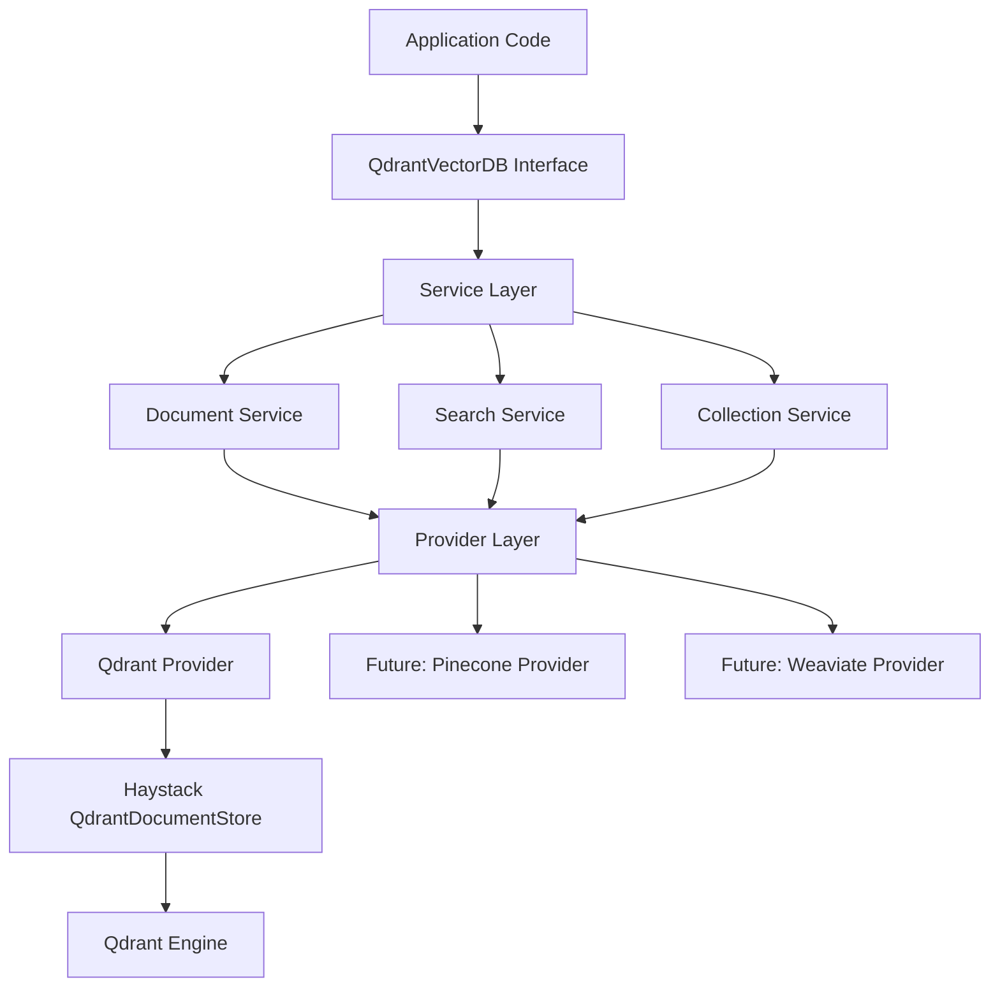

# Vector Database Migration Guide

## Table of Contents
1. [Overview](#overview)
2. [Why Migrate?](#why-migrate)
3. [Architecture Changes](#architecture-changes)
4. [Migration Steps](#migration-steps)
5. [API Changes](#api-changes)
6. [Code Examples](#code-examples)
7. [Testing Migration](#testing-migration)
8. [Rollback Plan](#rollback-plan)
9. [Troubleshooting](#troubleshooting)

---

## Overview

This guide covers migration from the **legacy monolithic architecture** to the **new modular architecture** for the vector database module.

**Migration Status**: ✅ Complete (278 tests passing - Batch 1-2)

**Timeline**: 
- Legacy: 643-line monolithic `qdrant_db.py`
- New: Modular architecture with 12+ files, provider abstraction

**Backward Compatibility**: ✅ Yes - `QdrantVectorDB` maintains the same interface

---

## Why Migrate?

### Benefits of New Architecture

| Aspect | Legacy (Old) | Modular (New) |
|--------|-------------|---------------|
| **Testability** | Hard to mock, integration tests only | 278 unit + integration tests |
| **Extensibility** | Qdrant-only, hard to add providers | Easy to add Pinecone, Weaviate, Chroma |
| **Maintainability** | 643-line file, mixed concerns | 12 focused files, clear separation |
| **Type Safety** | Minimal type hints | Full type hints + dataclasses |
| **Configuration** | Constructor params only | YAML, env vars, programmatic |
| **Error Handling** | Basic logging | Structured exceptions + recovery |
| **Testing** | Manual testing | Automated with mocks + fixtures |

### Key Improvements

1. **Provider Abstraction**: Support multiple vector database backends
2. **Service Layer**: Separation of concerns (documents, search, collections)
3. **Type Safety**: Comprehensive type hints and dataclasses
4. **Configuration**: Flexible YAML-based configuration
5. **Testing**: 200+ tests with mocked providers
6. **Error Handling**: Structured exceptions and error recovery

---

## Architecture Changes

### Legacy Architecture (Old)

```
src/
└── qdrant_db.py (643 lines)
    └── QdrantDB class
        ├── __init__()
        ├── initialize()
        ├── insert_documents()
        ├── search()
        ├── get_collection_stats()
        ├── delete_documents()
        ├── count_documents()
        └── close()
```

**Problems**:
- All-in-one class (God object anti-pattern)
- Tightly coupled to Qdrant
- Hard to test without real Qdrant instance
- Mixed responsibilities (storage, search, management)

### New Modular Architecture

```
src/vector_database/
├── qdrant_db.py              # Backward-compatible interface
├── factory.py                # Provider factory
├── utils.py                  # Utility functions
├── MIGRATION.md              # This guide
├── config/
│   └── vectordb_config.py    # Type-safe configuration
├── models/
│   ├── search_result.py      # SearchResult, SearchResults
│   └── collection_stats.py   # CollectionStats, CollectionInfo
├── providers/
│   ├── base_provider.py      # Abstract base provider
│   └── qdrant_provider.py    # Qdrant implementation
└── services/
    ├── document_service.py    # Document CRUD operations
    ├── search_service.py      # Search & retrieval
    └── collection_service.py  # Collection management
```

**Benefits**:
- Single Responsibility Principle
- Easy to mock and test
- Easy to add new providers (Pinecone, Weaviate, Chroma)
- Clear separation of concerns

### Component Layers



---

## Migration Steps

### Step 0: Prerequisites

**Install dependencies**:
```bash
# Already in pyproject.toml
uv pip install qdrant-haystack haystack-ai pyyaml
```

**Check tests**:
```bash
pytest tests/vector_database/ -v
# Should show 278 tests passing
```

### Step 1: Update Imports

**Old imports**:
```python
from src.qdrant_db import QdrantDB
```

**New imports** (same interface):
```python
from src.vector_database.qdrant_db import QdrantVectorDB
```

### Step 2: No Code Changes Required (Backward Compatible)

**Old code continues to work**:
```python
# This still works!
from src.vector_database.qdrant_db import QdrantVectorDB

db = QdrantVectorDB(
    storage_path="./qdrant_data",
    collection_name="documents",
    embedding_dim=384,
    recreate_index=False
)

# All existing methods work
db.insert_documents(docs)
results = db.search(query_embedding, top_k=10)
stats = db.get_collection_stats()
```

### Step 3: Optional - Use New Configuration System

**YAML configuration** (recommended):

Create `config/vectordb.yaml`:
```yaml
storage:
  path: "./storage/qdrant_db"
  collection_name: "documents"

vector:
  embedding_dim: 384
  distance_metric: "cosine"

index:
  recreate: false
  return_embedding: true

hnsw:
  m: 16
  ef_construct: 200
  full_scan_threshold: 10000

quantization:
  enabled: false
  type: "scalar"
  quantile: 0.99

search:
  default_top_k: 10
  score_threshold: null
```

**Load configuration**:
```python
import yaml
from pathlib import Path
from src.vector_database.qdrant_db import QdrantVectorDB

# Load YAML
with open("config/vectordb.yaml") as f:
    config = yaml.safe_load(f)

# Create database
db = QdrantVectorDB(
    storage_path=config['storage']['path'],
    collection_name=config['storage']['collection_name'],
    embedding_dim=config['vector']['embedding_dim'],
    hnsw_config=config['hnsw'],
    quantization_config=config['quantization'] if config['quantization']['enabled'] else None
)
```

### Step 4: Optional - Use New Service Layer (Advanced)

**Access services directly** (for advanced use cases):
```python
from src.vector_database.qdrant_db import QdrantVectorDB

db = QdrantVectorDB()

# Use document service
from haystack import Document

docs = [Document(content="text", embedding=[...])]
result = db.insert_documents(docs)  # Uses document service internally

# Use search service
results = db.search(query_embedding=[...])  # Uses search service internally

# Use collection service
stats = db.get_collection_stats()  # Uses collection service internally
```

---

## API Changes

### Backward Compatible Methods

All legacy methods work with the same signatures:

| Method | Status | Notes |
|--------|--------|-------|
| `__init__()` | ✅ Compatible | Same parameters |
| `insert_documents()` | ✅ Compatible | Same signature |
| `insert_embedded_documents()` | ✅ Compatible | Same signature |
| `search()` | ✅ Compatible | Same return format |
| `search_with_query_text()` | ✅ Compatible | Same signature |
| `get_document_by_id()` | ✅ Compatible | Same signature |
| `get_collection_stats()` | ✅ Compatible | Returns dict (legacy format) |
| `delete_collection()` | ✅ Compatible | Same signature |

### New Methods (Optional)

**Enhanced methods** available in new architecture:

```python
# Delete by filter
db.delete_documents_by_filter(
    filters={"category": "obsolete"}
)

# List all collections
collections = db.list_collections()

# Batch operations
db.insert_documents_batch(large_doc_list, batch_size=100)

# Collection info
info = db.get_collection_info()
```

---

## Code Examples

### Example 1: Basic Migration (No Changes)

**Old code**:
```python
from src.qdrant_db import QdrantDB

db = QdrantDB(
    storage_path="./qdrant_data",
    collection_name="docs",
    embedding_dim=384
)

# Insert
ids = db.insert_documents(documents)

# Search
results = db.search(query_embedding, top_k=10)
```

**New code** (just update import):
```python
from src.vector_database.qdrant_db import QdrantVectorDB

db = QdrantVectorDB(
    storage_path="./qdrant_data",
    collection_name="docs",
    embedding_dim=384
)

# Everything else stays the same!
ids = db.insert_documents(documents)
results = db.search(query_embedding, top_k=10)
```

### Example 2: Using YAML Configuration

**Before**:
```python
db = QdrantVectorDB(
    storage_path="./storage/qdrant_db",
    collection_name="documents",
    embedding_dim=384,
    recreate_index=False,
    hnsw_config={
        "m": 16,
        "ef_construct": 200,
        "full_scan_threshold": 10000
    },
    quantization_config={
        "enabled": True,
        "type": "scalar",
        "quantile": 0.99
    }
)
```

**After** (cleaner):
```python
import yaml

with open("config/vectordb.yaml") as f:
    config = yaml.safe_load(f)

db = QdrantVectorDB(
    storage_path=config['storage']['path'],
    collection_name=config['storage']['collection_name'],
    embedding_dim=config['vector']['embedding_dim'],
    hnsw_config=config['hnsw'],
    quantization_config=config['quantization'] if config['quantization']['enabled'] else None
)
```

### Example 3: Environment-Based Configuration

**Load from environment**:
```python
import os
from src.vector_database.qdrant_db import QdrantVectorDB

db = QdrantVectorDB(
    storage_path=os.getenv("QDRANT_STORAGE_PATH", "./storage/qdrant_db"),
    collection_name=os.getenv("QDRANT_COLLECTION_NAME", "documents"),
    embedding_dim=int(os.getenv("QDRANT_EMBEDDING_DIM", "384")),
    recreate_index=os.getenv("QDRANT_RECREATE_INDEX", "false").lower() == "true"
)
```

### Example 4: Gradual Migration with Feature Flag

**Use both implementations** during migration:
```python
import os
from pathlib import Path

USE_NEW = os.getenv("USE_NEW_VECTOR_DB", "true") == "true"

if USE_NEW:
    from src.vector_database.qdrant_db import QdrantVectorDB
    db = QdrantVectorDB(
        storage_path="./qdrant_data",
        collection_name="docs",
        embedding_dim=384
    )
else:
    # Legacy fallback (if you kept the old code)
    from src.legacy.qdrant_db import QdrantDB
    db = QdrantDB(
        storage_path="./qdrant_data",
        collection_name="docs",
        embedding_dim=384
    )

# Same interface, works with both!
results = db.search(query_embedding, top_k=10)
```

---

## Testing Migration

### Unit Tests

**Test with mocked provider** (new capability):
```python
from unittest.mock import Mock
from haystack import Document

def test_insert_documents():
    # Mock the document store
    mock_store = Mock()
    mock_store.write_documents.return_value = 2
    
    # Create database with mocked store
    db = QdrantVectorDB()
    db.document_store = mock_store
    
    # Test
    docs = [
        Document(content="doc1", embedding=[0.1, 0.2]),
        Document(content="doc2", embedding=[0.3, 0.4])
    ]
    result = db.insert_documents(docs)
    
    assert len(result) == 2
    mock_store.write_documents.assert_called_once()
```

### Integration Tests

**Run full test suite**:
```bash
# All tests
pytest tests/vector_database/ -v

# Specific categories
pytest tests/vector_database/test_qdrant_db.py -v          # Main interface
pytest tests/vector_database/test_document_service.py -v   # Document operations
pytest tests/vector_database/test_search_service.py -v     # Search operations
pytest tests/vector_database/test_collection_service.py -v # Collection management
```

**Expected results**: 278 tests passing

### Comparison Testing

**Compare old vs new**:
```python
from src.vector_database.qdrant_db import QdrantVectorDB
from haystack import Document
import numpy as np

# Same configuration for both
config = {
    "storage_path": "./test_comparison",
    "collection_name": "test_docs",
    "embedding_dim": 384,
    "recreate_index": True
}

# Create databases
new_db = QdrantVectorDB(**config)

# Same documents
docs = [
    Document(content="Python programming", embedding=np.random.rand(384).tolist()),
    Document(content="Machine learning", embedding=np.random.rand(384).tolist())
]

# Insert
new_ids = new_db.insert_documents(docs)

# Search with same query
query_embedding = np.random.rand(384).tolist()
new_results = new_db.search(query_embedding, top_k=2)

print(f"New DB - Inserted: {len(new_ids)}, Found: {len(new_results)}")

# Compare results
assert len(new_results) == 2
assert all('id' in r for r in new_results)
assert all('score' in r for r in new_results)
assert all('content' in r for r in new_results)
```

---

## Rollback Plan

### If Issues Occur

1. **Keep Legacy Code** (safety net):
```bash
# Don't delete old code immediately
git branch backup-legacy-vectordb
mv src/qdrant_db.py src/legacy/qdrant_db.py  # Keep as backup
```

2. **Feature Flag Rollback**:
```python
# Set environment variable to rollback
export USE_NEW_VECTOR_DB=false

# Or in code
import os
os.environ["USE_NEW_VECTOR_DB"] = "false"
```

3. **Data Migration Rollback**:
```python
# Export data before migration
from src.vector_database.qdrant_db import QdrantVectorDB

db = QdrantVectorDB()
all_docs = db.export_all_documents()  # Save to JSON

# If issues, restore from backup
db.insert_documents(all_docs)
```

4. **Gradual Rollout**:
```python
# Migrate one module at a time
# Week 1: RAG module
# Week 2: Search module
# Week 3: API module
# Monitor for issues at each step
```

---

## Troubleshooting

### Issue 1: Import Error

**Symptom**:
```
ModuleNotFoundError: No module named 'src.vector_database'
```

**Solution**:
```python
# Check your imports
from src.vector_database.qdrant_db import QdrantVectorDB  # Correct

# Not:
from src.vector_database import QdrantVectorDB  # Wrong
```

### Issue 2: Dimension Mismatch

**Symptom**:
```
ValueError: Embedding dimension mismatch: expected 384, got 768
```

**Solution**:
```python
from src.embeddings.embedding_generator import EmbeddingGenerator

# Check model dimension
embedder = EmbeddingGenerator(model_name="BAAI/bge-small-en-v1.5")
dim = embedder.get_embedding_dimension()

# Use correct dimension
db = QdrantVectorDB(embedding_dim=dim)
```

### Issue 3: Collection Already Exists

**Symptom**:
```
CollectionAlreadyExistsError: Collection 'documents' already exists
```

**Solution**:
```python
# Option 1: Use existing collection
db = QdrantVectorDB(recreate_index=False)

# Option 2: Recreate (deletes existing data!)
db = QdrantVectorDB(recreate_index=True)

# Option 3: Use different name
db = QdrantVectorDB(collection_name="documents_v2")
```

### Issue 4: Tests Failing

**Symptom**:
```
pytest tests/vector_database/ 
# Some tests fail
```

**Solution**:
```bash
# Clean test data
rm -rf ./storage/test_*

# Reinstall dependencies
uv pip install --upgrade qdrant-haystack haystack-ai

# Run tests with verbose output
pytest tests/vector_database/ -v --tb=short

# Run specific test
pytest tests/vector_database/test_qdrant_db.py::test_insert_documents -v
```

### Issue 5: Performance Degradation

**Symptom**: New implementation is slower than legacy.

**Investigation**:
```python
import time
from src.vector_database.qdrant_db import QdrantVectorDB

db = QdrantVectorDB()

# Benchmark insert
start = time.time()
db.insert_documents(documents)
insert_time = time.time() - start
print(f"Insert: {insert_time:.2f}s ({len(documents)/insert_time:.0f} docs/s)")

# Benchmark search
start = time.time()
results = db.search(query_embedding, top_k=10)
search_time = time.time() - start
print(f"Search: {search_time*1000:.2f}ms")
```

**Solutions**:
1. Enable quantization for large collections
2. Tune HNSW parameters (increase `m`)
3. Ensure proper batch sizes
4. Check disk I/O (use SSD for storage)

---

## Migration Checklist

- [ ] **Backup data**: Export existing collections
- [ ] **Update dependencies**: `uv pip install qdrant-haystack haystack-ai`
- [ ] **Update imports**: Change to `from src.vector_database.qdrant_db import QdrantVectorDB`
- [ ] **Run tests**: `pytest tests/vector_database/ -v` (278 tests should pass)
- [ ] **Update configuration**: Create `config/vectordb.yaml` (optional)
- [ ] **Test in development**: Run integration tests with real data
- [ ] **Monitor performance**: Benchmark insert/search speeds
- [ ] **Gradual rollout**: Migrate one module at a time
- [ ] **Monitor logs**: Check for errors or warnings
- [ ] **Cleanup**: Remove legacy code after successful migration

---

## Additional Resources

- **Overview**: [overview.md](./overview.md) - Vector database overview
- **Architecture**: See "Architecture Changes" section above
- **Testing**: `tests/vector_database/` - 278 test examples
- **Source Code**: `src/vector_database/` - New modular implementation
- **Legacy Code**: `src/qdrant_db.py` → `src/vector_database/qdrant_db.py` (preserved interface)

---

## Support

**Questions or issues?**
1. Check test examples in `tests/vector_database/`
2. Review [overview.md](./overview.md) for detailed API documentation
3. See AGENTS.md for design principles
4. Check existing issues in the codebase

**Migration complete!** ✅ 278 tests passing (Batch 1-2)
