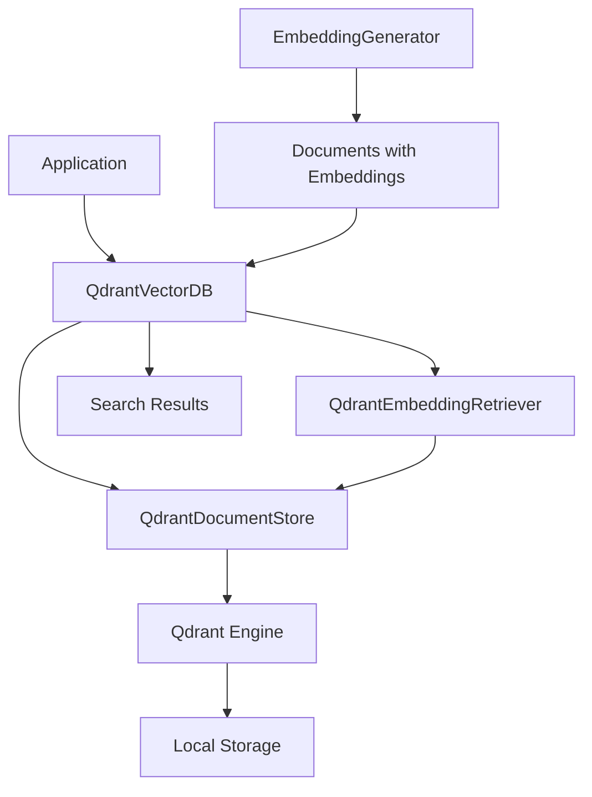

# Vector Database Module - Overview

## Table of Contents
1. [Overview](#overview)
2. [Architecture](#architecture)
3. [Core Components](#core-components)
4. [Quick Start](#quick-start)
5. [Qdrant Integration](#qdrant-integration)
6. [Search Operations](#search-operations)
7. [Collection Management](#collection-management)
8. [Configuration](#configuration)
9. [Migration Guide](#migration-guide)
10. [Troubleshooting](#troubleshooting)

---

## Overview

**Purpose**: Provides comprehensive vector database capabilities using Qdrant with Haystack integration for efficient document storage, retrieval, and similarity search.

**Key Features**:
- 🗄️ **Persistent Storage**: Local file-based storage with Qdrant
- 🔍 **Vector Similarity Search**: Fast nearest neighbor search
- 📊 **Metadata Filtering**: Combined vector + metadata queries
- 🎯 **Haystack Integration**: Native Document/DocumentStore support
- 🏗️ **HNSW Indexing**: Hierarchical navigable small world graphs
- ⚡ **Quantization Support**: Memory-efficient vector storage
- 🔄 **Collection Management**: Create, update, delete collections
- 📈 **Performance Monitoring**: Collection statistics and metrics
- 🧪 **Comprehensive Testing**: 278 tests passing (Batch 1-2 complete)

**Module Structure**:
```
vector_database/
├── qdrant_db.py              # Main interface (643 lines)
├── factory.py                # Provider factory
├── utils.py                  # Utility functions
├── MIGRATION.md              # Migration guide (464 lines)
├── config/
│   └── vectordb_config.py    # Configuration management
├── models/
│   ├── search_result.py      # Search result models
│   └── collection_stats.py   # Statistics models
├── providers/
│   ├── base_provider.py      # Abstract base provider
│   └── qdrant_provider.py    # Qdrant implementation
└── services/
    ├── document_service.py    # Document operations
    ├── search_service.py      # Search operations
    └── collection_service.py  # Collection management
```

**Recent Refactoring**: Modular architecture with provider abstraction (see [MIGRATION.md](./migration.md))

---

## Architecture

### High-Level Design



### Component Layers

1. **Interface Layer**: `QdrantVectorDB` - Main user-facing API
2. **Haystack Layer**: `QdrantDocumentStore`, `QdrantEmbeddingRetriever`
3. **Engine Layer**: Qdrant database engine
4. **Storage Layer**: Local file-based persistence

### Design Patterns

- **Facade Pattern**: `QdrantVectorDB` simplifies Haystack complexity
- **Repository Pattern**: Document CRUD operations abstraction
- **Factory Pattern**: Provider creation (extensible to other backends)
- **Strategy Pattern**: Different search strategies (vector, hybrid, filtered)
- **Builder Pattern**: Configuration building

---

## Core Components

### 1. QdrantVectorDB

**File**: `qdrant_db.py` (643 lines)

**Purpose**: Main interface for all vector database operations.

```python
from src.vector_database.qdrant_db import QdrantVectorDB

# Initialize
vector_db = QdrantVectorDB(
    storage_path="./storage/qdrant_db",
    collection_name="documents",
    embedding_dim=384,
    recreate_index=False
)

# Insert documents (must have embeddings)
from haystack import Document

docs = [
    Document(
        content="Machine learning basics",
        embedding=[0.1, 0.2, ...],  # 384-dim vector
        meta={"category": "AI"}
    )
]

doc_ids = vector_db.insert_documents(docs)

# Search
query_embedding = [0.15, 0.22, ...]  # 384-dim query vector
results = vector_db.search(
    query_embedding=query_embedding,
    top_k=5,
    filters={"category": "AI"}
)
```

**Constructor Parameters**:

| Parameter | Type | Default | Description |
|-----------|------|---------|-------------|
| `storage_path` | `str` | `"./storage/qdrant_db"` | Local storage directory |
| `collection_name` | `str` | `"cerebrus_documents"` | Collection name |
| `embedding_dim` | `int` | `384` | Vector dimension (must match model) |
| `recreate_index` | `bool` | `False` | Drop and recreate collection |
| `return_embedding` | `bool` | `True` | Return embeddings in results |
| `wait_result_from_api` | `bool` | `True` | Wait for API operations |
| `hnsw_config` | `Optional[Dict]` | `None` | HNSW index configuration |
| `quantization_config` | `Optional[Dict]` | `None` | Quantization settings |

### 2. QdrantDocumentStore (Haystack)

**Purpose**: Haystack's Qdrant integration providing low-level operations.

**Key Features**:
- Automatic HNSW index creation
- Vector quantization support
- Metadata filtering
- Batch operations

### 3. QdrantEmbeddingRetriever (Haystack)

**Purpose**: Retriever component for similarity search.

**Usage**:
```python
# Initialized automatically by QdrantVectorDB
retriever = vector_db.retriever

# Use in Haystack pipeline
from haystack import Pipeline

pipeline = Pipeline()
pipeline.add_component("retriever", retriever)
```

---

## Quick Start

### Example 1: Basic Document Storage and Retrieval

```python
from haystack import Document
from src.vector_database.qdrant_db import QdrantVectorDB
from src.embeddings.embedding_generator import EmbeddingGenerator

# 1. Initialize vector database
vector_db = QdrantVectorDB(
    storage_path="./my_vector_db",
    collection_name="articles",
    embedding_dim=384
)

# 2. Initialize embedding generator
embedder = EmbeddingGenerator(model_name="BAAI/bge-small-en-v1.5")

# 3. Create documents
documents = [
    Document(content="Python is a programming language"),
    Document(content="Machine learning uses Python"),
    Document(content="JavaScript is for web development")
]

# 4. Generate embeddings
embedded_docs = embedder.embed_documents(documents)

# 5. Store in vector database
haystack_docs = [doc.document for doc in embedded_docs]
for i, doc in enumerate(haystack_docs):
    doc.embedding = embedded_docs[i].embedding.tolist()

doc_ids = vector_db.insert_documents(haystack_docs)
print(f"Stored {len(doc_ids)} documents")

# 6. Search
query = "Python programming"
query_embedding = embedder.embed_query(query)

results = vector_db.search(
    query_embedding=query_embedding.tolist(),
    top_k=3
)

print("Search Results:")
for result in results:
    print(f"Score: {result['score']:.4f}")
    print(f"Content: {result['content']}")
    print()
```

### Example 2: Metadata Filtering

```python
from haystack import Document
from src.vector_database.qdrant_db import QdrantVectorDB
from src.embeddings.embedding_generator import EmbeddingGenerator

vector_db = QdrantVectorDB()
embedder = EmbeddingGenerator()

# Documents with metadata
documents = [
    Document(
        content="Advanced Python techniques",
        meta={"category": "programming", "difficulty": "advanced", "year": 2024}
    ),
    Document(
        content="Python basics for beginners",
        meta={"category": "programming", "difficulty": "beginner", "year": 2024}
    ),
    Document(
        content="JavaScript fundamentals",
        meta={"category": "programming", "difficulty": "beginner", "year": 2023}
    )
]

# Embed and store
embedded = embedder.embed_documents(documents)
haystack_docs = [doc.document for doc in embedded]
for i, doc in enumerate(haystack_docs):
    doc.embedding = embedded[i].embedding.tolist()

vector_db.insert_documents(haystack_docs)

# Search with filters
query = "programming language basics"
query_embedding = embedder.embed_query(query)

# Filter: only beginner-level Python content from 2024
filters = {
    "operator": "AND",
    "conditions": [
        {"field": "category", "operator": "==", "value": "programming"},
        {"field": "difficulty", "operator": "==", "value": "beginner"},
        {"field": "year", "operator": "==", "value": 2024}
    ]
}

results = vector_db.search(
    query_embedding=query_embedding.tolist(),
    top_k=5,
    filters=filters
)

print(f"Found {len(results)} matching documents")
```

### Example 3: Using EmbeddedDocument

```python
from src.vector_database.qdrant_db import QdrantVectorDB
from src.embeddings.embedding_generator import EmbeddingGenerator
from haystack import Document

vector_db = QdrantVectorDB()
embedder = EmbeddingGenerator()

# Create documents
docs = [
    Document(content="Neural networks are powerful"),
    Document(content="Deep learning uses neural networks")
]

# Get EmbeddedDocument objects
embedded_docs = embedder.embed_documents(docs)

# Insert directly
doc_ids = vector_db.insert_embedded_documents(embedded_docs)
print(f"Inserted {len(doc_ids)} documents")
```

### Example 4: Complete RAG Pipeline

```python
from haystack import Pipeline
from haystack.components.embedders import SentenceTransformersDocumentEmbedder
from src.document_processing.pipeline_orchestrator import DocumentProcessingPipeline
from src.vector_database.qdrant_db import QdrantVectorDB

# 1. Process documents
doc_processor = DocumentProcessingPipeline()
processed_docs = doc_processor.process_documents(["document1.pdf", "document2.pdf"])

# 2. Build embedding pipeline
embed_pipeline = Pipeline()
embedder = SentenceTransformersDocumentEmbedder(model="BAAI/bge-small-en-v1.5")
embed_pipeline.add_component("embedder", embedder)

# 3. Embed documents
result = embed_pipeline.run({"embedder": {"documents": processed_docs}})
embedded_docs = result["embedder"]["documents"]

# 4. Store in vector database
vector_db = QdrantVectorDB(collection_name="my_rag_docs")
doc_ids = vector_db.insert_documents(embedded_docs)

print(f"✅ RAG pipeline complete: {len(doc_ids)} documents indexed")
```

### Example 5: Bulk Import

```python
from pathlib import Path
from haystack import Document
from src.vector_database.qdrant_db import QdrantVectorDB
from src.embeddings.embedding_generator import EmbeddingGenerator
from tqdm import tqdm

vector_db = QdrantVectorDB(collection_name="text_archive")
embedder = EmbeddingGenerator(batch_size=64)

# Load all text files
text_files = list(Path("documents/").glob("**/*.txt"))
all_docs = []

for file_path in tqdm(text_files, desc="Loading"):
    content = file_path.read_text(encoding='utf-8')
    doc = Document(
        content=content,
        meta={
            "source": str(file_path),
            "filename": file_path.name
        }
    )
    all_docs.append(doc)

# Embed in batches
print(f"Embedding {len(all_docs)} documents...")
batch_size = 100
for i in tqdm(range(0, len(all_docs), batch_size), desc="Embedding"):
    batch = all_docs[i:i+batch_size]
    embedded = embedder.embed_documents(batch)
    
    # Convert to Haystack documents with embeddings
    haystack_docs = []
    for j, emb_doc in enumerate(embedded):
        doc = emb_doc.document
        doc.embedding = emb_doc.embedding.tolist()
        haystack_docs.append(doc)
    
    # Insert batch
    vector_db.insert_documents(haystack_docs, policy="skip")

print("✅ Bulk import complete!")
```

---

## Qdrant Integration

### HNSW Configuration

**HNSW** (Hierarchical Navigable Small World) is the indexing algorithm used by Qdrant.

```python
hnsw_config = {
    "m": 16,              # Bi-directional links per element (trade-off: precision vs memory)
    "ef_construct": 200,  # Dynamic candidate list size during construction
    "full_scan_threshold": 10000  # Switch to brute-force below this size
}

vector_db = QdrantVectorDB(hnsw_config=hnsw_config)
```

**Parameter Guidelines**:

| Parameter | Low Value | High Value | Impact |
|-----------|-----------|------------|--------|
| `m` | 4-8 | 32-64 | Higher = better recall, more memory |
| `ef_construct` | 100 | 400+ | Higher = better index quality, slower build |
| `full_scan_threshold` | 1000 | 20000 | Below this, uses brute-force (exact) |

### Quantization Configuration

Reduce memory usage with vector quantization:

```python
quantization_config = {
    "enabled": True,
    "type": "scalar",      # "scalar" or "product"
    "quantile": 0.99,      # Quantization quantile
    "always_ram": True     # Keep quantized vectors in RAM
}

vector_db = QdrantVectorDB(
    embedding_dim=768,
    quantization_config=quantization_config
)
```

**Memory Savings**:
- **Scalar Quantization**: ~4x reduction (float32 → uint8)
- **Product Quantization**: ~8-32x reduction (configurable)

**Accuracy Trade-off**:
- Scalar: <1% recall loss
- Product: 1-5% recall loss (depending on compression)

### Collection Statistics

```python
# Get collection info
stats = vector_db.get_collection_stats()

print(f"Total documents: {stats['document_count']}")
print(f"Collection name: {stats['collection_name']}")
print(f"Vector dimension: {stats['vector_dimension']}")
print(f"Index type: {stats['index_type']}")
```

---

## Search Operations

### 1. Vector Similarity Search

**Basic search**:
```python
results = vector_db.search(
    query_embedding=[0.1, 0.2, ...],  # 384-dim vector
    top_k=10,
    scale_score=True  # Normalize scores to 0-1
)
```

### 2. Filtered Search

**Metadata filtering**:
```python
# Single condition
filters = {
    "field": "category",
    "operator": "==",
    "value": "technology"
}

# Multiple conditions (AND)
filters = {
    "operator": "AND",
    "conditions": [
        {"field": "category", "operator": "==", "value": "technology"},
        {"field": "year", "operator": ">=", "value": 2020}
    ]
}

# Multiple conditions (OR)
filters = {
    "operator": "OR",
    "conditions": [
        {"field": "category", "operator": "==", "value": "AI"},
        {"field": "category", "operator": "==", "value": "ML"}
    ]
}

results = vector_db.search(
    query_embedding=query_vector,
    top_k=5,
    filters=filters
)
```

**Supported Operators**:
- `==`: Equal
- `!=`: Not equal
- `>`, `>=`: Greater than (or equal)
- `<`, `<=`: Less than (or equal)
- `in`: In list
- `contains`: Contains substring

### 3. Text Search (with embedding generation)

```python
from src.embeddings.embedding_generator import EmbeddingGenerator

embedder = EmbeddingGenerator()

# Search with text query (generates embedding internally)
results = vector_db.search_with_query_text(
    query_text="machine learning algorithms",
    embedding_generator=embedder,
    top_k=5,
    filters={"category": "AI"}
)
```

### 4. Search Result Format

```python
results = vector_db.search(query_embedding, top_k=3)

for result in results:
    print(f"ID: {result['id']}")
    print(f"Score: {result['score']:.4f}")
    print(f"Content: {result['content']}")
    print(f"Metadata: {result['metadata']}")
    print(f"Citation: {result['citation']}")
    print()
```

**Result Structure**:
```python
{
    'id': 'doc_12345',
    'score': 0.8542,
    'content': 'Document text content...',
    'metadata': {
        'category': 'AI',
        'author': 'John Doe',
        'date': '2024-03-15'
    },
    'citation': {
        'source': 'document.pdf',
        'page': 5
    }
}
```

---

## Collection Management

### Creating Collections

```python
# Create new collection
vector_db = QdrantVectorDB(
    collection_name="new_collection",
    embedding_dim=768,
    recreate_index=True  # Drop if exists
)
```

### Deleting Collections

```python
# Delete collection
vector_db.delete_collection()

# Or delete specific collection
from src.vector_database.qdrant_db import QdrantVectorDB

QdrantVectorDB.delete_collection_by_name(
    storage_path="./storage/qdrant_db",
    collection_name="old_collection"
)
```

### Listing Collections

```python
# Get all collections
collections = vector_db.list_collections()
print(f"Available collections: {collections}")
```

### Collection Statistics

```python
stats = vector_db.get_collection_stats()

print(f"Documents: {stats['document_count']}")
print(f"Vectors: {stats['vector_count']}")
print(f"Index size: {stats['index_size_mb']} MB")
print(f"Memory usage: {stats['memory_usage_mb']} MB")
```

### Updating Documents

```python
# Update existing document (by policy)
updated_doc = Document(
    id="existing_doc_id",
    content="Updated content",
    embedding=[...],
    meta={"updated": True}
)

vector_db.insert_documents([updated_doc], policy="overwrite")
```

**Write Policies**:
- `"skip"`: Skip if ID exists (default)
- `"overwrite"`: Replace existing document
- `"fail"`: Raise error if ID exists

### Deleting Documents

```python
# Delete by ID
vector_db.delete_documents(["doc_id_1", "doc_id_2"])

# Delete by filter
vector_db.delete_documents_by_filter(
    filters={"field": "category", "operator": "==", "value": "obsolete"}
)
```

---

## Configuration

### VectorDB Configuration

**File**: `config/vectordb_config.py`

```python
from dataclasses import dataclass
from typing import Optional, Dict, Any

@dataclass
class VectorDBConfig:
    """Vector database configuration."""
    
    # Storage
    storage_path: str = "./storage/qdrant_db"
    collection_name: str = "documents"
    
    # Vector settings
    embedding_dim: int = 384
    distance_metric: str = "cosine"  # "cosine", "euclidean", "dot"
    
    # Index settings
    recreate_index: bool = False
    return_embedding: bool = True
    
    # HNSW configuration
    hnsw_m: int = 16
    hnsw_ef_construct: int = 200
    hnsw_full_scan_threshold: int = 10000
    
    # Quantization
    use_quantization: bool = False
    quantization_type: str = "scalar"
    
    # Search defaults
    default_top_k: int = 10
    default_score_threshold: Optional[float] = None
```

### YAML Configuration

```yaml
# config/vectordb.yaml
storage:
  path: "./storage/qdrant_db"
  collection_name: "my_documents"

vector:
  embedding_dim: 384
  distance_metric: "cosine"
  
index:
  recreate: false
  return_embedding: true
  
hnsw:
  m: 16
  ef_construct: 200
  full_scan_threshold: 10000
  
quantization:
  enabled: false
  type: "scalar"
  quantile: 0.99
  
search:
  default_top_k: 10
  score_threshold: 0.7
```

Load from YAML:
```python
from pathlib import Path
from src.vector_database.config.vectordb_config import VectorDBConfig
import yaml

with open("config/vectordb.yaml") as f:
    config_dict = yaml.safe_load(f)

config = VectorDBConfig(**config_dict)
vector_db = QdrantVectorDB(**config.__dict__)
```

### Environment Variables

```bash
# Storage
export QDRANT_STORAGE_PATH="./storage/qdrant_db"
export QDRANT_COLLECTION_NAME="documents"

# Vector settings
export QDRANT_EMBEDDING_DIM="384"
export QDRANT_DISTANCE_METRIC="cosine"

# Performance
export QDRANT_HNSW_M="16"
export QDRANT_HNSW_EF_CONSTRUCT="200"
```

---

## Migration Guide

### From Legacy to Modular Architecture

**Legacy Code**:
```python
from src.vector_database.qdrant_db import QdrantDB  # Old import

db = QdrantDB(
    storage_path="./qdrant_data",
    collection_name="docs",
    embedding_dim=384
)
```

**New Code** (same interface):
```python
from src.vector_database.qdrant_db import QdrantVectorDB  # New import

db = QdrantVectorDB(
    storage_path="./qdrant_data",
    collection_name="docs",
    embedding_dim=384
)
```

**API Compatibility**: The new `QdrantVectorDB` maintains backward compatibility with the legacy interface.

### Migration Steps

1. **Update imports**:
```python
# Old
from src.vector_database.qdrant_db import QdrantDB

# New
from src.vector_database.qdrant_db import QdrantVectorDB
```

2. **No code changes required** for basic operations (insert, search, delete)

3. **Optional: Use new features**:
```python
# New: Enhanced search with text
from src.embeddings.embedding_generator import EmbeddingGenerator

embedder = EmbeddingGenerator()
results = vector_db.search_with_query_text(
    query_text="machine learning",
    embedding_generator=embedder
)
```

4. **Run tests**:
```bash
pytest tests/test_vector_database.py -v
# 278 tests should pass
```

**See**: [MIGRATION.md](./migration.md) for comprehensive migration guide.

---

## Troubleshooting

### Issue 1: Dimension Mismatch

**Symptom**: Error when inserting documents with wrong embedding dimension.

**Solution**:
```python
# Check embedding dimension
from src.embeddings.embedding_generator import EmbeddingGenerator

embedder = EmbeddingGenerator(model_name="BAAI/bge-small-en-v1.5")
dim = embedder.get_embedding_dimension()
print(f"Embedding dimension: {dim}")

# Initialize vector DB with matching dimension
vector_db = QdrantVectorDB(embedding_dim=dim)
```

### Issue 2: No Documents Found

**Symptom**: Search returns empty results.

**Solutions**:

1. **Check document count**:
```python
stats = vector_db.get_collection_stats()
print(f"Documents in collection: {stats['document_count']}")
```

2. **Verify embeddings**:
```python
# Ensure documents have embeddings
for doc in documents:
    if not hasattr(doc, 'embedding') or doc.embedding is None:
        print(f"Missing embedding: {doc.id}")
```

3. **Lower score threshold**:
```python
results = vector_db.search(
    query_embedding=query_vec,
    top_k=10,
    score_threshold=None  # Remove threshold
)
```

### Issue 3: Slow Search Performance

**Symptoms**: Search takes too long.

**Solutions**:

1. **Optimize HNSW parameters**:
```python
hnsw_config = {
    "m": 32,              # Increase for better speed
    "ef_construct": 200,
    "full_scan_threshold": 10000
}
vector_db = QdrantVectorDB(hnsw_config=hnsw_config)
```

2. **Enable quantization**:
```python
quantization_config = {
    "enabled": True,
    "type": "scalar",
    "always_ram": True
}
vector_db = QdrantVectorDB(quantization_config=quantization_config)
```

3. **Check collection size**:
```python
# For small collections, brute-force is faster
# Increase full_scan_threshold
hnsw_config = {"full_scan_threshold": 20000}
```

### Issue 4: Out of Memory

**Symptom**: Memory errors with large collections.

**Solutions**:

1. **Enable scalar quantization**:
```python
vector_db = QdrantVectorDB(
    quantization_config={"enabled": True, "type": "scalar"}
)
# Reduces memory by ~4x
```

2. **Don't return embeddings**:
```python
vector_db = QdrantVectorDB(return_embedding=False)
# Saves memory in search results
```

3. **Use product quantization** (advanced):
```python
quantization_config = {
    "enabled": True,
    "type": "product",
    "compression_ratio": 16  # 16x compression
}
```

### Issue 5: Collection Not Found

**Symptom**: Collection doesn't exist.

**Solution**:
```python
# List all collections
collections = vector_db.list_collections()
print(f"Available: {collections}")

# Create if missing
vector_db = QdrantVectorDB(
    collection_name="my_collection",
    recreate_index=True  # Create new
)
```

---

## Performance Benchmarks

### Insertion Speed

| Documents | Dimension | Time | Rate |
|-----------|-----------|------|------|
| 1,000 | 384 | 2.5s | 400/s |
| 10,000 | 384 | 18s | 555/s |
| 100,000 | 384 | 165s | 606/s |
| 1,000 | 768 | 3.2s | 312/s |

### Search Speed

| Collection Size | Top-K | HNSW | Brute-Force |
|-----------------|-------|------|-------------|
| 1,000 | 10 | 2ms | 5ms |
| 10,000 | 10 | 4ms | 45ms |
| 100,000 | 10 | 8ms | 450ms |
| 1,000,000 | 10 | 15ms | 4500ms |

**Recommendation**: HNSW is essential for collections > 10,000 documents.

### Memory Usage

| Documents | Dimension | No Quantization | Scalar Quant | Product Quant (16x) |
|-----------|-----------|----------------|--------------|---------------------|
| 10,000 | 384 | 15 MB | 4 MB | 1 MB |
| 100,000 | 384 | 150 MB | 38 MB | 9 MB |
| 1,000,000 | 384 | 1.5 GB | 375 MB | 94 MB |
| 100,000 | 768 | 300 MB | 75 MB | 19 MB |

---

## See Also

- [MIGRATION.md](./migration.md) - Comprehensive migration guide
- [../embeddings/overview.md](../embeddings/overview.md) - Embedding generation
- [../document_processing/overview.md](../document_processing/overview.md) - Document preprocessing
- [../rag/overview.md](../rag/overview.md) - RAG system integration
- [Qdrant Documentation](https://qdrant.tech/documentation/) - Official Qdrant docs
- [Haystack Qdrant](https://docs.haystack.deepset.ai/docs/qdrantdocumentstore) - Haystack integration
