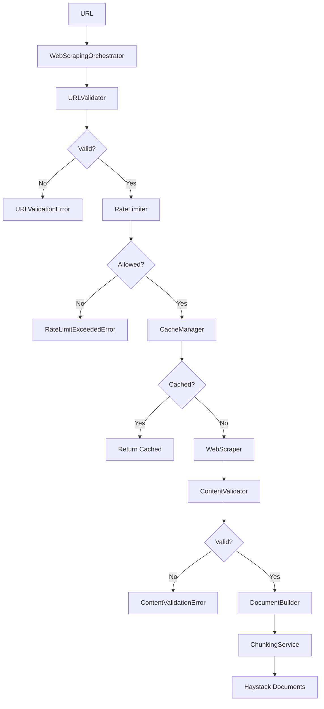

# Web Scraping Module - Overview

## Table of Contents
1. [Overview](#overview)
2. [Architecture](#architecture)
3. [Core Components](#core-components)
4. [Quick Start](#quick-start)
5. [Scraping Providers](#scraping-providers)
6. [Validation](#validation)
7. [Caching](#caching)
8. [Rate Limiting](#rate-limiting)
9. [Configuration](#configuration)
10. [Troubleshooting](#troubleshooting)

---

## Overview

**Purpose**: Provides comprehensive web scraping capabilities with validation, caching, rate limiting, and integration with document processing pipelines.

**Key Features**:
- 🌐 **Firecrawl Integration**: JavaScript rendering and content extraction
- ✅ **URL Validation**: Comprehensive URL checking before scraping
- 📄 **Content Validation**: Quality checks on scraped content
- 💾 **Smart Caching**: File-based caching with TTL
- ⏱️ **Rate Limiting**: Token bucket algorithm to prevent overloading
- 📚 **Document Integration**: Creates Haystack Documents
- ✂️ **Automatic Chunking**: Uses document_processing ChunkingService
- 🔄 **Orchestrated Workflow**: Coordinated multi-step scraping process
- 🛡️ **Error Handling**: Comprehensive exception handling

**Module Structure**:
```
web_scraping/
├── config.py                 # Configuration dataclasses
├── exceptions.py             # Custom exceptions
├── interfaces.py             # Abstract interfaces (ABC)
├── cache/
│   ├── manager.py            # File-based cache manager
│   └── __init__.py
├── components/
│   └── document_builder.py   # Builds Haystack Documents
├── processing/
│   └── content_processor.py  # Content processing utilities
├── rate_limiting/
│   ├── limiter.py            # Token bucket rate limiter
│   └── __init__.py
├── scraping/
│   ├── orchestrator.py       # Main orchestration logic
│   ├── providers/
│   │   ├── base.py           # Abstract base provider
│   │   ├── firecrawl.py      # Firecrawl implementation
│   │   └── __init__.py
│   └── __init__.py
└── validation/
    ├── url_validator.py      # URL validation
    ├── content_validator.py  # Content validation
    └── __init__.py
```

**Dependencies**:
- **firecrawl-py**: Firecrawl API client
- **haystack-ai**: Document format
- **document_processing**: Chunking integration

---

## Architecture

### High-Level Design



### Component Layers

1. **Orchestration Layer**: `DefaultWebScrapingOrchestrator` - Coordinates workflow
2. **Validation Layer**: `URLValidator`, `ContentValidator` - Input/output validation
3. **Provider Layer**: `FirecrawlScraper` - Actual scraping implementation
4. **Caching Layer**: `FileCacheManager` - Persistent caching
5. **Rate Limiting Layer**: `TokenBucketRateLimiter` - Request throttling
6. **Document Layer**: `DocumentBuilder`, `ChunkingService` - Output formatting

### Design Patterns

- **Facade Pattern**: `WebScrapingOrchestrator` simplifies complex workflow
- **Strategy Pattern**: Swappable scraping providers (Firecrawl, future: BeautifulSoup, Selenium)
- **Dependency Injection**: All dependencies injected via constructor
- **Interface Segregation**: Focused interfaces for each responsibility
- **Factory Pattern**: Provider creation based on configuration

---

## Core Components

### 1. WebScrapingOrchestrator

**File**: `scraping/orchestrator.py` (387 lines)

**Purpose**: Coordinates the complete scraping workflow.

```python
from src.web_scraping.scraping.orchestrator import DefaultWebScrapingOrchestrator
from src.web_scraping.scraping.providers.firecrawl import FirecrawlScraper
from src.web_scraping.validation.url_validator import DefaultURLValidator
from src.web_scraping.validation.content_validator import DefaultContentValidator
from src.web_scraping.components.document_builder import DefaultDocumentBuilder
from src.web_scraping.cache.manager import FileCacheManager
from src.web_scraping.rate_limiting.limiter import TokenBucketRateLimiter
from src.web_scraping.config import WebScrapingConfig

# Load configuration
config = WebScrapingConfig.from_yaml("config/web_scraping_config.yml")

# Create components
scraper = FirecrawlScraper(config.scraping, config.providers.firecrawl)
url_validator = DefaultURLValidator(config.validation.url)
content_validator = DefaultContentValidator(config.validation.content)
document_builder = DefaultDocumentBuilder()
cache_manager = FileCacheManager(config.cache)
rate_limiter = TokenBucketRateLimiter(config.rate_limiting)

# Create orchestrator
orchestrator = DefaultWebScrapingOrchestrator(
    scraper=scraper,
    url_validator=url_validator,
    content_validator=content_validator,
    document_builder=document_builder,
    cache_manager=cache_manager,
    rate_limiter=rate_limiter,
    enable_chunking=True
)

# Scrape URL
documents = orchestrator.scrape("https://example.com")
print(f"Generated {len(documents)} document chunks")
```

**Key Methods**:
- `scrape(url)`: Scrape single URL → List[Document]
- `scrape_batch(urls)`: Scrape multiple URLs → Dict[str, List[Document]]

### 2. ScrapedContent

**File**: `interfaces.py`

**Purpose**: Immutable container for scraped content.

```python
from src.web_scraping.interfaces import ScrapedContent
from datetime import datetime

content = ScrapedContent(
    url="https://example.com/article",
    content="Article text content...",
    title="Article Title",
    description="Article description from meta tag",
    links=["https://example.com/page1", "https://example.com/page2"],
    metadata={"author": "John Doe", "date": "2024-01-15"},
    scraped_at=datetime.now(),
    word_count=500,
    content_type="text/html"
)

# Convert to dict for serialization
data = content.to_dict()
```

**Attributes**:
- `url`: Original URL
- `content`: Main text content
- `title`: Page title
- `description`: Meta description
- `links`: Extracted links
- `metadata`: Additional metadata
- `scraped_at`: Timestamp
- `word_count`: Number of words (auto-calculated)
- `content_type`: MIME type

---

## Quick Start

### Example 1: Basic Web Scraping

```python
from pathlib import Path
from src.web_scraping.config import WebScrapingConfig
from src.web_scraping.scraping.orchestrator import DefaultWebScrapingOrchestrator
from src.web_scraping.scraping.providers.firecrawl import FirecrawlScraper
from src.web_scraping.validation.url_validator import DefaultURLValidator
from src.web_scraping.validation.content_validator import DefaultContentValidator
from src.web_scraping.components.document_builder import DefaultDocumentBuilder

# 1. Load configuration
config = WebScrapingConfig.from_yaml(Path("config/web_scraping_config.yml"))

# 2. Create scraper
scraper = FirecrawlScraper(
    config=config.scraping,
    provider_config=config.providers.firecrawl
)

# 3. Create validators
url_validator = DefaultURLValidator(config.validation.url)
content_validator = DefaultContentValidator(config.validation.content)

# 4. Create document builder
document_builder = DefaultDocumentBuilder()

# 5. Create orchestrator (no caching/rate limiting)
orchestrator = DefaultWebScrapingOrchestrator(
    scraper=scraper,
    url_validator=url_validator,
    content_validator=content_validator,
    document_builder=document_builder,
    enable_chunking=False  # Get single document
)

# 6. Scrape URL
url = "https://example.com/article"
documents = orchestrator.scrape(url)

print(f"Scraped: {documents[0].meta['title']}")
print(f"Content length: {len(documents[0].content)} chars")
print(f"Word count: {documents[0].meta['word_count']}")
```

### Example 2: Scraping with Caching

```python
from pathlib import Path
from src.web_scraping.config import WebScrapingConfig
from src.web_scraping.scraping.orchestrator import DefaultWebScrapingOrchestrator
from src.web_scraping.cache.manager import FileCacheManager
# ... other imports from Example 1

# Load configuration
config = WebScrapingConfig.from_yaml(Path("config/web_scraping_config.yml"))

# Create cache manager
cache_manager = FileCacheManager(config.cache)

# Create orchestrator with caching
orchestrator = DefaultWebScrapingOrchestrator(
    scraper=scraper,
    url_validator=url_validator,
    content_validator=content_validator,
    document_builder=document_builder,
    cache_manager=cache_manager,  # Enable caching
    enable_chunking=False
)

# First scrape (hits API)
documents = orchestrator.scrape("https://example.com")
print("First scrape: Fetched from web")

# Second scrape (hits cache)
documents = orchestrator.scrape("https://example.com")
print("Second scrape: Retrieved from cache")
```

### Example 3: Rate-Limited Scraping

```python
from src.web_scraping.rate_limiting.limiter import TokenBucketRateLimiter
# ... other imports

# Create rate limiter
rate_limiter = TokenBucketRateLimiter(config.rate_limiting)

# Create orchestrator with rate limiting
orchestrator = DefaultWebScrapingOrchestrator(
    scraper=scraper,
    url_validator=url_validator,
    content_validator=content_validator,
    document_builder=document_builder,
    rate_limiter=rate_limiter,  # Enable rate limiting
    enable_chunking=False
)

# Scrape multiple URLs (respects rate limit)
urls = [
    "https://example.com/page1",
    "https://example.com/page2",
    "https://example.com/page3",
]

for url in urls:
    documents = orchestrator.scrape(url)
    print(f"Scraped: {url}")
    # Rate limiter automatically controls timing
```

### Example 4: Complete Pipeline with Chunking

```python
from pathlib import Path
from src.web_scraping.config import WebScrapingConfig
from src.web_scraping.scraping.orchestrator import DefaultWebScrapingOrchestrator
from src.web_scraping.scraping.providers.firecrawl import FirecrawlScraper
from src.web_scraping.validation.url_validator import DefaultURLValidator
from src.web_scraping.validation.content_validator import DefaultContentValidator
from src.web_scraping.components.document_builder import DefaultDocumentBuilder
from src.web_scraping.cache.manager import FileCacheManager
from src.web_scraping.rate_limiting.limiter import TokenBucketRateLimiter

# Load configuration
config = WebScrapingConfig.from_yaml(Path("config/web_scraping_config.yml"))

# Create all components
scraper = FirecrawlScraper(config.scraping, config.providers.firecrawl)
url_validator = DefaultURLValidator(config.validation.url)
content_validator = DefaultContentValidator(config.validation.content)
document_builder = DefaultDocumentBuilder()
cache_manager = FileCacheManager(config.cache)
rate_limiter = TokenBucketRateLimiter(config.rate_limiting)

# Create fully-featured orchestrator
orchestrator = DefaultWebScrapingOrchestrator(
    scraper=scraper,
    url_validator=url_validator,
    content_validator=content_validator,
    document_builder=document_builder,
    cache_manager=cache_manager,
    rate_limiter=rate_limiter,
    enable_chunking=True  # Enable automatic chunking
)

# Scrape with all features enabled
url = "https://example.com/long-article"
chunks = orchestrator.scrape(url)

print(f"Generated {len(chunks)} chunks from article")
for i, chunk in enumerate(chunks):
    print(f"Chunk {i+1}: {len(chunk.content)} chars")
```

### Example 5: Batch Scraping

```python
# Scrape multiple URLs
urls = [
    "https://example.com/article1",
    "https://example.com/article2",
    "https://example.com/article3",
]

results = orchestrator.scrape_batch(urls)

for url, documents in results.items():
    if documents:
        print(f"{url}: {len(documents)} documents")
    else:
        print(f"{url}: Failed to scrape")
```

### Example 6: Custom Validation Rules

```python
from src.web_scraping.config import URLValidationConfig, ContentValidationConfig

# Custom URL validation
url_config = URLValidationConfig(
    allowed_schemes=["https"],  # Only HTTPS
    allowed_domains=["example.com", "trusted-site.org"],  # Whitelist
    blocked_domains=["spam-site.com"],  # Blacklist
    max_url_length=2000
)

# Custom content validation
content_config = ContentValidationConfig(
    min_content_length=100,  # At least 100 chars
    max_content_length=50000,  # Max 50k chars
    min_word_count=20,  # At least 20 words
    required_keywords=["python", "programming"]  # Must contain keywords
)

url_validator = DefaultURLValidator(url_config)
content_validator = DefaultContentValidator(content_config)

orchestrator = DefaultWebScrapingOrchestrator(
    scraper=scraper,
    url_validator=url_validator,
    content_validator=content_validator,
    document_builder=document_builder
)
```

---

## Scraping Providers

### Firecrawl Provider

**File**: `scraping/providers/firecrawl.py` (360 lines)

**Purpose**: Firecrawl API integration for robust web scraping.

**Features**:
- JavaScript rendering
- Markdown conversion
- Link extraction
- Dynamic content waiting

```python
from src.web_scraping.scraping.providers.firecrawl import FirecrawlScraper
from src.web_scraping.config import ScrapingConfig, FirecrawlProviderConfig
import os

# Set API key
os.environ["FIRECRAWL_API_KEY"] = "your-api-key"

# Configure
scraping_config = ScrapingConfig(
    timeout_seconds=30,
    retry_attempts=3,
    retry_delay_seconds=2,
    user_agent="CerebrusAI/1.0"
)

provider_config = FirecrawlProviderConfig(
    api_key_env="FIRECRAWL_API_KEY",
    formats=("markdown",),
    wait_for_content=True,
    include_links=True
)

# Create scraper
scraper = FirecrawlScraper(scraping_config, provider_config)

# Validate configuration
scraper.validate_config()

# Scrape
content = scraper.scrape("https://example.com")

print(f"Title: {content.title}")
print(f"Content: {content.content[:200]}...")
print(f"Links found: {len(content.links)}")
```

**Configuration**:
- `api_key_env`: Environment variable for API key
- `formats`: Output formats ("markdown", "html", "text")
- `wait_for_content`: Wait for JavaScript rendering
- `include_links`: Extract links from page

**Error Handling**:
- `ConfigurationError`: Invalid configuration
- `ScrapingProviderError`: Firecrawl API errors
- `ScrapingTimeoutError`: Request timeout

---

## Validation

### URL Validation

**File**: `validation/url_validator.py`

**Purpose**: Validates URLs before scraping.

```python
from src.web_scraping.validation.url_validator import DefaultURLValidator
from src.web_scraping.config import URLValidationConfig

# Configure validation rules
config = URLValidationConfig(
    allowed_schemes=["http", "https"],
    blocked_domains=["malicious-site.com"],
    allowed_domains=None,  # None = allow all (except blocked)
    max_url_length=2048
)

validator = DefaultURLValidator(config)

# Validate URLs
urls = [
    "https://example.com",
    "http://malicious-site.com",
    "ftp://ftp.example.com",
]

for url in urls:
    is_valid, errors = validator.validate_with_errors(url)
    if is_valid:
        print(f"✓ {url}")
    else:
        print(f"✗ {url}: {', '.join(errors)}")
```

**Validation Checks**:
1. **Scheme**: Must be in `allowed_schemes`
2. **Domain**: Must not be in `blocked_domains`
3. **Whitelist**: If `allowed_domains` set, must be in list
4. **Length**: Must be ≤ `max_url_length`
5. **Format**: Must be valid URL format

### Content Validation

**File**: `validation/content_validator.py`

**Purpose**: Validates scraped content quality.

```python
from src.web_scraping.validation.content_validator import DefaultContentValidator
from src.web_scraping.config import ContentValidationConfig
from src.web_scraping.interfaces import ScrapedContent

# Configure content rules
config = ContentValidationConfig(
    min_content_length=50,
    max_content_length=100000,
    min_word_count=10,
    required_keywords=None  # No required keywords
)

validator = DefaultContentValidator(config)

# Validate content
content = ScrapedContent(
    url="https://example.com",
    content="This is a short article about Python programming.",
    title="Python Guide",
    word_count=8
)

is_valid, errors = validator.validate_with_errors(content)
if not is_valid:
    print(f"Validation failed: {', '.join(errors)}")
```

**Validation Checks**:
1. **Length**: Content length in range
2. **Word Count**: Minimum words threshold
3. **Keywords**: Required keywords present (optional)
4. **Empty Content**: Not empty string

---

## Caching

**File**: `cache/manager.py` (402 lines)

**Purpose**: File-based caching with TTL.

```python
from pathlib import Path
from src.web_scraping.cache.manager import FileCacheManager
from src.web_scraping.config import CacheConfig

# Configure cache
config = CacheConfig(
    enabled=True,
    cache_dir=Path("cache/web_scraping"),
    ttl_hours=24,
    max_cache_size_mb=1000
)

cache_manager = FileCacheManager(config)

# Generate cache key
url = "https://example.com/article"
cache_key = cache_manager.generate_key(url)

# Try to get from cache
cached = cache_manager.get(cache_key)
if cached:
    print("Cache hit!")
    content_dict = cached
else:
    print("Cache miss - scraping...")
    # Scrape content
    content_dict = scrape_url(url)
    
    # Store in cache
    cache_manager.set(cache_key, content_dict)

# Clear expired entries
removed = cache_manager.clear_expired()
print(f"Removed {removed} expired entries")

# Get cache statistics
stats = cache_manager.get_stats()
print(f"Cache entries: {stats['total_entries']}")
print(f"Cache size: {stats['total_size_mb']:.2f} MB")
```

**Cache Operations**:
- `generate_key(url)`: Generate cache key from URL
- `get(key)`: Retrieve cached content
- `set(key, value)`: Store content in cache
- `delete(key)`: Remove specific cache entry
- `clear_expired()`: Remove expired entries
- `clear_all()`: Clear entire cache
- `get_stats()`: Get cache statistics

**Storage Format**:
```json
{
  "url": "https://example.com",
  "content": "Article text...",
  "title": "Article Title",
  "description": "Description...",
  "links": ["https://link1.com", "https://link2.com"],
  "metadata": {"author": "John Doe"},
  "scraped_at": "2024-03-15T10:30:00",
  "word_count": 500,
  "content_type": "text/html",
  "cached_at": 1710497400.123,
  "ttl_hours": 24
}
```

---

## Rate Limiting

**File**: `rate_limiting/limiter.py` (265 lines)

**Purpose**: Token bucket algorithm for request throttling.

```python
from src.web_scraping.rate_limiting.limiter import TokenBucketRateLimiter
from src.web_scraping.config import RateLimitConfig
from urllib.parse import urlparse
import time

# Configure rate limiter
config = RateLimitConfig(
    enabled=True,
    requests_per_minute=30,  # 30 requests per minute
    burst_size=10  # Allow bursts of 10 requests
)

limiter = TokenBucketRateLimiter(config)

# Scrape with rate limiting
urls = [f"https://example.com/page{i}" for i in range(50)]

for url in urls:
    # Extract domain for rate limiting
    domain = urlparse(url).netloc
    
    # Acquire token (blocks if rate limited)
    if limiter.acquire(domain):
        print(f"Scraping: {url}")
        # Perform scraping
    else:
        print(f"Rate limited: {url}")
        # Wait and retry
        time.sleep(2)
        limiter.acquire(domain)

# Wait for tokens (non-blocking)
wait_time = limiter.wait_time("example.com")
if wait_time > 0:
    print(f"Must wait {wait_time:.2f} seconds")

# Reset rate limit for domain
limiter.reset("example.com")
```

**Token Bucket Algorithm**:
1. Each domain has a bucket with `burst_size` tokens
2. Tokens refill at `requests_per_minute / 60` per second
3. Each request consumes 1 token
4. If no tokens available, request is denied
5. Allows bursts up to `burst_size`

**Configuration**:
- `enabled`: Enable/disable rate limiting
- `requests_per_minute`: Rate limit (tokens per minute)
- `burst_size`: Maximum burst size
- `per_domain`: Limit per domain vs global

---

## Configuration

### Complete Configuration Example

**File**: `config/web_scraping_config.yml`

```yaml
# Scraping settings
scraping:
  default_provider: "firecrawl"
  timeout_seconds: 30
  retry_attempts: 3
  retry_delay_seconds: 2
  user_agent: "CerebrusAI/1.0"

# Firecrawl provider
providers:
  firecrawl:
    api_key_env: "FIRECRAWL_API_KEY"
    formats:
      - "markdown"
    wait_for_content: true
    include_links: true

# URL validation
validation:
  url:
    allowed_schemes:
      - "http"
      - "https"
    blocked_domains:
      - "spam-site.com"
      - "malicious-site.com"
    allowed_domains: null  # null = allow all (except blocked)
    max_url_length: 2048
  
  # Content validation
  content:
    min_content_length: 50
    max_content_length: 100000
    min_word_count: 10
    required_keywords: null

# Caching
cache:
  enabled: true
  cache_dir: "./cache/web_scraping"
  ttl_hours: 24
  max_cache_size_mb: 1000

# Rate limiting
rate_limiting:
  enabled: true
  requests_per_minute: 30
  burst_size: 10
  per_domain: true

# Document building
document:
  include_metadata: true
  include_links: true
  chunk_size: 500
  chunk_overlap: 50
```

### Loading Configuration

```python
from pathlib import Path
from src.web_scraping.config import WebScrapingConfig

# Load from YAML
config = WebScrapingConfig.from_yaml(Path("config/web_scraping_config.yml"))

# Access nested configuration
print(f"Cache TTL: {config.cache.ttl_hours} hours")
print(f"Rate limit: {config.rate_limiting.requests_per_minute} RPM")
print(f"Provider: {config.scraping.default_provider}")
```

### Environment Variables

```bash
# Firecrawl API key
export FIRECRAWL_API_KEY="your-api-key"

# Cache directory
export WEB_SCRAPING_CACHE_DIR="./cache/web_scraping"

# Rate limit
export WEB_SCRAPING_RPM="30"
```

---

## Troubleshooting

### Issue 1: Firecrawl API Key Not Found

**Symptom**:
```
ConfigurationError: Firecrawl API key not found. Set the FIRECRAWL_API_KEY environment variable.
```

**Solution**:
```bash
# Set environment variable
export FIRECRAWL_API_KEY="your-api-key"

# Or in Python
import os
os.environ["FIRECRAWL_API_KEY"] = "your-api-key"
```

### Issue 2: URL Validation Failed

**Symptom**:
```
URLValidationError: URL validation failed: Domain is blocked
```

**Solution**:
```python
# Check blocked domains
config = URLValidationConfig(
    blocked_domains=[]  # Remove blocked domains
)

# Or add to allowed domains
config = URLValidationConfig(
    allowed_domains=["example.com", "trusted-site.com"]
)
```

### Issue 3: Content Too Short

**Symptom**:
```
ContentValidationError: Content too short: 45 chars (minimum: 50)
```

**Solution**:
```python
# Lower minimum content length
config = ContentValidationConfig(
    min_content_length=20,  # Lower threshold
    min_word_count=5
)

# Or disable content validation
orchestrator = DefaultWebScrapingOrchestrator(
    scraper=scraper,
    url_validator=url_validator,
    content_validator=None,  # Disable validation
    document_builder=document_builder
)
```

### Issue 4: Rate Limited

**Symptom**:
```
RateLimitExceededError: Rate limit exceeded for domain: example.com
```

**Solution**:
```python
# Increase rate limit
config = RateLimitConfig(
    enabled=True,
    requests_per_minute=60,  # Increase from 30
    burst_size=20  # Increase from 10
)

# Or disable rate limiting
config = RateLimitConfig(enabled=False)

# Or wait before retrying
import time
wait_time = rate_limiter.wait_time("example.com")
if wait_time > 0:
    time.sleep(wait_time)
```

### Issue 5: Cache Not Working

**Symptom**: Every request hits the API, cache not being used.

**Solution**:
```python
# Check cache configuration
config = CacheConfig(
    enabled=True,  # Ensure enabled
    cache_dir=Path("./cache/web_scraping"),
    ttl_hours=24
)

# Verify cache directory exists
cache_dir = Path("./cache/web_scraping")
if not cache_dir.exists():
    cache_dir.mkdir(parents=True)

# Check cache statistics
cache_manager = FileCacheManager(config)
stats = cache_manager.get_stats()
print(f"Cache entries: {stats['total_entries']}")

# Clear expired entries
removed = cache_manager.clear_expired()
print(f"Removed {removed} expired entries")
```

---

## See Also

- [../document_processing/overview.md](../document_processing/overview.md) - Document processing and chunking
- [../embeddings/overview.md](../embeddings/overview.md) - Embedding generation
- [../vector_database/overview.md](../vector_database/overview.md) - Vector storage
- [../rag/overview.md](../rag/overview.md) - Complete RAG pipeline
- [Firecrawl Documentation](https://www.firecrawl.dev/) - Firecrawl API docs
